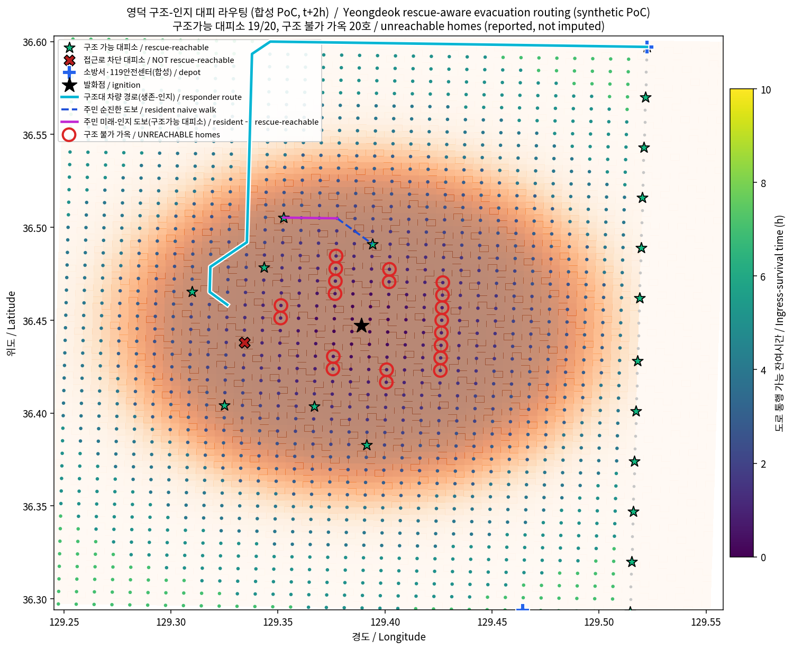
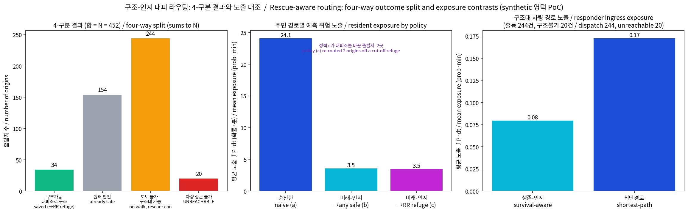
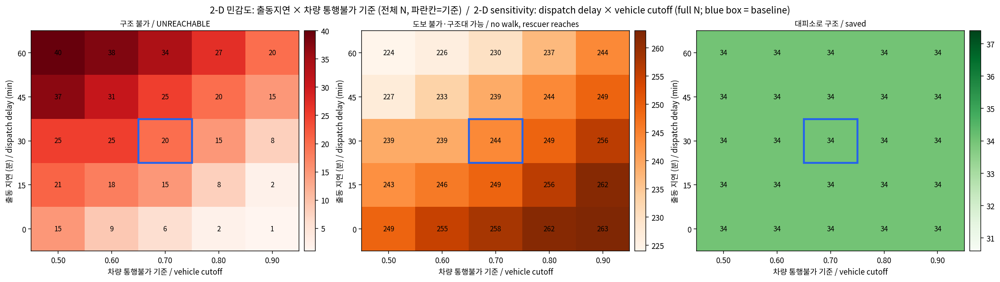
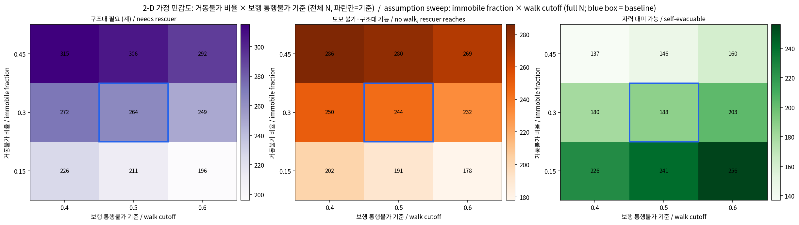

# WildfireGuardian — 산불 골든타임

> Multi-scale wildfire forecasting and personalized evacuation system for the protection of rural elderly Koreans.
>
> 농촌 고령층을 위한 다중규모 산불 예측·개인화 대피 안내 시스템.


---

## 🇰🇷 한국어

### 프로젝트 개요

**WildfireGuardian** 은 산불 발생부터 대피 완료까지의 "골든타임" 동안 위성 화재 탐지·물리 기반 화재 확산 모델·연기 확산 모델·개인 맞춤형 대피 경로 안내를 통합 제공하는 연구용 시스템입니다.

**보호 대상**: 한국 농촌의 고령층(60–80대). 2025년 3월 22–28일 영남권 산불 (사망자 30 명 이상, 대부분 60–80 대 고령자) 의 재발 방지·대응 개선을 동기로 삼습니다.

**대회**: 2026년 대한민국 학생 SW공모전 → ISEF (Systems Software) 출전 목표. 제출 마감 2026-06-13.

### 시스템 구성

| 모듈 | 역할 | 과학적 근거 |
|------|------|-------------|
| `fire_detection` | 위성 (VIIRS, MODIS) 발화점 탐지 및 시간 정합 | NASA FIRMS 알고리즘 |
| `lfmc_model` | 생체 수분 (Live Fuel Moisture Content) 추정 | Sentinel-2 NDWI/NDVI 기반 회귀 |
| `spread_model` | 지표 화재 확산 시뮬레이션 | Rothermel (1972), Finney FARSITE (1998) |
| `smoke_dispersion` | 연기 확산 / PM2.5 노출 | Gaussian plume + HYSPLIT 결합 |
| `routing` | 고령자 가중치 반영 대피 경로 | 시간 의존 다익스트라 |
| `delivery` | 다채널 알림 (SMS, 마을 방송, 푸시) | — |
| `validation` | 2025년 영덕 산불 재현 검증 | 사후 분석 |

### 현재 상태

🟧 **연구 프로토타입 (alpha)**. 본 저장소는 다음을 제공합니다:

- ✅ 저장소 골격 및 모듈 구조
- ✅ Rothermel 표면 화재 확산 모델 — **단일 연료층 + 다중 연료층 (Andrews 2018 §3)** — `src/wildfireguardian/spread_model/rothermel/`
- ✅ 한국 소나무 (Pinus densiflora) 다중 연료층 모델 (`KOREAN_PINUS`)
- ✅ Huygens 타원 wavelet 기반 CRS-aware 셀룰러 오토마타 (EPSG:5179 안착) — `src/wildfireguardian/spread_model/cellular_automaton.py`
- ✅ 지역 설정 (`RegionConfig`) — 영덕 2025, 울진/삼척 2022, 고성 2019 등 — `src/wildfireguardian/utils/regions.py`
- ✅ 농촌-고령 산불 취약도 점수 (placeholder) — `src/wildfireguardian/utils/vulnerability.py`
- ✅ 래스터 데이터 인제스션 골격 (DEM, 임상도, 토지피복) — `src/wildfireguardian/data_io/raster.py`
- ✅ 검증 하네스 (IoU, Sørensen-Dice, Brier, lead-time gain) — `src/wildfireguardian/validation/`
- ⏳ 실 KFS 산불 perimeter shapefile 인제스션 — Session 3
- ⏳ LFMC 회귀 모델 (Sentinel-2 + XGBoost) — Session 3
- ⏳ 위성 발화점 탐지 (FIRMS) — Session 3
- ⏳ 대피 경로 그래프 (OSM + 시간의존 Dijkstra) — Session 4

### 구조-인지 대피 라우팅 (신규 기능)

`wildfireguardian.routing.rescue` 는 기존 미래-인지 라우터 위에 **구조 가능성**
제약을 더합니다: 고령자를 **차량 접근로가 예측 화재에서 살아남는** 대피소로만
안내하고, 스스로 대피할 수 없는 주민에게는 **구조대 차량의 진입 경로**를
계산하며, **누가 도달 불가능한지 정직하게** 보고합니다(추정·날조 없음).

- `ingress_survival_time` = 대피소·가옥으로의 차량 접근로 중 어느 구간이라도
  **차량 통행불가 기준**(보행자보다 높은 별도 기준)을 처음 넘는 예측 시각.
  `구조가능 ⟺ 잔여시간 ≥ 구조대 도착예정(출동지연 포함) + 안전여유`,
  그리고 `구조가능 ⊆ 안전`.
- 합성 영덕 PoC 4-구분(합 = N = 452): 원래 안전 154 · 구조가능 대피소로
  구조 34 · 도보 불가(구조대 출동) 244 · **차량 접근 불가(도달 불가) 20**.
- 대조(강건한 결과): 미래-인지 주민 경로는 노출을 순진한 경로 대비 **~85% 감소**,
  생존-인지 구조대 진입은 최단경로 대비 노출을 **약 절반**으로 감소.

실데이터 로더(OSM 도보/차량 도로망, 공공데이터포털 대피소, 119안전센터)와
**명시적으로 표기된 합성 대체 데이터**를 모두 제공하여 오프라인에서도 전체
파이프라인이 동작합니다. 자세한 방법론은 `docs/rescue_routing.md` 참고.

### 데이터 출처

본 시스템은 다음의 공개 데이터에 의존하며, **사용자 환경에서 직접 다운로드** 받습니다 (저장소에는 포함되지 않습니다).

- **NASA FIRMS** (VIIRS/MODIS 활성 화재 픽셀): <https://firms.modaps.eosdis.nasa.gov/>
- **Copernicus Sentinel-2** (광학 위성, LFMC 추정): <https://browser.dataspace.copernicus.eu/>
- **KMA AWS** (자동기상관측소 풍속·풍향·습도): <https://data.kma.go.kr/>
- **수치지도** (DEM 30 m, 지형도): 국토지리정보원
- **OpenStreetMap** (도로망): <https://www.openstreetmap.org/>

### 설치 및 테스트

```bash
git clone https://github.com/sparkxt-0318/wildfireguardian.git
cd wildfireguardian

python -m venv .venv
source .venv/bin/activate     # Windows: .venv\Scripts\activate
pip install -r requirements.txt
pip install -e .

# 단위 테스트 실행
pytest -v

# Rothermel LFMC 민감도 차트 생성
python -m wildfireguardian.spread_model.demo_sensitivity

# LFMC × 풍속 2D 결합 민감도 히트맵 (Session 3 핵심 그림)
python -m wildfireguardian.spread_model.demo_lfmc_wind_heatmap

# 영덕-유사 합성 시나리오 (셀룰러 오토마타)
python -m wildfireguardian.spread_model.demo_yeongdeok_synthetic

# 영덕 2025 후향적 검증 (실제 SRTM 지형 + 베이스라인 비교)
python scripts/run_yeongdeok_validation.py

# 연기 확산 시연 (가우시안 플룸)
python -m wildfireguardian.smoke_dispersion.demo_yeongdeok_plume
```

### 인용

```
WildfireGuardian Project (2026). WildfireGuardian: multi-scale wildfire
forecasting and personalized evacuation for rural elderly Koreans.
2026 Korea Code Fair SW공모전. https://github.com/sparkxt-0318/wildfireguardian
```

---

## 🇺🇸 English

### Project overview

**WildfireGuardian** is a research-grade system that integrates satellite fire
detection, physics-based fire spread modelling, atmospheric smoke dispersion,
and personalised evacuation routing — with the explicit goal of protecting
rural elderly Koreans during the "golden time" between ignition and safe
evacuation.

**Motivating event**: the Yeongnam wildfires of 22–28 March 2025 killed 30+
people in South Korea, the majority of whom were in their 60s–80s and lived
in rural villages (영덕군 in particular). The system is designed to be
retrospectively validated against that event before any real-time deployment.

**Target venue**: 2026 Korea Code Fair SW공모전 (Korean high school SW
competition), with the stretch goal of qualifying for ISEF in the Systems
Software category. Submission deadline 2026-06-13.

### System architecture (high level)

```
                  ┌───────────────────────────────────────────────┐
                  │           Satellite fire detection            │
                  │     (NASA FIRMS VIIRS + MODIS, near-real)     │
                  └────────────────────┬──────────────────────────┘
                                       │ ignition points
                  ┌────────────────────▼──────────────────────────┐
                  │              Fuel & weather state             │
                  │  LFMC (Sentinel-2) + KMA wind/RH + DEM/slope  │
                  └────────────────────┬──────────────────────────┘
                                       │
                  ┌────────────────────▼──────────────────────────┐
                  │     Rothermel surface fire spread model       │
                  │  + Huygens-elliptical cellular automaton CA   │
                  │  + Monte Carlo ensemble (wind/moisture noise) │
                  └────────────────────┬──────────────────────────┘
                                       │ perimeter, burn probability
                  ┌────────────────────▼──────────────────────────┐
                  │       Smoke dispersion (Gaussian plume)       │
                  │       Evacuation routing (elderly-aware)      │
                  └────────────────────┬──────────────────────────┘
                                       │
                  ┌────────────────────▼──────────────────────────┐
                  │      Personalised alerts & route delivery     │
                  └───────────────────────────────────────────────┘
```

See `docs/architecture.md` for the long form.

### Current status

🟧 **Research prototype (alpha) — Session 7 (DIAGNOSTIC: the crown result was a bug).**

**Headline verdict: the Session-6 "54 %" was an ARTIFACT and is retracted.**
A forensic audit found the crown-transition (Van Wagner) check was fed the
*surface* drought-LFMC (40 %) as the *tree-crown foliar moisture* — but live
conifer crowns stay ~119 % (measured). Fixing this conflation collapses crown
initiation from 32 % of cells to **0 %**, and 24-h area-capture from 54 % back
to **~9 %** (the surface-only baseline). Reported honestly; nothing was tuned
to preserve the number.

- **Concern 2 (bug):** found and fixed. Crown foliar moisture is now decoupled
  from surface LFMC (`crown_foliar_moisture_pct`). The winds were *not* buggy
  (both paths WAF-consistent); the inconsistency was the moisture input.
- **Concern 1 (fragility):** at the measured CBH range (3.6–5.2 m) capture is a
  stable ~9 %; it reaches ~27 % only if CBH drops to ~2 m. **Crown initiation
  is acutely CBH-sensitive** — a real finding (stand structure, raisable by
  thinning, governs catastrophe potential). See
  `docs/methodology/crown_initiation_sensitivity.md`.
- **Concern 3:** the ∂R/∂U numbers are now anchored to the realistic 1.39 m/s
  midflame wind (dry 0.97, moist 0.59; ratio 1.64 constant).

**Net:** the diagnostic strengthens credibility (we caught our own headline
bug pre-writeup and turned it into a finding) but weakens the
"prediction-works" claim — crown fire did **not** actually solve Session 5's
under-prediction; the apparent fix was a parameter artifact. The
future-front routing spine (Session 5) is unaffected and remains the core
contribution. See `docs/OVERNIGHT_REPORT_SESSION7.md`.

<details><summary>Earlier: Session 6 (fire-type physics — crown/spotting/topo wind, since corrected)</summary>

Session 6 *reported* crown fire lifting capture 9 % → 54 %; Session 7 showed
that 54 % was the foliar-moisture artifact above. The physics modules
(topographic wind, Van Wagner + Cruz/Alexander crown, Albini spotting,
rule-based regime classifier) are sound and retained; only the headline
number was wrong. `docs/OVERNIGHT_REPORT_SESSION6.md`.

</details>

<details><summary>Earlier: Session 5 (mentor refocus: fix physics, build the spine)</summary>

- **Wind fixed (root-cause bug)**: Rothermel needs the **midflame** wind. We
  now convert 10-m → midflame via the Andrews 2012 Wind Adjustment Factor
  (closed Korean pine canopy WAF ≈ 0.10). The old code fed raw 10-m wind to
  Rothermel, inflating the wind factor to ~115×; corrected it is ~5×.
- **Moisture × wind interaction (corrected)**: the Session-4 "multiplicative
  coupling, ratio = 1.000" was **tautological** (Rothermel is separable) and
  is **retracted**. The honest, dimensional measure is ∂R/∂U: each m/s of
  midflame wind adds **~1.0 m/min of spread on dry fuel vs ~0.6 on moist**
  (∂²R/∂M∂U < 0). See `docs/figures/interaction_fanning.png`.
- **Validation (honest)**: with physically-correct wind the surface model
  **under-predicts the Yeongdeok front by ~90 %** at every horizon — it
  cannot capture the crown/spotting-driven run. The Session-4 "24 h +25 %"
  was an inflated-wind + disc-injection cancellation, now exposed. The
  prediction does not work yet; we say so plainly.
- **The spine (new core contribution)**: future-front-aware evacuation
  routing. The naive nearest-shelter route walks an evacuee **into** the
  advancing front; the time-dependent router detours to a shelter the fire
  never reaches in time, with a reported clearance margin and latest-safe-
  departure. See `docs/figures/route_away_from_front.png`.
- **Korean fuel**: live moisture is the **measured** 119 % foliar value; the
  Rothermel surface bed is **provisional** (flagged) pending Korean
  surface-litter literature.

</details>

⚠️ **Honesty note**: only the DEM is real. Wind, fuel raster, observed
perimeter, and Korean fuel parameters are SYNTHETIC / APPROXIMATE / ANALOG
(no FIRMS or KMA API keys this session). The LFMC×wind decomposition is
exact and independent of these. Real KFS / KMA / Sentinel ingestion is
Round 2. See `docs/methodology/validation_limitations.md` for the full
reviewer-defense.

This repository provides:

- ✅ Repository scaffold and module structure
- ✅ Rothermel surface fire spread model — **single-class + multi-class**
  (Andrews 2018 §3 weighting), with Anderson 13 + Korean Pinus densiflora
  analog in `src/wildfireguardian/spread_model/rothermel/`
- ✅ Dynamic live moisture of extinction via Burgan (1979)
- ✅ Huygens-elliptical cellular automaton with **CRS-aware FireGrid**
  anchored to EPSG:5179, GeoTIFF + WGS84 GeoJSON export
  (`src/wildfireguardian/spread_model/cellular_automaton.py`)
- ✅ Monte Carlo ensembling (wind/moisture perturbations)
- ✅ **RegionConfig** system (`src/wildfireguardian/utils/regions.py`)
  with Yeongdeok 2025, Uljin/Samcheok 2022, Goseong 2019 as primary
  validation cases, plus the East Coast Pine Belt deployment region
- ✅ **Vulnerability scoring framework** (placeholders; real KOSIS/KFS/MOIS
  data is Session 3)
- ✅ **Raster ingestion scaffolding** (DEM, fuel-type, landcover) with
  synthetic fallback so the whole pipeline runs without external data
- ✅ **Validation harness** with IoU, Sørensen-Dice, Brier score,
  lead-time gain, temporal-area RMSE (`src/wildfireguardian/validation/`)
- ⏳ Real KFS perimeter shapefile + NGII DEM + KFS 임상도 ingestion (Session 3)
- ⏳ LFMC regression (Sentinel-2 + XGBoost) — Session 3
- ⏳ Satellite ignition ingestion (FIRMS) — Session 3
- ⏳ Smoke dispersion module (Gaussian plume) — Session 3
- ⏳ Evacuation routing graph (OSM + time-dependent Dijkstra) — Session 4

**Test status**: 143 / 143 passing (39 Session 1 + 104 Session 2).

This is **not** production software. It has not been validated against a real
fire event yet, and it must never be used as the sole input to a public
evacuation order without expert review.

### Rescue-aware evacuation routing (new feature)

On top of the future-aware router, `wildfireguardian.routing.rescue` adds a
tightly-scoped **rescue-awareness** layer: it routes the vulnerable elderly only
to refuges whose **vehicle access road survives the predicted fire**, and — when a
resident cannot self-evacuate — computes the **responder's** ingress route
instead, always reporting honestly who cannot be reached.

- **Ingress-corridor survival.** For each refuge (and each home, on the rescuer
  side) the vehicle access route from the nearest depot is sampled onto the hazard
  grid; `ingress_survival_time` is the earliest forecast slice any segment exceeds
  a *separate, higher* **vehicle** impassability cutoff. A destination is
  `rescue_reachable` iff `survival ≥ responder_ETA + safety_margin`, where the ETA
  includes a realistic dispatch delay (a delayed responder is a documented cause
  of death for the immobile). By construction `rescue_reachable ⊆ safe`.
- **Resident policies (same refuge set, only the policy differs):** (a) naive
  fire-blind nearest refuge; (b) future-aware → any safe refuge (current method);
  (c) future-aware → nearest **rescue-reachable** refuge (new method).
- **Rescuer side:** a prioritized **dispatch list** (homes with a surviving
  ingress, ranked by closing window) and an explicitly-reported **unreachable
  set** — never imputed.

**Honest four-way origin split on the synthetic 영덕 PoC (sums to N = 452):**

| outcome | count |
|---|---:|
| already safe (naive walk works) | 154 |
| saved by routing to a rescue-reachable refuge | 34 |
| no safe pedestrian route — but a responder can reach (dispatched) | 244 |
| **no surviving vehicle ingress — UNREACHABLE (reported, not imputed)** | **20** |

Contrasts (the robust result; absolute magnitudes are illustrative on a
single-fire PoC + synthetic auxiliary inputs): the future-aware resident route
cuts predicted-hazard exposure **~85 %** vs naive (24.1 → 3.5 prob·min), and the
survival-aware responder ingress roughly **halves** exposure vs a fire-blind
shortest path (0.08 vs 0.17). The surviving-ingress layer *reduces* — does **not**
eliminate — the unreachable set. See `docs/rescue_routing.md` for the full methods
note and data provenance (real-source loaders for OSM walk/drive networks,
공공데이터포털 대피소, and 119안전센터 depots, each with a clearly-labelled synthetic
fallback so the pipeline runs end-to-end offline).

All headline numbers above sit on **one baseline** (vehicle cutoff 0.7, dispatch
delay 30 min) at the **same N = 452**; the resident (pedestrian) and responder
(vehicle) exposures are distinct metrics and never compared across scales. A
verification pass (`scripts/verify_rescue_routing.py`) re-derives the four-way
split and runs a **full-N 2-D sweep** (dispatch delay × vehicle cutoff) whose
baseline cell equals the headline (asserted). Robust finding: **unreachable rises
monotonically with dispatch delay** (6 → 34 across 0 → 60 min at cutoff 0.7) and
with a harsher cutoff — the computational echo of a fire reaching the towns before
responders can. The point estimates (e.g. 20 unreachable) are directional, not
exact. The quick `run_rescue_routing.py` sweep is sub-sampled (N ≈ 151) for speed;
`verify_rescue_routing.py` is the authoritative full-N reconciliation
(`docs/rescue_routing.md §4a`).

A second sweep over the two assumption knobs that set the burden's *size*
(`immobile_fraction × walk_cutoff`, `--sweep fc`, §4b) shows the **"58 % need a
rescuer" is assumption-driven, not a fixed number**: it ranges 43–70 % across
plausible values and falls to **47 %** if the assumed immobile fraction is halved
(0.30→0.15). `immobile_fraction` forces a random share of origins onto the rescuer
path regardless of walkability, so `already_safe`/`saved` are over the mobile pool
and are *not* invariant to it. The robust claim is the **direction** (a large
minority — ≥43 % even at optimistic assumptions — cannot self-evacuate; unreachable
rises with dispatch delay), not the exact percentage.

```bash
python scripts/run_rescue_routing.py            # four-way split + exposure + sensitivity
python scripts/make_rescue_figures.py           # docs/figures/rescue_*.png
python scripts/verify_rescue_routing.py             # reconciled baseline + vehicle×delay sweep
python scripts/verify_rescue_routing.py --sweep fc  # immobile×walk-cutoff assumption sweep
pytest tests/test_rescue_routing.py -q          # incl. the orientation regression test
```









### Data sources

All data sources are public. The repository does **not** distribute any data;
users download data into `data/raw/` at run time. See `docs/data_sources.md`.

### Install & run tests

```bash
git clone https://github.com/sparkxt-0318/wildfireguardian.git
cd wildfireguardian
python -m venv .venv && source .venv/bin/activate
pip install -r requirements.txt
pip install -e .

pytest -v

# Generate the LFMC sensitivity figure
python -m wildfireguardian.spread_model.demo_sensitivity

# Run a synthetic Yeongdeok-like cellular-automaton scenario
python -m wildfireguardian.spread_model.demo_yeongdeok_synthetic
```

### Citation

```bibtex
@software{wildfireguardian2026,
  title  = {WildfireGuardian: Multi-scale wildfire forecasting and personalised
            evacuation for rural elderly Koreans},
  author = {{WildfireGuardian Project Contributors}},
  year   = {2026},
  note   = {2026 Korea Code Fair SW공모전 submission.},
  url    = {https://github.com/sparkxt-0318/wildfireguardian}
}
```

### Scientific references

Core algorithmic references used in this repository:

- Rothermel, R.C. (1972). *A mathematical model for predicting fire spread in
  wildland fuels.* USDA Forest Service Research Paper INT-115.
- Albini, F.A. (1976). *Estimating wildfire behavior and effects.* USDA Forest
  Service General Technical Report INT-30.
- Anderson, H.E. (1982). *Aids to determining fuel models for estimating fire
  behavior.* USDA Forest Service General Technical Report INT-122.
- Finney, M.A. (1998). *FARSITE: Fire Area Simulator — model development and
  evaluation.* USDA Forest Service Research Paper RMRS-RP-4.
- Andrews, P.L. (2018). *The Rothermel surface fire spread model and
  associated developments: a comprehensive explanation.* USDA Forest Service
  General Technical Report RMRS-GTR-371.

### License

MIT. See [`LICENSE`](LICENSE).
