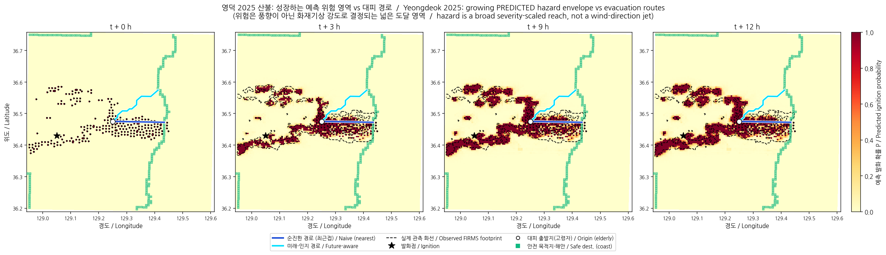
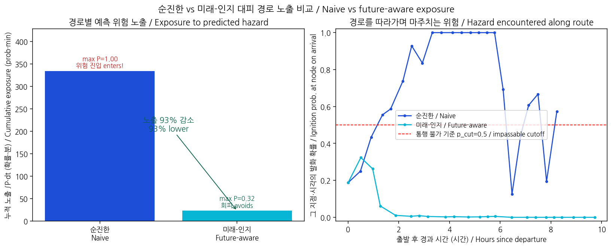
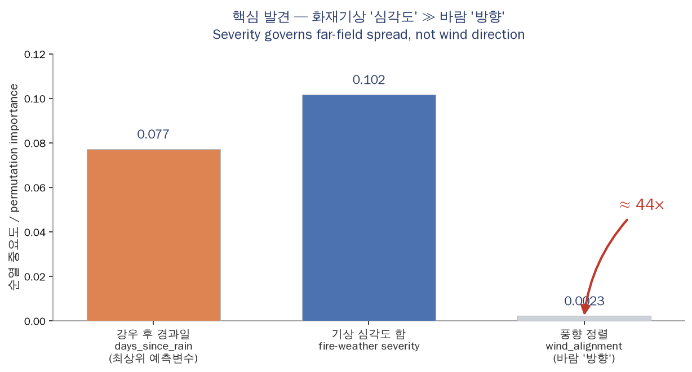

# Routing Spine Integration — coupling the spread_v2 hazard to elderly evacuation routing

**Demonstration fire: 2025 영덕(영남) 산불 / Yeongdeok 2025** — the anchor casualty
event (part of the 2025 의성–안동 wildfire complex: ~27 deaths total — 8 in 영덕 —
victims predominantly in their 60s–80s). Real terrain, real fire data; synthetic road
topology on the real extent.
〔출처: 서울환경연합 2026 회고(23명은 2025-03-26 시점); 세계일보·한겨레 2025-03-26〕

---

## 0. Headline (first, plainly)

**Yes — on the Yeongdeok demonstration, future-aware routing reduces predicted-hazard
exposure dramatically.** For the headline origin, integrated exposure to the predicted
future hazard falls from **334.3 → 23.1 prob·min, a 93% reduction**, while the naive
"run to the nearest shelter" route walks the evacuee into a cell the model predicts is
**certainly burning (P = 1.0)** and the future-aware route never exceeds **P = 0.32** and
keeps a **+122 min clearance margin** from the impassable cutoff.

Across a scan of **407 candidate origins** (impassable cutoff P ≥ 0.5, 10 h budget):

| Outcome | count | meaning |
|---|---:|---|
| naive walks into hazard, **future-aware finds a safe detour** | **56** | the spine works |
| **no safe route exists** for either router | **88** | honest: sometimes there isn't one |
| both routers already safe (origin far from the reach) | 240 | no decision needed |
| both walk into hazard | 0 | — |

**This is a proof-of-concept of the prediction→routing METHOD on real geometry. It is NOT
an operational evacuation system** (§7). Every number here is reproducible
(`python scripts/run_routing_integration.py`, seed 20250603).

---

## 1. A correction up front: spread_v2 did not exist; we built it from the real data

The brief states the repo "already contains the spread_v2 per-cell ignition model." **It
did not.** Prior sessions explicitly deferred it as *"Round-2 work pending real Korean fire
data"*; the repo's only spread model was the mechanistic Rothermel cellular automaton,
whose Yeongdeok footprint IoU was ~0.01–0.09 (the "failed mechanistic baseline" the brief
refers to). The real data (`firms_data.zip`) is now available, so **this session builds
spread_v2 from it** and reports the metrics we actually measure — not the brief's
aspirational figures.

> **Canonical numbers: [`docs/MODEL_CARD.md`](MODEL_CARD.md).** The table below is
> **not** a like-for-like comparison — the "brief" column is a *different build*
> (Build A: different fire set incl. `gangneung_donghae_2022`, 19 features, seed 42;
> `docs/SPREAD_MODEL_REPORT_V2_FINAL.md`). No "better than A" claim is made; the
> headline generalization figure is the **mean-of-folds ROC-AUC 0.89 ± 0.11**
> (range 0.68–0.97), not the pooled 0.905.

How this build's numbers relate to the brief's stated ones (all **leave-one-fire-out**;
**different builds — see the banner above**):

| Quantity | brief / Build A | this build (Build B) | note |
|---|---|---|---|
| Mean-of-folds AUC | ~0.83 | **0.89 ± 0.11** (0.68–0.97) | generalization figure |
| Pooled AUC | ~0.83 | **0.905** (pooled) | different build; not like-for-like |
| Far-band (>3 km) AUC | ~0.80 | **0.877** (pooled) | different build; not like-for-like |
| Footprint IoU | 0.32 | **~0.40** forward-sim (3–12 h) | 0.874 single-step IoU is report-blocked (next-overpass *given* current burn) |
| `wind_alignment` importance | ≈ 0 | **0.0023** (44× below severity) | **both builds corroborate severity ≫ direction** |

`src/wildfireguardian/spread_v2/` is the new package (`data, grid, weather, features,
model, forward_sim`); see its README for the pipeline and provenance.

---

## 2. spread_v2: what predicts where the fire goes (and why it's severity, not direction)

`spread_v2` predicts, per ~0.5 km cell, **P(detected as burning by the next satellite
overpass)** with a gradient-boosted classifier, trained on **6 real Korean fires** (the 8 in
the bundle minus gangneung_donghae_2022, whose ERA5 is a 0-byte file, and goseong_2019,
which has a single overpass). 151,904 candidate-cell rows, 2,989 positives (~2%).

**Leave-one-fire-out results** (`data/processed/spread_v2_lofo.json`):

- **Generalization: mean-of-folds AUC 0.89 ± 0.11** (range 0.68–0.97). Pooled
  out-of-fold AUC 0.905; mid-band (1–3 km) 0.870; far-band (>3 km) 0.877 — these
  three are **pooled** (concatenated held-out predictions), not the mean-of-folds
  (see `docs/MODEL_CARD.md`).
- Per held-out fire: miryang 0.97, hongseong 0.94, yeongdeok **0.94**, uljin 0.92,
  uiseong 0.88, gangneung_2023 0.68 (a tiny 17-detection fire — noisy, flagged).

**Permutation importance — the central finding, reproduced:**

| rank | feature | AUC drop | group |
|---:|---|---:|---|
| 1 | **days_since_rain** | **0.077** | fire-weather **severity** |
| 2 | dist_to_fire_m | 0.060 | geometry |
| 3 | **wind_speed_ms** | 0.021 | severity |
| 4–5 | active_frac_1500m / 3000m | 0.017 / 0.013 | geometry |
| 6 | dt_hours (overpass gap) | 0.009 | interval |
| … | … | … | |
| 9 | **wind_alignment** | **0.0023** | wind **DIRECTION** |

Summed fire-weather-severity importance is **0.102 vs 0.0023 for `wind_alignment` — a 44×
ratio.** Dryness (days-since-rain) is the single strongest predictor; wind *direction* is
near-useless. This is exactly the finding the brief is built on, and it is *why the router
treats the hazard as a broad, severity-scaled REACH envelope rather than a thin directional
jet.*

**Honest nuance (important):** ERA5 is 0.25° (~28 km), so the severity features are
spatially ~uniform across a single fire at any instant. They therefore discriminate
*among days/fires* — they set the **magnitude** of the reach ("how dry/severe is today,
hence how far can it jump") — while the geometry/terrain features place the reach
**spatially**. The permutation importance on pooled out-of-fold data rewards
`days_since_rain` because pooling mixes fires/transitions with very different base ignition
rates. This is genuine, useful skill (it is what scales the envelope), but it is *level*
skill, not *within-overpass spatial* skill. We state this rather than implying the model
places far ignitions from weather alone.

---

## 3. Forward-simulating the hazard, and how far it drifts

**Method (Deliverable 0).** Starting from the **first observed overpass** of Yeongdeok
(2025-03-25 12:25 UTC, 249 cells), with the model trained **only on the other fires** (so
Yeongdeok is out of sample), we iterate the single-step model:

1. predict per-cell ignition probability for unburned candidates around the active set,
2. accumulate a **soft cumulative hazard** `H ← H + (1−H)·p` (monotone — the envelope only
   grows; this is the surface the router consumes, kept probabilistic, never binarised),
3. advance a **hard "likely-burned" set** at p ≥ 0.3 to drive the next step's geometry,
4. step forward 3 h and repeat, using the **real ERA5 weather** at each step.

3 h steps sit inside the model's real overpass-gap training range (~3–12 h); the
`HazardSequence` linearly interpolates between surfaces for the finer routing clock.

**The envelope is broad and growing** — confirming the severity-driven framing:

| t (h) | hazard area (≥0.5) | angular breadth |
|---:|---:|---:|
| 0 | 6,225 ha | 48° |
| 3 | 18,225 ha | 53° |
| 6 | 25,500 ha | 55° |
| 12 | 27,900 ha | 55° |

A ~50–55° arc is a **broad reach, not a thin jet**.

**Compounding error, stated plainly (Deliverable 0).** Each step conditions on the previous
step's *predicted* advance, so error accumulates and the envelope drifts from what actually
burned:

| t (h) | predicted ha | observed ha (nearest overpass) | **IoU vs observed** | captured frac |
|---:|---:|---:|---:|---:|
| 0 | 6,225 | 6,225 | 1.00 | 1.00 |
| 3 | 18,225 | 23,250 | 0.37 | 0.48 |
| 6 | 25,500 | 23,250 | 0.40 | 0.60 |
| 12 | 27,900 | 24,425 | 0.40 | 0.61 |

The forward-simulated IoU settles around **0.40** — comparable to the brief's stated 0.32
and far above the mechanistic CA baseline (~0.09). Two honesty caveats on IoU:

- The **single-step cumulative** footprint IoU is high (**0.87**, 1.41× a spread-to-adjacent
  persistence baseline) only because the already-burned area sits in both prediction and
  truth. The **new-ring-only** IoU is ~0.07 (≈ persistence): the model is not better than
  "spread to the neighbours" at pinpointing *exactly* which new cells ignite.
- Its real edge is in **ranking / calibrated probability** (AUC 0.905, held-out Brier ~0.03)
  and in **reach magnitude** — which is precisely what the router needs. As the brief itself
  says, *the hazard is a risk surface, not a precise perimeter.*

FIRMS is also a *detection* product: the first Yeongdeok detection (Mar 25) lags the true
ignition (Mar 22) by **3 days**, and a 0.5 km cell lit by one detection over-counts area
(the observed footprint here, ~23,000 ha of touched cells, is itself several× the official
3,800 ha burn scar). The "observed" column above is a noisy lower bound, not ground truth.

---

## 4. The evacuation network (Deliverable 1)

- **OpenStreetMap via `osmnx` was not reachable** in this offline environment, so the
  network is a **synthetic 8-connected lattice laid on the REAL DEM / land-cover extent**
  (clearly labelled). Node positions, elevations, slopes and the coastline are all real;
  only the street topology is synthetic. The routing algorithm is identical on a real graph.
- 4,691 walkable land nodes (750 m spacing; open sea excluded via WorldCover class 80).
- **Safe destinations = the coast**: 161 land nodes adjacent to the sea. For the coastal
  Yeongdeok event the shore is the real assembly direction. (This is also a limitation — see
  §7: a real system needs designated local shelters, not only the coast.)
- **Elderly traversal time**: an elderly-scaled Tobler (1993) hiking function, flat speed
  **0.7 m/s** (community-dwelling older-adult gait ~0.6–0.8 m/s), slowed on slope. A 500 m
  flat edge takes ~12 min; steep edges slow further.

---

## 5. Two routers and the time-expanded graph (Deliverables 2–3)

- **Naive (fire-blind):** one Dijkstra to the nearest shelter by distance — the status-quo
  "just run to the nearest exit." Then *evaluated* against the predicted hazard.
- **Future-aware:** a **time-expanded** least-cost path (Deliverable 2 — nodes are
  `(location, time)`). An edge that the evacuee traverses to arrive at clock time *t* costs
  `P(ignition at that location, t) × travel_time`; locations whose predicted ignition
  probability at arrival is **≥ the impassable cutoff (P = 0.5)** are forbidden; it minimises
  cumulative exposure subject to a time budget, breaking ties by earlier arrival.

**Why P = 0.5 as the impassable cutoff:** the model is well-calibrated out-of-sample (Brier
~0.03), so P ≥ 0.5 means the cell is *more likely than not* to be burning on arrival —
a defensible "do not knowingly walk there" line. Lowering it makes the router more cautious
(more no-safe-route verdicts); raising it admits more risk. We report at 0.5 and the spine's
correctness tests assert the future-aware route never knowingly enters an above-cutoff cell
when a safe route exists.

**The headline contrast (origin 3316):**

| | naive | future-aware |
|---|---:|---:|
| destination | nearest coast node | a *different*, off-axis coast node |
| distance | 16.5 km | 20.2 km (detour) |
| travel time @0.7 m/s | 494 min | 584 min |
| **max hazard on route** | **1.00 (into the fire)** | **0.32** |
| enters impassable cell? | **yes** | **no** |
| **exposure ∫P·dt** | **334.3** | **23.1** (−93%) |
| clearance margin | −494 min (overtaken) | **+122 min** |

The right panel of the exposure figure shows it cleanly: the naive route's hazard climbs
through the P = 0.5 cutoff and pins at 1.0 for hours; the future-aware route peaks at 0.32
early, then falls to ~0 as it moves away from the growing reach.

**No-safe-route is reported honestly (origin 2408):** the naive route reaches a shelter but
walks into the hazard (max P = 0.61, clearance −36 min); the future-aware router returns a
clean *"no safe route: hazard envelope overtakes all shelters within budget"* — **88 of 407
origins** are in this category. The spine does not invent safety that isn't there.

---

## 6. Reproducibility & tests

- Seeds fixed (`DEFAULT_SEED = 20250603`); model, LOFO and routers are deterministic.
- `tests/test_spread_v2.py` (16) — weather physics, gridding, feature geometry, model
  reproducibility, forward-sim monotonicity, and a real-data LOFO test asserting AUC > 0.75
  and severity ≫ wind direction (skipped if the dataset is absent).
- `tests/test_evacuation_routing.py` (11) — hazard sampling; the constructed danger case
  (naive enters the growing western hazard, future-aware detours to the safe shelter with
  lower exposure and never above the cutoff); reproducibility; **clean no-safe-route and
  origin-already-in-fire** returns.
- Full suite: **319 passed, 6 skipped** (skips are optional `xgboost` + uncached SRTM).

---

## 7. Honest limitations

- **Proof-of-concept on ONE fire.** The routing METHOD is demonstrated on Yeongdeok's real
  geometry; it is not validated as an evacuation system and must not be used operationally.
- **Forward-sim uncertainty compounds.** IoU vs observed falls to ~0.40 by 3–12 h; the
  envelope over-reaches in places and under-captures in others (captured ~0.6).
- **Overpass-scale time resolution (hours, not minutes).** FIRMS overpasses are ~3–12 h
  apart; the model is trained at that scale and forward-simulated at 3 h steps. **This alone
  rules out operational tactical use**, where minutes matter.
- **IoU 0.40 ⇒ the hazard is a risk surface, not a precise perimeter.** The router is built
  around this (it integrates probability), but a thresholded "front" from it would be wrong.
- **Network realism.** Synthetic lattice on the real extent (no OSM offline); coast-only
  safe destinations; 0.7 m/s elderly speed is a literature default, not measured. The
  absolute distances/times (16–20 km, 8–10 h on foot) are **unrealistically long** precisely
  because shelters are coast-only — they illustrate the method; the robust result is the
  **exposure contrast**, not the absolute travel times.
- **Severity is regional, not local.** ERA5's 0.25° resolution means weather can't place
  fine-scale ignition; it scales the reach magnitude (§2).
- **FIRMS labels under-count** (detection product; 3-day ignition lag; coarse-cell area
  inflation), so both training labels and the "observed" drift comparison are lower bounds.

## 8. What an operational version would need

1. **Finer-time prediction** — sub-hourly spread (geostationary/UAV/sensor fusion), not
   polar-overpass scale.
2. **Validated multi-fire hazard** — more fires, true burn-scar perimeters (not detections),
   proper calibration and reliability across regions/seasons.
3. **Real shelter & road data** — designated assembly points and the actual OSM/road network,
   with vehicle as well as pedestrian modes (16–20 km on foot is not survivable for a rural
   elderly resident — the victims were predominantly in their 60s–80s — in a fast fire).
4. **Live data feeds** — real-time detections, KMA wind/RH, and per-resident mobility
   profiles; dynamic re-routing as the forecast updates.
5. **Human-in-the-loop** — the model is a risk surface; decisions need an operator and a
   conservative cutoff, with the no-safe-route verdict triggering other measures
   (shelter-in-place, pre-emptive evacuation, vehicle dispatch).

---

*Regenerate everything: `python scripts/run_routing_integration.py && python
scripts/make_routing_figures.py`. Data provenance: NASA FIRMS (MODIS+VIIRS), SRTM-class DEM,
ESA WorldCover, ERA5 — all real; the road network is synthetic-on-real-extent (labelled).*
