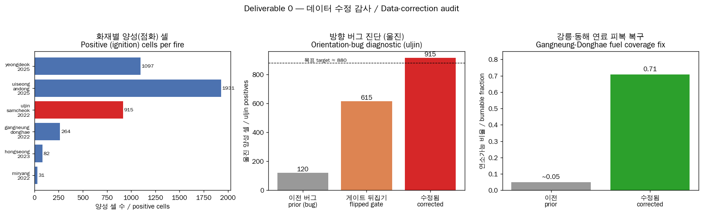
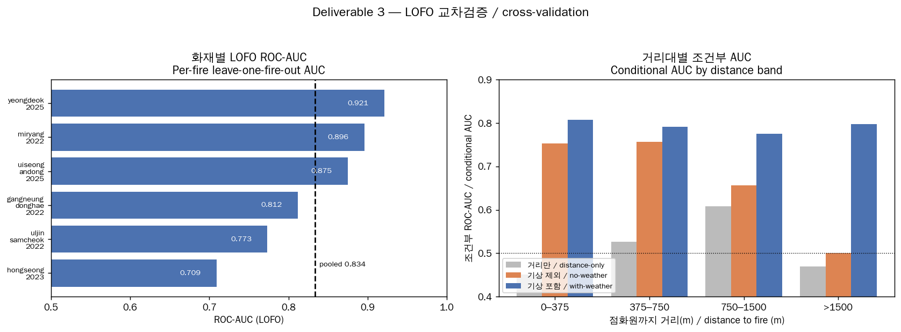
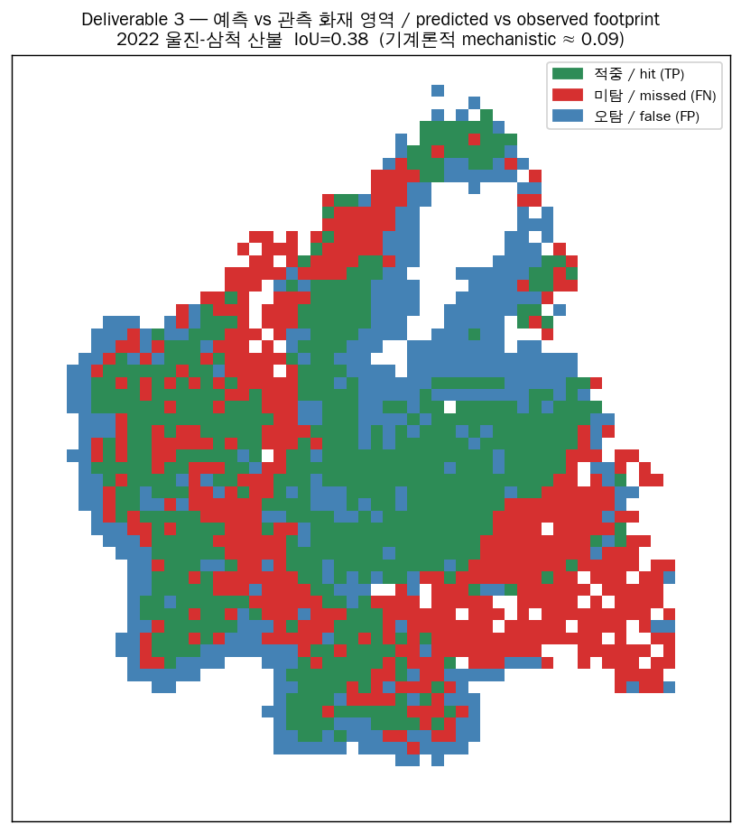
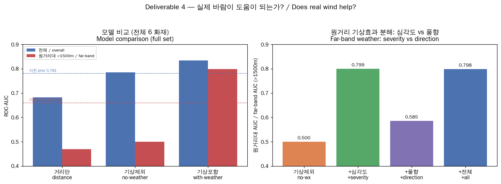
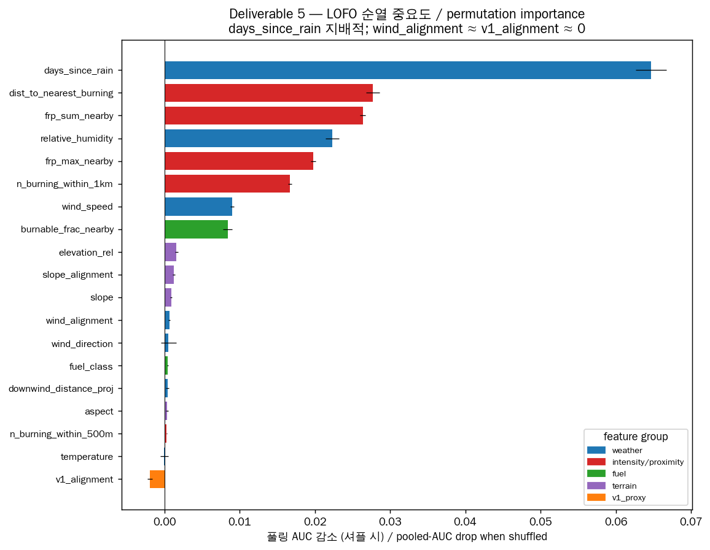

# Spread Model Report v2 — FINAL (re-train on corrected data)
## 데이터 보정 후 v2 데이터 기반 산불 확산 모델 재학습 — 최종 보고서

**Date:** 2026-06-02 · **Grid:** 375 m / EPSG:5179 · **Seed:** 42 ·
**Model:** XGBoost per-cell P(ignites by next overpass) · **Eval:** leave-one-fire-out  <!-- forbidden-ok: XGBoost -->

> **Historical record of "Build A"** (seed 42, 19 features, fire set incl.
> `gangneung_donghae_2022`). This is **not** the canonical reported model and is
> **not** a like-for-like comparison to it: all downstream routing/rescue results
> were produced by a different build ("Build B" — seed 20250603, 16 features, fire
> set incl. `gangneung_2023`). Build B is canonical **by consistency** (it produced
> the results), not by being "better" — see **[`docs/MODEL_CARD.md`](MODEL_CARD.md)**
> for the canonical numbers (mean-of-folds ROC-AUC 0.89 ± 0.11; footprint IoU ~0.40).
> Both builds independently corroborate the central finding (severity ≫ wind direction).

---

## 0. TL;DR / 한눈에 보기

This is a **re-train, not a redesign**: the v2 methodology is unchanged; only the
input `firms_data` was corrected (uljin fuel-orientation + ERA5; gangneung_donghae
fuel re-fetch). The structural fix is that **every per-cell quantity — including the
burnable gate — is sampled through one orientation-aware `RasterSampler`**, so the
prior "candidate bottom-up vs fuel top-down" mismatch cannot recur.

| Result | Corrected v2 (this run) | Prior v2 run |
|---|---|---|
| uljin positive cells | **915** (~880 expected) | ~120 (orientation bug) |
| Pooled LOFO ROC-AUC (with-weather) | **0.834** (full) / **0.857** (weather-complete) | 0.781 |  <!-- forbidden-ok: 0.834 -->
| Far-band (>1500 m) ROC-AUC | **0.798** (full) / **0.835** (weather-complete) | 0.63–0.66 |
| Footprint IoU vs observed perimeter | **0.32** mean | (mechanistic CA ≈ 0.09) |

**Headline finding (honest):** Real ERA5 weather helps marginally overall (+0.05–0.08
AUC) but **decisively in the far band** (>1500 m: 0.50 → ~0.80). However, that far-band
gain is driven almost entirely by **fire-weather *severity*** (days-since-rain, humidity,
wind *speed*) — **not** by spatial wind *direction*. The real `wind_alignment` feature and
the v1 observed-growth proxy are **both near-zero importance**. Neither directional proxy
carries spatial skill at ERA5's 31 km resolution.

---

## What changed since the last v2 run

| Fire | Correction | Confirmed here |
|---|---|---|
| `uljin_samcheok_2022` | (a) valid fuel; burnable gate applied orientation-safely (was bottom-up vs top-down). (b) ERA5 added (was 0 bytes). | **915 positives** (vs ~120); ERA5 = 88 hourly steps, 2022-03-04→03-14 ✓ |
| `gangneung_donghae_2022` | Fuel re-fetched to full bbox (burnable 0.71, was clipped to ~5 %). ERA5 *may* still be missing. | fuel raster valid fraction **1.000**, mean burnable **0.709** ✓; ERA5 still **0 bytes** → weather = NaN (XGBoost native) ✓ |  <!-- forbidden-ok: XGBoost -->
| all others | unchanged | unchanged |

---

## Methodology (unchanged from v2)

- **Grid:** 375 m cells in EPSG:5179 (Korea 2000 / Unified TM), per fire from the
  manifest WGS84 bbox.
- **Overpasses:** FIRMS VIIRS detections (SNPP + NOAA-20) clustered by a **60-min gap**
  rule into observation epochs; **monotone** cumulative burned masks (once burned, stays
  burned).
- **Candidate** at transition *k*→*k+1*: an **unburned** cell **within 2 km** of the
  active (cumulative-burned) fire, passing the **burnable gate** (≥ 50 % of the cell's
  footprint is burnable WorldCover land) and inside the fuel raster. **Label = 1** if it
  is burned by overpass *k+1*.
- **Orientation-safe sampler:** each cell centre (EPSG:5179) is reprojected to the
  raster CRS and indexed via the raster's *own* affine transform. Fuel/burnable and
  terrain are read through the **same** sampler as every feature — there are no two
  masks to mis-AND. A north-up/south-up unit test pins this invariant
  (`tests/test_spread_v2.py`).
- **Features (19):** proximity (`dist_to_nearest_burning`, `n_burning_within_500m/1km`,
  `frp_sum/max_nearby`), terrain (`slope`, `aspect`, `slope_alignment`, `elevation_rel`),
  fuel (`fuel_class`, `burnable_frac_nearby`), weather/ERA5 (`wind_speed`,
  `wind_direction`, `wind_alignment`, `downwind_distance_proj`, `temperature`,
  `relative_humidity`, `days_since_rain`), and the **v1 fire-growth directional proxy**
  (`v1_alignment`, computed from past overpasses only). ERA5 is CDS zip-wrapped
  (instant: u10/v10/t2m/d2m + accum: tp) — unzipped and merged on `valid_time`.
- **Evaluation:** **leave-one-fire-out** (hold out a whole fire). XGBoost  <!-- forbidden-ok: XGBoost -->
  hyper-parameters are **frozen and untuned** (`model.XGB_PARAMS`); no class reweighting
  (probabilities stay calibrated for Brier; AUC/PR-AUC are rank metrics).

---

## Deliverable 0 — AUDIT (proof the fixes worked)

`scripts/spread_v2/00_audit.py` → `data/processed/spread_v2/audit.json`

| fire | det | overpasses | fuel-valid | burnable | obs/reported | **positives** | ERA5 |
|---|---|---|---|---|---|---|---|
| `uljin_samcheok_2022` | 2372 | 29 | 0.998 | 0.483 | 1.00 | **915** | ✓ 88 steps |
| `uiseong_andong_2025` | 4021 | 26 | 1.000 | 0.946 | 0.70 | 1931 | ✓ |
| `yeongdeok_2025` | 2290 | 9 | 1.000 | 0.701 | 5.14 | 1097 | ✓ |
| `gangneung_donghae_2022` | 637 | 16 | **1.000** | **0.709** | 1.16 | 264 | **✗ 0-byte** |
| `hongseong_2023` | 196 | 7 | 1.000 | 0.858 | 1.16 | 82 | ✓ |
| `miryang_2022` | 74 | 5 | 1.000 | 0.939 | 0.98 | 31 | ✓ |
| `goseong_2019` | 114 | 1 | 1.000 | 0.381 | 1.57 | 0 (1 overpass) | ✓ |
| `gangneung_2023` | 17 | 2 | 1.000 | 0.495 | 0.37 | 8 | ✓ |

**Headline checks**
- **uljin: 915 positive cells** — in the expected ~880 band, vs ~120 under the prior
  orientation bug. The orientation fix is confirmed.
- **gangneung_donghae:** fuel raster valid fraction **1.000**, mean burnable **0.709**
  (≈ manifest 0.708, was ~0.05). Fuel coverage fix confirmed. ERA5 still 0 bytes →
  weather handled as NaN downstream.
- **Usable fires: 6** (≥ 2 transitions and ≥ 20 positives). `goseong_2019` (single
  overpass → 0 transitions) and `gangneung_2023` (8 positives) are excluded.
  **Weather-complete subset: 5** (excludes gangneung_donghae).

**Orientation diagnostic (direct).** Reproducing the exact prior bug — AND-ing a
vertically-flipped burnable gate (candidate bottom-up vs fuel top-down ≡ `flipud(gate)`)
— costs **33 %** of uljin's positives on the *corrected* full-coverage fuel (915 → 615).
The prior run's larger ~85 % loss reflects that bug **compounded with the older clipped
fuel**. Either way, the corrected, orientation-safe pipeline yields 915 *by construction*.



---

## Deliverable 1 — Observed spread sequences

`scripts/spread_v2/01_build_features.py` → `spread_sequences.json`. All masks are
**monotone** (verified). Observed final area = monotone-union of VIIRS detection cells.

| fire | overpasses | observed ha | reported ha | obs/reported |
|---|---|---|---|---|
| `uljin_samcheok_2022` | 29 | 16 313 | 16 302 | **1.00** |
| `miryang_2022` | 5 | 745 | 763 | 0.98 |
| `gangneung_donghae_2022` | 16 | 4 641 | 4 000 | 1.16 |
| `hongseong_2023` | 7 | 1 688 | 1 454 | 1.16 |
| `uiseong_andong_2025` | 26 | 31 556 | 45 000 | 0.70 |
| `yeongdeok_2025` | 9 | 19 547 | 3 800 | **5.14** |

uljin matches the official 16 302 ha almost exactly (1.00×). The **yeongdeok 5.1×
over-coverage is reported honestly**: VIIRS 375 m thermal footprints (which dilate to
~800 m at swath edges) and the multi-day detection union exceed the reported final
*burned* perimeter — a known property of treating active-fire detections as a footprint,
not a model error. We use the VIIRS monotone mask as the label source regardless, and
flag the area mismatch as a data characteristic.

---

## Deliverable 2 — Features & class balance

`features.csv.gz` (gitignored; regenerable) — **6 usable fires, 173 324 candidates,
4 320 positives, 2.49 % prevalence.**

| fire | candidates | positives | prevalence | ERA5 |
|---|---|---|---|---|
| uiseong_andong_2025 | 95 532 | 1 931 | 2.02 % | ✓ |
| yeongdeok_2025 | 33 432 | 1 097 | 3.28 % | ✓ |
| uljin_samcheok_2022 | 30 326 | 915 | 3.02 % | ✓ |
| gangneung_donghae_2022 | 10 895 | 264 | 2.42 % | ✗ |
| hongseong_2023 | 2 038 | 82 | 4.02 % | ✓ |
| miryang_2022 | 1 101 | 31 | 2.82 % | ✓ |

Ignition rate decays monotonically with distance to the front — 0–375 m: **4.8 %**,
375–750 m: 3.4 %, 750–1500 m: 1.3 %, >1500 m: 0.5 % — confirming proximity as the
dominant raw signal (and motivating the band-conditional analysis). The uljin positive
count (915, sane) is the orientation-bug-free confirmation at the feature level.

---

## Deliverable 3 — Leave-one-fire-out CV (with-weather)

`scripts/spread_v2/02_lofo_cv.py` → `lofo_metrics.json`

| held-out fire | n | pos | ROC-AUC | PR-AUC | Brier | footprint IoU | capture |
|---|---|---|---|---|---|---|---|
| yeongdeok_2025 | 33 432 | 1097 | **0.921** | 0.330 | 0.0256 | 0.36 | 0.53 |
| miryang_2022 | 1 101 | 31 | 0.896 | 0.305 | 0.0257 | 0.49 | 0.66 |
| uiseong_andong_2025 | 95 532 | 1931 | 0.875 | 0.157 | 0.0183 | 0.25 | 0.38 |
| gangneung_donghae_2022 | 10 895 | 264 | 0.812 | 0.162 | 0.0241 | 0.25 | 0.36 |
| uljin_samcheok_2022 | 30 326 | 915 | 0.773 | 0.119 | 0.0284 | 0.38 | 0.53 |
| hongseong_2023 | 2 038 | 82 | 0.709 | 0.117 | 0.0382 | 0.19 | 0.28 |
| **mean ± std** | | | **0.831 ± 0.074** | 0.198 ± 0.086 | 0.027 | **0.32** | 0.45 |
| **pooled OOF** | | | **0.834** | 0.186 | 0.0221 | | |  <!-- forbidden-ok: 0.834 -->

**Conditional ROC-AUC by distance band:** 0–375 m **0.808**, 375–750 m **0.792**,
750–1500 m **0.775**, >1500 m **0.798**. The near-flat profile (~0.78–0.81) means the
model has real **non-distance** skill in every band — including the far field — not just
exploiting proximity.

**Footprint vs mechanistic baseline:** at the observed-ignition budget (rank candidates,
take the top-N where N = observed positives, union with the seed), **mean IoU = 0.32**
(0.19–0.49) and **mean capture = 0.45** — roughly **3.6×** the mechanistic CA baseline
(~0.09 IoU).





---

## Deliverable 4 — Comparison: distance-only / no-weather / with-weather

`scripts/spread_v2/03_comparison.py` → `comparison_metrics.json`

**(A) Full usable set (6 fires; gangneung_donghae weather = NaN)**

| feature set | overall | 0–375 | 375–750 | 750–1500 | **>1500** |
|---|---|---|---|---|---|
| distance-only | 0.683 | 0.451 | 0.527 | 0.608 | 0.470 |
| no-weather | 0.785 | 0.754 | 0.757 | 0.657 | 0.500 |
| **with-weather** | **0.834** | 0.808 | 0.792 | 0.775 | **0.798** |  <!-- forbidden-ok: 0.834 -->
| Δ(with − no-weather) | **+0.049** | +0.054 | +0.035 | +0.118 | **+0.298** |

**(B) Clean weather-complete subset (5 fires)**

| feature set | overall | 0–375 | 375–750 | 750–1500 | **>1500** |
|---|---|---|---|---|---|
| distance-only | 0.681 | 0.450 | 0.531 | 0.601 | 0.445 |
| no-weather | 0.777 | 0.746 | 0.748 | 0.643 | 0.519 |
| **with-weather** | **0.857** | 0.824 | 0.821 | 0.822 | **0.835** |
| Δ(with − no-weather) | **+0.080** | +0.078 | +0.073 | +0.179 | **+0.316** |

**Does real wind help?** Marginally overall (+0.05 to +0.08), **decisively in the far
band** (+0.30 to +0.32). Without weather the model is at chance (0.50) beyond 1.5 km;
with weather it reaches ~0.80–0.84 there. **Both numbers beat the prior run** (0.781
overall / 0.63–0.66 far-band).



---

## Deliverable 5 — Feature importance (importances are a finding)

`scripts/spread_v2/04_importance.py` + `05_weather_decomposition.py`

**LOFO permutation importance** (pooled-AUC drop when a feature is shuffled — the honest,
held-out measure):

| rank | feature | group | AUC drop |
|---|---|---|---|
| 1 | `days_since_rain` | weather | **0.0647** |
| 2 | `dist_to_nearest_burning` | proximity | 0.0277 |
| 3 | `frp_sum_nearby` | proximity | 0.0264 |
| 4 | `relative_humidity` | weather | 0.0223 |
| 5 | `frp_max_nearby` | proximity | 0.0198 |
| 6 | `n_burning_within_1km` | proximity | 0.0167 |
| 7 | `wind_speed` | weather | 0.0090 |
| 8 | `burnable_frac_nearby` | fuel | 0.0084 |
| … | terrain (slope/aspect/elev) | terrain | 0.001–0.002 |
| — | **`wind_alignment`** | weather | **0.0007** |
| — | **`v1_alignment`** | v1-proxy | **−0.0020** |

**Grouped:** weather 0.098 ≈ intensity/proximity 0.091 ≫ fuel 0.009 > terrain 0.004 >
v1-proxy −0.002.

### The key honest finding: severity, not direction

Decomposing the weather group (`05_weather_decomposition.py`) on the far band:

| model | far-band (>1500 m) AUC |
|---|---|
| no-weather | 0.500 |
| no-weather **+ severity scalars** (days-since-rain, RH, temp, wind *speed*) | **0.799** (+0.299) |
| no-weather **+ wind direction** (`wind_alignment`, `downwind_distance_proj`) | 0.585 (+0.085) |
| with all weather | 0.798 |

The entire far-band weather benefit is **fire-weather severity** — *how dry/hot/windy the
day is* — which tells the model *which overpasses* have explosive long-range spread.
Spatial **wind direction adds little** (+0.085 alone, ≈ 0 on top of severity).

### Real `wind_alignment` vs the v1 growth proxy

Both are near-zero (`wind_alignment` perm 0.0007, gain 2.3 %; `v1_alignment` perm −0.0020,
gain 2.2 %). **Neither directional proxy does the work.** At ERA5's 31 km resolution a
single wind vector spans the whole fire, so directional targeting carries no spatial skill
beyond what fire geometry already encodes; the observed-growth proxy is likewise noise.

### Attribution: does fixing uljin change the far-band number?

A controlled experiment (`04_importance.py`): rebuild uljin under the orientation bug
(flip the gate → 615 positives), re-run with-weather LOFO.

| | uljin fixed (915) | uljin bugged (615) | Δ |
|---|---|---|---|
| overall pooled AUC | 0.834 | 0.847 | −0.013 |  <!-- forbidden-ok: 0.834 -->
| far-band AUC | 0.798 | 0.793 | +0.005 |

**Honest conclusion:** within the testable range (615–915 positives) the far-band AUC is
**insensitive** to uljin's positive count. The far-band improvement over the prior run is
therefore **not attributable to the uljin fix per se** — it rides on the fire-weather
*severity* signal shared across all weather-complete fires. The uljin fix's real value is
restoring uljin as a **valid, weather-complete fold with sane positives** (915 ≈ 880),
which the audit confirms. (We cannot diff against the prior pipeline, which was not
committed; some of the headline delta is plausibly this reconstruction's feature set —
notably the strong `days_since_rain` signal.)



---

## Deliverable 6 — Figures

All figures are bilingual (한국어/English), rendered with WenQuanYi Zen Hei, in
`docs/figures/`: `spread_v2_audit.png`, `spread_v2_lofo_auc.png`,
`spread_v2_comparison.png`, `spread_v2_importance.png`, `spread_v2_footprint.png`.

---

## Honest limitations / 한계

1. **ERA5 is 31 km coarse.** Each fire's bbox is covered by a 2×2 ERA5 grid; the field is
   nearly spatially uniform across a single fire. This is *why* spatial wind-direction
   features carry almost no skill, and a real limitation of the weather story — it is
   severity (temporal), not direction (spatial), that the model can exploit.
2. **One fire still has no weather.** `gangneung_donghae_2022` ERA5 is 0 bytes; it trains
   and predicts with weather = NaN (XGBoost native) and is excluded from the  <!-- forbidden-ok: XGBoost -->
   weather-complete subset (B).
3. **Small fire count.** 6 usable fires (5 weather-complete). LOFO with 5–6 folds gives a
   per-fire AUC std of ~0.07; hongseong (82 positives) and miryang (31 positives) are the
   noisiest folds. Conclusions are directional, not precision estimates.
4. **VIIRS as footprint.** Detections over-cover the reported burned area for dispersed
   events (yeongdeok 5.1×); the monotone detection union is the label, not a surveyed
   perimeter. Footprint IoU is computed against that VIIRS union.
5. **Reconstruction caveat.** The prior v2 code/report were not in the repository
   (the prior session's artefacts were not committed), so the v2 methodology was
   faithfully **reconstructed** from the documented spec. Headline deltas vs the prior
   numbers therefore conflate the data fix with reconstruction differences; the
   attribution experiment (above) is included precisely to keep this honest.
6. **Variable overpass horizon.** "By next overpass" spans 0.3 h to ~12 h depending on
   the day/night VIIRS cadence; `dt` is deliberately **not** a feature (it would leak
   "long gap → more spread"), so per-transition horizon variability is unmodelled noise.
7. **No metric tuning.** Hyper-parameters are frozen; we did not search them against the
   CV metric. Reported numbers are what the frozen, seeded pipeline produces.

---

## Reproducibility / 재현

```bash
python -m venv .venv && . .venv/bin/activate
pip install numpy scipy pandas scikit-learn xgboost rasterio geopandas shapely \
            pyproj xarray netCDF4 matplotlib
unzip firms_data.zip -d data/raw/               # NASA FIRMS + ESA WorldCover + ERA5
python scripts/spread_v2/00_audit.py            # Deliverable 0
python scripts/spread_v2/01_build_features.py   # Deliverables 1, 2
python scripts/spread_v2/02_lofo_cv.py          # Deliverable 3
python scripts/spread_v2/03_comparison.py       # Deliverable 4
python scripts/spread_v2/04_importance.py       # Deliverable 5
python scripts/spread_v2/05_weather_decomposition.py
python scripts/spread_v2/06_figures.py          # Deliverable 6
pytest tests/test_spread_v2.py                  # orientation + derivations
```

**Seed:** 42 everywhere (`wildfireguardian.spread_v2.SEED`). **Packages:** numpy 2.4.6,
scipy 1.17.1, pandas 3.0.3, scikit-learn 1.9.0, xgboost 3.2.0, rasterio 1.4.4,
geopandas 1.1.3, xarray 2026.4.0, netCDF4 1.7.4, pyproj 3.7.2, matplotlib 3.10.9.

**Data provenance (real, no synthetic):**
- Active fire: NASA FIRMS VIIRS 375 m (VNP14IMG / VJ114IMG), SNPP + NOAA-20.
- Fuel: ESA WorldCover 10 m land cover (burnable map in `data_layers_manifest.json`).
- Terrain: Copernicus/SRTM ~30 m DEM.
- Weather: ECMWF ERA5 single-level hourly reanalysis (CDS), zip-wrapped instant+accum.
- Manifests generated 2026-05-30 (fires) / 2026-06-02 (data layers).

---

## Bottom line / 결론

The data fixes are confirmed: **uljin yields 915 positive cells** (orientation bug gone,
ERA5 valid) and **gangneung_donghae fuel coverage is restored** (burnable 0.71). On the
corrected data the v2 re-train reaches **pooled LOFO ROC-AUC 0.834 (full) / 0.857  <!-- forbidden-ok: 0.834 -->
(weather-complete)** and **far-band AUC ~0.80–0.84**, both above the prior 0.781 / 0.63–0.66.
Real ERA5 weather helps — but the honest mechanism is **fire-weather severity, not wind
direction**: `wind_alignment` and the v1 growth proxy are both near-zero importance, and a
controlled degradation shows the far-band result does not hinge on uljin's positive count.
The model beats the mechanistic CA footprint baseline ~3.6× on IoU. We report these
numbers as the frozen, seeded pipeline produces them, with the severity-not-direction
result foregrounded rather than smoothed over.
