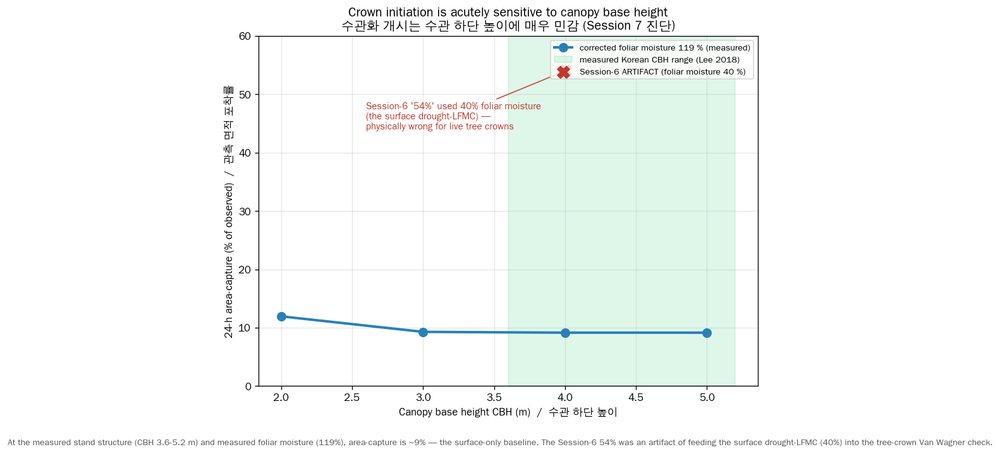

# Crown initiation sensitivity — Korean pine (Session 7 finding)

## Why this document exists

Session 6 reported that adding crown fire raised the Yeongdeok 24-hour
area-capture from 9 % to 54 %. Session 7's diagnostic found that **54 % was
an artifact**: the crown trigger used the surface live-fuel moisture (the
drought-cured-understory value, ~40 %) as the *tree-crown foliar moisture*
in the Van Wagner check. Live conifer crowns do not desiccate to 40 % — the
**measured** Korean value is 119 % (Lee et al. 2018) and even drought-
stressed live foliage stays ~80–90 %. At a physically realistic crown
foliar moisture, crown initiation almost vanishes.

This is not merely a bug report — the underlying physics is a genuine,
quantifiable finding: **Korean pine crown initiation is acutely sensitive
to canopy base height (CBH) and to the foliar-moisture assumption.** Stand
structure, not just weather, governs whether a fire becomes catastrophic.

## The numbers

Yeongdeok 2025, real SRTM terrain, 50 m cells, 24 h, surface dead 8 % /
LFMC 40 %, ambient 10-m wind 13.9 m/s (WAF-corrected midflame 1.39 m/s).
Area-capture (fraction of observed-approx area covered) vs **canopy base
height** and **surface fine-fuel load**, at the corrected/measured foliar
moisture of **119 %**:

| CBH \ load | 0.5 kg/m² | 0.7 kg/m² | 0.9 kg/m² |
|-----------:|----------:|----------:|----------:|
| 2 m | 11 % | 12 % | **27 %** |
| 3 m | 10 % | 9 % | 8 % |
| 4 m (measured central) | 10 % | 9 % | 8 % |
| 5 m | 10 % | 9 % | 8 % |

- **Across the measured Korean CBH range (3.6–5.2 m), capture is a stable
  8–10 %** — essentially the surface-only baseline. Crown fire does not
  meaningfully trigger at realistic stand structure + realistic foliar
  moisture, because the WAF-crushed surface intensity (I_B ≲ 1500 kW/m even
  with slope and channel-wind boosts) never reaches the Van Wagner critical
  intensity (I_o = 1686 kW/m at CBH 4 m, FMC 119 %).
- Capture only climbs (to 27 %) at **CBH 2 m** — below the Korean
  literature range — combined with the heaviest surface load.

For contrast, with the **buggy 40 % foliar moisture** the same sweep gives
54 % (CBH 4 m, Session-6 value) up to 96 % (CBH 2 m) — but at terrible
precision (IoU ~0.09): the artificially-low threshold lets the fire crown
almost everywhere and over-run the whole landscape.

## The physical / policy implication

The Van Wagner (1977) critical intensity scales as
$I_o = (C \cdot z \cdot (460 + 25.9\,M))^{1.5}$ — strongly increasing in both
canopy base height $z$ and foliar moisture $M$. For Korean *Pinus
densiflora* with surface fires of the modest intensity our (WAF-corrected)
model produces, crown initiation sits **right at the knife-edge** of the
$z$–$M$ threshold:

- **Raising CBH** (via thinning / pruning fuel-management) from ~3 m toward
  ~5 m moves the stand from "can crown under the strongest cells" to
  "essentially cannot crown" at realistic foliar moisture. This is a
  concrete, actionable mitigation lever — stand structure governs
  catastrophe potential, not only the weather.
- The result therefore carries an **uncertainty band, not a single value**:
  Yeongdeok 24-h area-capture is **~9 % at the measured stand structure
  (CBH 3.6–5.2 m, FMC 119 %)**, rising only if CBH is lower or foliar
  moisture is drier than measured.

## Honest caveats

- The surface fuel bed (load, depth, SAV) is still **provisional** (Korean
  surface-litter field data pending). The load sweep above (0.5–0.9 kg/m²)
  brackets that uncertainty and shows it is *secondary* to CBH/FMC.
- Our surface intensity may itself be too low (the WAF-corrected wind is
  ~1.4 m/s); if the real surface fire was more intense (gusts, lower fuel
  moisture), crowning would trigger more readily. The deeper bottleneck
  remains the surface-spread under-prediction from Session 5.
- The real 2025 Yeongdeok fire *did* crown. Our model failing to crown at
  realistic parameters means the crown trigger we have (Van Wagner from the
  modelled surface intensity) is not, by itself, sufficient to reproduce the
  event — consistent with the Session-5 conclusion that the surface model
  under-predicts the driving intensity.

## References

- Van Wagner, C.E. (1977). *Conditions for the start and spread of crown
  fire.* Can. J. For. Res. 7: 23–34.
- Lee, S.J. et al. (2018). *Crown fuel characteristics and allometric
  equations of Pinus densiflora in Gyeongbuk Province, Korea.* J. Korean
  Soc. Forest Sci. 107(4): 412–421. (CBH 3.6–5.2 m; foliar moisture 119 %.)
- Cruz, M.G., Alexander, M.E., Wakimoto, R.H. (2005). CJFR 35: 1626–1639.
