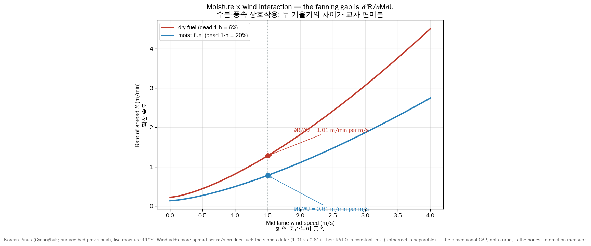

# Moisture–wind interaction in fire spread (corrected, Session 5)

## What was wrong (Session 4 retraction)

Session 4 reported a "multiplicative coupling" between live-fuel moisture
and wind with an "interaction ratio = 1.000," presented as a finding. **It
is a tautology and is retracted.**

Rothermel's rate of spread is *multiplicatively separable* in moisture and
wind. From the master equation (Rothermel 1972 eq. 52; Andrews 2018 eq. 52),
with no slope:

$$ R = \frac{I_R(M)\,\xi}{\rho_b\,\varepsilon\,Q_{ig}(M)}\,\big(1+\phi_w(U)\big)
     \;=\; \underbrace{h(M)}_{\text{moisture-only}}\cdot
            \underbrace{\big(1+\phi_w(U)\big)}_{\text{wind-only}} . $$

- The wind coefficient $\phi_w = C\,U^B(\beta/\beta_{op})^{-E}$ depends on
  the wind $U$ and bed geometry ($\sigma_T,\beta$) — **not** on moisture.
- The reaction intensity $I_R$ and heat-of-preignition $Q_{ig}$ depend on
  moisture $M$ — **not** on wind. The surface-area weights that set
  $\sigma_T$ are moisture-independent, so $\phi_w$ is too.

For any separable $R = K\,g(M)\,f(U)$, the four-corner ratio

$$ \frac{R(M_{\text{dry}},U_{\text{hi}})\;R(M_{\text{wet}},U_{\text{lo}})}
        {R(M_{\text{dry}},U_{\text{lo}})\;R(M_{\text{wet}},U_{\text{hi}})}
   = \frac{g(M_{\text{dry}})f(U_{\text{hi}})\;g(M_{\text{wet}})f(U_{\text{lo}})}
          {g(M_{\text{dry}})f(U_{\text{lo}})\;g(M_{\text{wet}})f(U_{\text{hi}})}
   \equiv 1 $$

**identically**, for *every* separable function. The "= 1.000" result
therefore says nothing about fire physics; it merely confirms the model is
separable (which we already knew from its algebra). It is removed from all
forward-looking artifacts.

## The correct, dimensional measure

The genuine interaction quantity is the **mixed partial derivative**
$\partial^2 R / \partial M\,\partial U$, and the operationally meaningful
report is the **marginal wind effect** $\partial R/\partial U$ (m/min of
spread per m/s of wind) at different moisture levels.

Using the literature-anchored Korean Pinus fuel (live moisture 119 %,
surface bed provisional) at a representative **midflame** wind of 1.5 m/s:

| Fuel state | $\partial R/\partial U$ (m/min per m/s) |
|------------|----------------------------------------:|
| dry (dead 1-h = 6 %) | **1.01** |
| moist (dead 1-h = 20 %) | **0.61** |

So **each additional m/s of midflame wind adds ~1.0 m/min of spread on dry
fuel but only ~0.6 m/min on moist fuel** — wind and dryness reinforce each
other. The mixed partial is $\partial^2 R/\partial M\,\partial U \approx
-2.0$ (m/min per m/s per unit dead-moisture fraction); the negative sign
means *drier fuel makes wind more dangerous*.

The "fanning" gap between the dry and moist curves — not a ratio — is the
honest visual of the interaction.

## The honest caveat

Because raw Rothermel is separable, two things are **structurally
guaranteed** and therefore not novel findings:

1. The **sign** $\partial^2 R/\partial M\,\partial U < 0$. (Since
   $\partial^2 R/\partial M\partial U = K\,g'(M)\,f'(U)$ with $g'<0$,
   $f'>0$.)
2. The **ratio** of the two slopes, $\partial_U R|_{\text{dry}} /
   \partial_U R|_{\text{moist}} = g(M_{\text{dry}})/g(M_{\text{moist}})$,
   is **constant across all $U$** — verified numerically to < 1 %
   (`interaction.separability_slope_ratio_across_U`,
   `tests/test_interaction.py`).

What is operationally useful is the **magnitude** of $\partial R/\partial U$
(a dispatcher cares that wind adds 1 m/min per m/s, not 0.6). What would be
genuinely *novel* is evidence that **real** fire spread has a cross-partial
**larger** than this separable baseline — i.e. super-multiplicative
coupling from processes Rothermel omits (spotting, fire-induced wind,
crown transitions). That requires empirical fire+weather data and is
scaffolded in `lfmc_model` / a future session, not claimed here.

## References

- Rothermel, R.C. (1972). USDA FS RP INT-115 (eq. 52, 47-50, 64).
- Andrews, P.L. (2018). USDA FS GTR RMRS-GTR-371 (§3; separable structure).
- Andrews, P.L. (2012). USDA FS GTR RMRS-GTR-266 (midflame WAF — the wind
  must be midflame for $\phi_w$ to be valid).
