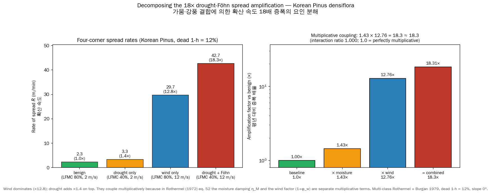

# LFMC × wind coupling — why simultaneous drought and Föhn was catastrophic

## The headline number, decomposed

Using the Korean Pinus densiflora multi-class fuel model at a fixed
typical-spring dead 1-h moisture of 12 %, slope 0°, the Rothermel rate of
spread at four corners of the (LFMC, midflame-wind) plane is:

| Corner | LFMC | midflame wind | R (m/min) | vs benign |
|--------|-----:|--------------:|----------:|----------:|
| A — benign | 80 % | 2 m/s | 2.33 | 1.00× |
| B — drought only | 40 % | 2 m/s | 3.34 | **1.44×** |
| C — wind only | 80 % | 12 m/s | 29.74 | **12.76×** |
| D — drought + Föhn | 40 % | 12 m/s | 42.66 | **18.31×** |

## The honest framing for the writeup

The March 2025 Yeongdeok catastrophe was **primarily wind-driven**: the
양강지풍 Föhn wind alone accounts for a **12.8×** amplification of the
surface-fire spread rate. Drought (low LFMC) alone accounts for a more
modest **1.4×**.

What made the event so severe was not either factor alone but their
**multiplicative coupling**: drought made an already-extreme wind day a
further 1.4× worse, so the combined amplification reached **18.3×**.

This is the scientifically precise statement. It would be wrong to claim
"drought caused the catastrophe" — wind dominated — but it is correct that
the *simultaneous* occurrence of drought and Föhn produced a spread rate
that neither could produce alone, because the two factors multiply.

## Why the coupling is multiplicative (Rothermel structure)

The multiplicativity is not an empirical accident; it is a structural
property of the Rothermel (1972) rate-of-spread equation (Andrews 2018
eq. 52):

$$ R = \frac{I_R \, \xi \, (1 + \phi_w + \phi_s)}{\rho_b \, \varepsilon \, Q_{ig}} $$

where the reaction intensity (Andrews 2018 eq. 27 / 58) carries the
moisture dependence through the moisture damping coefficient $\eta_M$:

$$ I_R = \Gamma' \, w_n \, h \, \eta_M(m_f, m_x) \, \eta_s . $$

- **Moisture** (LFMC) enters only through $\eta_M$ (and weakly through
  $Q_{ig} = 250 + 1116\,m_f$ in the denominator).
- **Wind** enters only through $\phi_w$, in the factor $(1 + \phi_w + \phi_s)$.

These are **separate multiplicative factors** in $R$. Holding slope at 0:

$$ R \;\propto\; \eta_M(\text{moisture}) \;\times\; (1 + \phi_w(\text{wind})) . $$

So scaling moisture and wind independently multiplies their effects on
$R$. Our numerical decomposition confirms this exactly:

$$ \underbrace{1.44}_{B/A,\ \text{moisture}} \times
   \underbrace{12.76}_{C/A,\ \text{wind}} = 18.31 =
   \underbrace{18.31}_{D/A,\ \text{combined}}, \qquad
   \text{interaction ratio} = \frac{D/A}{(B/A)(C/A)} = 1.000 . $$

An interaction ratio of exactly 1.000 means the coupling is perfectly
multiplicative — there is no synergistic "extra" beyond the product, and
no antagonism either. The catastrophe arithmetic is simply
moisture-factor × wind-factor.

## Verification

`wildfireguardian.spread_model.demo_lfmc_wind_decomposition.compute_decomposition()`
reproduces these numbers; `tests/test_lfmc_wind_decomposition.py` asserts
the interaction ratio is 1.0 to within 1 %, confirming the structural
multiplicativity holds across the implementation.

## References

- Rothermel, R.C. (1972). *A mathematical model for predicting fire spread
  in wildland fuels.* USDA FS RP INT-115. (Eq. 52 master equation; eq. 47-50
  wind factor; eq. 64 moisture damping.)
- Andrews, P.L. (2018). *The Rothermel surface fire spread model and
  associated developments.* USDA FS GTR RMRS-GTR-371. (§3, eqs. 27, 52, 58.)
- Burgan, R.E. (1979). USDA FS RP INT-226. (Dynamic live moisture of
  extinction used for the LFMC dependence.)
