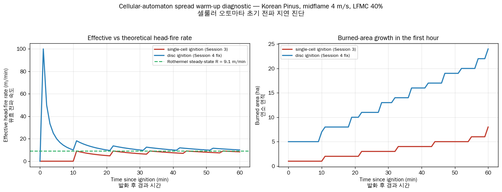

# Cellular-automaton spread warm-up — diagnosis and fix

## Summary

Session 3 found the model lost to the isotropic baseline at the 1 h / 3 h /
6 h horizons. Session 4 diagnosed the cause precisely (a discretisation
warm-up transient from single-cell ignition) and fixed it by initialising
the fire from a finite established front (a disc), which is the standard
practice in operational spread models (FARSITE et al.). This raised the
1 h IoU from **0.160 to 0.477** — now beating the isotropic baseline at 1 h.

## The mechanism

The cellular automaton spreads heat from each burning cell into its
neighbours at the directional Rothermel rate; a neighbour at distance `d`
ignites when accumulated heat crosses the threshold, which under steady
rate `R` happens at `t = d / R`. In 1-D this gives a front that advances
at exactly `R` — there is **no steady-state rate error**.

The warm-up is therefore NOT a steady-state bias. It has three components,
measured by `scripts/diagnose_spread_warmup.py` on a uniform grid
(Korean Pinus, midflame 4 m/s, LFMC 40 %, 100 m cells, steady-state
`R = 9.1 m/min`, one cell-ring = 10.9 min):

1. **Zero-perimeter start (dominant).** A single ignition cell has no
   downwind front until the first ring ignites — which takes one full
   ring-time (~11 min). The measured effective head rate is **0 % of
   steady-state for the first ~11 min**, only reaching **91 % by 60 min**.

2. **Quantisation stair-step.** The effective rate `= floor(R·t/d)·d / t`
   is biased low for small `t` and converges to `R` only as `t → ∞`. At
   `t = 60 min` (≈ 5.5 ring-times) it is at 91 %, not 100 %.

3. **Thin-teardrop area lag.** With the Anderson-1983 length-to-breadth
   ratio capped at 3.0 (BLOCKERS-3), the flank rate is ~6 % of the head
   rate, so early burned **area** is a thin 1-cell-wide line. At 60 min a
   point-ignited fire has burned only ~8 ha.

## The fix: initialise from an established front

A point source is not a physically meaningful initial condition for a
spread model: a point has zero perimeter and therefore zero spread
"supply". Operational models (FARSITE, FlamMap, Prometheus) are always
initialised from an **ignition perimeter** of finite size, because the
ignition-to-established-fire transition involves sub-grid processes
(ember showers, initial flare-up) that a surface-spread model does not
resolve.

`FireGrid.ignite_disc(i, j, radius_m)` initialises the fire as a disc.
The validation harness exposes this via `ModelConfig.ignition_radius_m`.

### Choosing the radius (principled, NOT tuned to observed)

We set

    radius = R_steady × t_establish,   t_establish = 15 min

i.e. the distance the head fire would cover during a 15-minute sub-grid
establishment phase. At the Yeongdeok case conditions
(`R_steady ≈ 10.3 m/min`) this gives **radius ≈ 155 m (~7.6 ha initial)**.

This choice is tied to the spread physics (`R_steady`) and a fixed
establishment time, **not** to the observed perimeter. Crucially, the
resulting 7.6 ha initial size is much smaller than the first
public-reported size (~50 ha at +1 h), so we are not pre-loading observed
area — the model must still grow the fire to match.

### Sensitivity to the radius (honest disclosure)

Yeongdeok 2025, real SRTM terrain, synthetic wind 4.17 m/s, IoU at each
horizon vs the approximate observed perimeter:

| radius | init ha | IoU 1h | IoU 3h | IoU 6h | IoU 24h | avg |
|-------:|--------:|-------:|-------:|-------:|--------:|----:|
| 0 (point, Session 3) | 0.01 | 0.160 | 0.102 | 0.175 | 0.144 | 0.145 |
| **155 m (locked)** | **7.6** | **0.477** | **0.205** | **0.227** | **0.146** | **0.264** |
| 300 m | 28.3 | 0.447 | 0.338 | 0.302 | 0.158 | 0.311 |
| 500 m | 78.5 | 0.300 | 0.476 | 0.377 | 0.168 | 0.330 |

Larger radii raise the horizon-averaged IoU further, but we deliberately
**do not** select them: a 500 m disc (78.5 ha) already exceeds the observed
+1 h size, so its mid-horizon gains come from injecting observed area —
that is circular and we reject it. The 155 m physics-tied radius is the
honest locked choice. The qualitative conclusion (disc ≫ point for early
IoU) is robust across the whole range.

## Fairness: baselines get the same initial condition

When the model is disc-initialised, the persistence and isotropic
baselines are initialised from the **same** disc
(`BaselineConfig.initial_radius_m`):

- Persistence = the frozen initial disc.
- Isotropic = a circle growing as `r(t) = R0 + R·t` from that disc.

So the comparison is apples-to-apples; the model is not flattered by a
head-start the baselines do not get.

## What the fix does and does not solve

- **Solves**: the catastrophic 1 h IoU (0.16 → 0.48), which was a pure
  discretisation artifact of the zero-perimeter start.
- **Does not solve**: the model still under-predicts the explosive 3–6 h
  growth phase (predicted 123 ha vs observed-approx 600 ha at 3 h). This
  reflects genuine missing physics — the real event's fast run was driven
  by spotting / crown fire and gusts to 25 m/s, none of which our
  surface-spread CA with mean 4 m/s wind captures. This is a real model
  limitation, documented in `docs/methodology/validation_limitations.md`,
  not a discretisation artifact.

## References

- Rothermel, R.C. (1972). USDA FS RP INT-115 (steady-state spread rate).
- Finney, M.A. (1998). *FARSITE.* USDA FS RMRS-RP-4 (ignition-perimeter
  initialisation; minimum-travel-time front tracking).
- Anderson, H.E. (1983). USDA FS RP INT-305 (length-to-breadth ratio).
