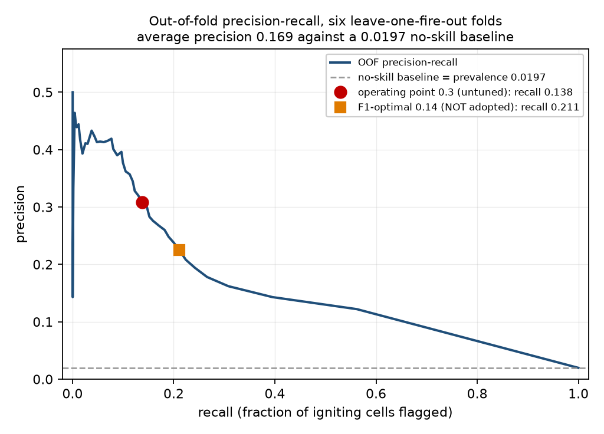

# 작동점 — AUC는 순위를 매기고, 재현율은 개수를 센다

WFG-019. **모델을 새로 학습하지 않았습니다.** 이미 커밋된 leave-one-fire-out
보류예측 확률을 읽어 다시 계산한 것입니다.

산출: `data/processed/operating_point/per_fire_recall.json`
그림: `docs/figures/auto/pr_curve_operating_point.png`
코드: `scripts/operating_point_evidence.py`
입력: `data/processed/spread_v2_lofo_oof_cells.csv.gz` (151,904행 / 2,989 발화셀),
`data/processed/oof_classification_metrics.json` (Session 18)

---

## 0. 이 문서가 답하는 질문

> "ROC-AUC 0.89는 순위를 잘 매긴다는 뜻입니다. 그런데 시뮬레이터가 실제로
> 쓰는 임계값에서, 실제로 불이 붙은 칸 중 몇 %를 잡습니까?"

이것이 기술 심사위원이 AUC 다음에 묻는 질문이고, 답은 불리합니다. Session 18이
통합(pooled) 재현율 **0.138**, 폴드평균 **0.0867**을 이미 기록했습니다. 이
문서는 그 답이 **어느 화재에서 나오는지**를 화재별로 보이고, 그 다음 질문
— "그러면 임계값을 재현율이 보장되도록 **보정**하면 되지 않습니까?" — 을
실제로 실행해 본 결과를 **부정적 결과(negative result)로** 기록합니다.

**어떤 기본값도 바뀌지 않았습니다.** `forward_sim_advance_threshold`는 0.3,
`walk_cutoff_p`는 0.5 그대로입니다. 이 문서는 그 값들에 대한 증거이지, 그
값들을 다시 조정한 기록이 아닙니다.

---

## 1. 임계값은 두 개이고, 같은 것이 아닙니다

이 절이 없으면 아래 표가 통째로 오독됩니다.

| 이름 | 값 | 무엇에 적용되는가 | 어느 면(surface)에 |
|---|---:|---|---|
| `time.forward_sim_advance_threshold` | **0.3** | 순방향 모의의 **매 스텝** 발화 확률 | 스텝별 확률장 |
| `pedestrian.walk_cutoff_p` | **0.5** | 도보 경로계획의 통행 불가 판정 | **누적** 생존확률 합성장 |

아래의 재현율은 전부 **0.3**에서, **스텝별** 확률에 대해 계산한 것입니다.
따라서 이 재현율은 **경로계획이 쓰는 위험장의 오탐/미탐률이 아닙니다.**
재현율이 낮다는 것은 모의된 화선 **범위가 천천히 자란다**는 뜻이고,
경로계획기는 그 범위가 만들어 낸 **누적장**을 0.5에서 자릅니다. 둘을 한
문장에 섞으면 양쪽 다 틀립니다.

두 값 모두 **이 확률들 위에서 튜닝된 적이 없습니다.** 0.3은
`config/default.yaml`의 기본값이고, F1로도 Youden's J로도 어떤 비용모형으로도
고른 값이 아닙니다.

---

## 2. 화재별 재현율 — 재현율은 거의 전부 영덕에서 나옵니다

임계값 0.3, 보류예측(out-of-fold) 확률 기준.

| 화재 | 셀 수 | 발화 셀 | 잡은 셀 | 재현율 | FNR | 전체 셀 최대 확률 |
|---|---:|---:|---:|---:|---:|---:|
| 강릉 2023 | 396 | 8 | 0 | 0.000 | **1.000** | **0.0241** |
| 홍성 2023 | 3,353 | 34 | 0 | 0.000 | **1.000** | **0.296** |
| 밀양 2022 | 3,019 | 24 | 0 | 0.000 | **1.000** | 0.369 |
| 의성·안동 2025 | 82,736 | 1,502 | 34 | 0.0226 | **0.977** | 0.720 |
| 울진·삼척 2022 | 41,651 | 652 | 27 | 0.0414 | **0.959** | 0.783 |
| 영덕 2025 | 20,749 | 769 | 351 | 0.456 | **0.544** | 0.850 |

세 가지를 함께 읽어야 합니다.

**① 세 화재는 참양성이 0입니다.** 그리고 그 이유가 화재마다 다릅니다.
강릉(0.0241)과 홍성(0.296)은 **폴드 안의 어떤 셀도 0.3에 닿지 못합니다** —
0.3이 이 두 화재에서는 참양성도 오탐도 만들 수 없는 값입니다. 이는 "재현율
0"보다 강한 진술이며, 임계값 자체가 이 폴드에 대해 작동 범위 밖이라는 뜻입니다.
밀양은 최대 확률 0.369로 0.3을 넘지만, 넘는 칸이 **불이 붙지 않은 칸 2개**뿐
입니다.

**② 발화 셀이 8·24·34개인 폴드입니다.** 강릉 폴드의 "재현율 0.000"은 8개를
놓쳤다는 뜻입니다. 비율만 보고 세 화재를 나머지 셋과 같은 무게로 읽으면
안 되고, 그것이 폴드평균 재현율(0.0867)이 통합 재현율(0.138)보다 낮은
구조적 이유입니다.

**③ 그래서 통합 재현율 0.138은 사실상 영덕 하나의 성적입니다.** 351/412,
즉 참양성의 85 %가 영덕에서 나옵니다. 영덕은 이 프로젝트의 시연 대상이면서,
동시에 훈련셋에 같은 주(2025-03-22~28)의 의성·안동 행이 부분적으로 겹쳐
들어가 있는 폴드이기도 합니다(연구 브리프 (c), WFG-032). **"보지 못한
화재에서 이만큼"이라는 문장은 이 폴드에서 가장 약합니다.**

**AUC 0.905와 재현율 0.138은 둘 다 참이고 서로 모순되지 않습니다.** AUC는
칸의 **순서**를 채점하고, 발화율 1.97 %에서는 순서를 잘 매긴 모델도 0.3
같은 절대 임계값에서는 적게 표시합니다. 순위 자체의 정직한 요약은 무작위
기준선(=발화율 0.0197) 대비 평균정밀도 **0.169**입니다.

곡선 위의 붉은 점이 실제로 쓰는 0.3, 주황 사각형이 이 데이터에서 F1이
최대가 되는 0.14입니다. **0.14는 채택하지 않았습니다** — 채점 대상인 바로 그
확률 위에서 고른 임계값은 낙관적으로 편향되기 때문입니다.

---

## 3. 그러면 임계값을 보정하면 되지 않습니까 — 실행해 본 결과

자연스러운 다음 수는 0.3을 변호하는 대신, **미탐률(FNR)이 보장되는 임계값을
고르는** 것입니다. 그래서 그렇게 해 봤습니다.

**절차(중첩 leave-one-fire-out).** 화재 하나를 빼고, 나머지 다섯 화재의
보류예측 확률 위에서 "발화 셀의 FNR ≤ 예산"을 만족하는 **가장 큰** λ를
고릅니다. 그 λ를 빼 두었던 화재에 적용해, (ㄱ) 경계가 지켜지는지 (ㄴ) 전체
지도의 몇 %를 표시하게 되는지를 잽니다. 예산은 FNR ≤ **0.20**.

**규약을 먼저 밝힙니다.** 비교는 **엄격 부등호**(`확률 < λ`이면 놓친 것)이고,
λ는 예산을 만족하는 후보 중 **가장 큰** 값입니다. 라운드-3의 두 검증본이
λ 값에서 서로 달랐던 이유가 정확히 이 규약 차이이므로, 여기서는 규약을 명시
하고 산출물을 출처로 삼습니다(`scripts/operating_point_evidence.py::lambda_for_budget`,
`tests/test_operating_point_evidence.py`가 규약을 고정합니다).

### (ㄱ) 보정만 한 경우 — 경계가 지켜지지 않습니다

| 제외 화재 | λ | 보정셋 FNR | **제외 화재 FNR** | 경계 | 전체 셀 표시 비율 |
|---|---:|---:|---:|:--:|---:|
| 강릉 2023 | 0.00758 | 0.200 | **0.750** | ✗ | 0.157 |
| 홍성 2023 | 0.00754 | 0.200 | **0.206** | ✗ | 0.157 |
| 밀양 2022 | 0.00745 | 0.200 | 0.0417 | ✓ | 0.158 |
| 의성·안동 2025 | 0.0174 | 0.200 | **0.592** | ✗ | 0.0992 |
| 울진·삼척 2022 | 0.00693 | 0.200 | 0.156 | ✓ | 0.163 |
| 영덕 2025 | 0.00525 | 0.200 | 0.0130 | ✓ | 0.185 |

여섯 중 **셋**에서 경계가 깨지고, 최악은 강릉의 **0.750**입니다. 보정셋에서
0.200을 정확히 맞춘 λ가 처음 보는 화재에서는 아무것도 보장하지 못합니다.

### (ㄴ) 유한표본 보정을 넣은 경우 — 경계는 지켜지고, 지도가 사라집니다

leave-one-out 보정항은 **1/(n+1)**이고, 보정 화재가 **n = 5**이므로
**0.167**입니다(Angelopoulos et al., *Conformal Risk Control*, ICLR 2024).
0.20 예산에서 이것을 빼면 실제 목표는 **0.0333** — 즉 **보정항 하나가 예산의
83 %를 먹습니다.** 이 산수가 이 절의 결론입니다.

| 제외 화재 | λ | 보정셋 FNR | 제외 화재 FNR | 경계 | 전체 셀 표시 비율 |
|---|---:|---:|---:|:--:|---:|
| 강릉 2023 | 0.000784 | 0.0332 | 0.000 | ✓ | **0.396** |
| 홍성 2023 | 0.000779 | 0.0332 | 0.000 | ✓ | **0.397** |
| 밀양 2022 | 0.000784 | 0.0331 | 0.0417 | ✓ | **0.396** |
| 의성·안동 2025 | 0.00234 | 0.0330 | 0.108 | ✓ | **0.260** |
| 울진·삼척 2022 | 0.000647 | 0.0329 | 0.0138 | ✓ | **0.427** |
| 영덕 2025 | 0.000546 | 0.0333 | 0.000 | ✓ | **0.456** |

이제 여섯 중 **여섯** 모두 경계를 지킵니다. 대가는 λ가 0.0005~0.0023까지
내려가고, 전체 셀의 **26.0 %~45.6 %**가 "위험"으로 표시된다는 것입니다.
실제 발화율은 **1.97 %**입니다. 지도의 3분의 1에서 절반을 칠하는 위험장은
대피 경로를 고를 때 아무 정보도 주지 않습니다 — 통과 가능한 길이 남지 않기
때문입니다.

### 결론 — 둘 중 하나만 가질 수 있습니다

**이 모델에서, n = 6으로는 유한표본 미탐률 보장과 쓸 수 있는 위험장을 동시에
가질 수 없습니다.** 어느 한 열만으로는 결론이 되지 않고, 두 열이 함께여야
결론이 됩니다. 보정 없이는 경계가 처음 보는 화재에서 깨지고(6분의 3), 보정을
넣으면 경계는 지켜지지만 위험장이 사실상 전면 마스크가 됩니다. 그래서 이
시스템의 작동점은 **보장을 가진 분류기가 아니라, 순위에 기반한 순방향
모의**로 남습니다. 0.3은 바뀌지 않았습니다.

### ⚠ 이 결론의 두 조각은 근거가 다릅니다 — 하나만 n에 관한 것입니다

이 절이 제출용으로 나가기 전에 자체 누출 감사(`mandela`)에서 걸린 지점이고,
그대로 적습니다. 위 결론은 두 진술의 합인데 근거의 성격이 다릅니다.

- **"보정항이 예산의 83 %를 먹는다"는 순수하게 n에 관한 산수입니다.**
  1/(n+1)은 데이터도 모델도 보지 않습니다. 화재가 6개인 한 이 값은 0.167이고,
  이 진술은 어떤 모델을 쓰든 참입니다.
- **"표시 비율 26~46 %"는 이 모델의 확률 분포에 관한 진술입니다.** λ가
  0.0005까지 내려가야 하는 이유는 예산이 좁기 때문이기도 하지만, 세 소규모
  화재의 발화 셀 확률이 0.3은커녕 0.03에도 못 미칠 만큼 **바닥에 몰려 있기**
  때문이기도 합니다. 이 실험은 두 원인을 **분리하지 않습니다.** "표본이 적어서"
  와 "이 모델의 확률이 화재별로 너무 눌려 있어서"는 이 표만으로 구분되지
  않으며, 그것을 구분하려면 확률 분포는 같고 화재별 구조만 지운 대조군(예:
  화재 내 확률 치환)이 따로 필요합니다. **없습니다.**

따라서 정직한 범위는 "**n = 6에서는 원리적으로 불가능하다**"가 아니라
"**이 모델을 이 6개 화재로 보정하면 쓸 수 없는 값이 나오고, 그 중 예산
산수만큼은 화재 수만의 문제다**"입니다. 부스에서도 이 범위로 말해야 합니다.

### ⚠ 보정셋 FNR 열은 결과가 아니라 구성 확인입니다

표의 `보정셋 FNR`이 예산과 거의 같은 것(0.200, 0.0333)은 발견이 아니라
**λ를 그렇게 고른 결과**입니다. λ는 그 값이 예산을 넘지 않도록 정의되었으므로,
그 열은 "탐색이 의도대로 동작했다"는 확인일 뿐 읽을 결과가 아닙니다. 읽을
것은 **제외 화재 FNR**과 **표시 비율** 두 열입니다.

### ⚠ 규약 선택은 결론에 유리한 쪽이 아니라 불리한 쪽입니다

§3의 규약("가장 큰 λ")은 예산을 만족하는 후보 중 **가장 덜 보수적인** 값을
고릅니다. 즉 표시 비율을 **가능한 한 작게** 만드는 선택이며, 결론("표시 비율이
너무 크다")을 약화시키는 방향입니다. 더 보수적인 규약을 쓰면 표시 비율은
올라가기만 합니다. 규약을 우리에게 유리하게 고르지 않았다는 뜻입니다.

### ⚠ 여섯 폴드는 여섯 개의 독립 사건이 아닙니다

의성·안동 2025와 영덕 2025는 같은 2025-03-22~28의 같은 복합 화재이고 경계
상자가 겹칩니다. 따라서 위의 "다섯 화재로 보정"은 실제로는 **네 개의 독립
사건 + 한 쌍**이며, n = 5라는 계수 자체가 낙관적입니다. 보정항은 실제보다
작게 잡혀 있습니다(WFG-032).

### ⚠ 위의 어느 열도 실제 보장이 아닙니다 (교환가능성 위반)

정직하게 두 번 깨집니다. **첫째**, 화재 *g*의 보류예측 확률은 나머지 다섯
화재로 학습한 모델이 낸 값입니다. 즉 "보정 화재"와 "제외 화재"는 교환가능한
표본이 아니고, 보정셋은 시험셋을 채점한 모델과 얽혀 있습니다. **둘째**,
1/(n+1)은 **화재 단위**의 유한표본 항인데 분위수는 **셀 단위**로 잡았습니다.
한 화재 안의 셀들은 서로 독립도, 다른 화재의 셀과 동일분포도 아닙니다.

따라서 (ㄴ)는 "진짜 보장이 얼마나 비싼가"에 대한 **낙관적 하한**이지 보장이
아닙니다. 낙관적으로 잡아도 못 쓴다는 것이 이 절의 논지이므로 결론은
바뀌지 않지만, 이 표를 "우리는 conformal 보장을 했습니다"로 읽으면 안 됩니다.

---

## 4. 이 문서가 보여주지 않는 것

- **경로계획 위험장의 미탐률이 아닙니다.** §1의 두 임계값·두 면 구분을
  건너뛰고 이 재현율을 라우팅 성능으로 인용하면 틀립니다.
- **여섯 화재의 모델 품질 순위가 아닙니다.** 세 화재의 발화 셀이 8·24·34개
  이므로 그 폴드의 비율은 순위를 지지할 만큼 정밀하지 않습니다.
- **여기서 계산한 어떤 λ도 채택되지 않았고, 채택될 수 없습니다.** 모두
  교환가능성이 깨진 절차의 산물입니다.
- **"몇 분 뒤에 불이 여기 온다"의 정확도가 아닙니다.** 라벨은 "이 500 m 칸이
  **다음 위성 통과 시점까지** 발화하는가"이며, 시간 해상도는 통과 주기입니다.
- **NDWS·WSTS의 PR-AUC/AP와 비교할 수 없습니다.** 라벨 정의, 기하, 발화율이
  전부 다릅니다(`docs/MODEL_CARD.md`의 비교 금지 절).

---

## 5. 출처 — 이 문서의 현재 값이 대응하는 레지스트리 키

`docs/NUMBERS.json`에 등록되어 `make verify`가 커밋된 산출물에서 다시
계산합니다. 아래 키는 이 문서가 새로 등록한 것들입니다(17개, 전부
`A_operating_point` 암(arm)).

**값은 이 표에 다시 적지 않습니다.** §2와 §3의 표가 값의 유일한 자리이고,
여기는 "그 값이 어느 키에 들어 있는가"만 적습니다 — 한 문서 안에서 같은
수를 두 번 쓰면 그 둘이 어긋날 수 있고, 그것이 이 저장소가 레지스트리를
두는 이유이기 때문입니다.

| §2·§3의 어느 값인가 | 키 |
|---|---|
| 의성·안동 폴드의 FNR | `optpoint_uiseong_fnr_advance_cut` |
| 울진·삼척 폴드의 FNR | `optpoint_uljin_fnr_advance_cut` |
| 영덕 폴드의 FNR | `optpoint_yeongdeok_fnr_advance_cut` |
| 강릉 폴드의 전체 셀 최대 확률 | `optpoint_gangneung_ceiling_probability` |
| 홍성 폴드의 전체 셀 최대 확률 | `optpoint_hongseong_ceiling_probability` |
| 밀양 폴드의 전체 셀 최대 확률 | `optpoint_miryang_ceiling_probability` |
| 참양성이 0인 폴드의 개수 | `optpoint_zero_truepositive_fold_tally` |
| 유한표본 보정항 1/(n+1) | `lofocal_finite_sample_correction` |
| 보정항이 예산에서 차지하는 몫 | `lofocal_correction_share_of_budget` |
| (ㄱ) 경계를 지킨 제외-화재 수 | `lofocal_uncorrected_bound_upheld_tally` |
| (ㄱ) 최악의 제외-화재 FNR | `lofocal_uncorrected_heldout_fnr_worst` |
| (ㄱ) 표시 비율의 하한 / 상한 | `lofocal_uncorrected_flagged_share_floor` / `..._ceiling` |
| (ㄴ) 경계를 지킨 제외-화재 수 | `lofocal_corrected_bound_upheld_tally` |
| (ㄴ) 최악의 제외-화재 FNR | `lofocal_corrected_heldout_fnr_worst` |
| (ㄴ) 표시 비율의 하한 / 상한 | `lofocal_corrected_flagged_share_floor` / `..._ceiling` |

이미 등록되어 있어 다시 등록하지 않은 값과 그 키:

- 통합 재현율 → `oof_pooled_recall_at_operating_threshold`
- 폴드평균 재현율 → `oof_mean_of_folds_recall_at_operating_threshold`
- 평균정밀도 → `oof_average_precision`
- 발화율 → `oof_prevalence`

산출물 `per_fire_recall.json`은 통합·폴드평균 재현율을 셀 단위 파일에서 다시
계산해 Session 18 값과 대조하며, **불일치하면 스크립트가 쓰기를 거부합니다.**

---

## 6. 방법을 누가 제안했는가 (AI 원장)

중첩 LOFO 임계값 보정과 이를 부정적 결과로 보고한다는 구성은 자율 루프가
제안했습니다(WFG-019, 연구 브리프 (d)). 교환가능성 위반 두 가지와 §3의
"둘 중 하나만" 결론도 루프가 작성했습니다. 학생은 이 문서 전체를 부스에서
설명할 수 있어야 하며, 그 설명의 핵심은 두 문장입니다: **"AUC는 순위를
매기고 재현율은 개수를 셉니다. 화재가 여섯 개뿐이라, 미탐률을 보장하려면
지도의 절반을 칠해야 해서 보장을 포기하고 순위를 씁니다."**
