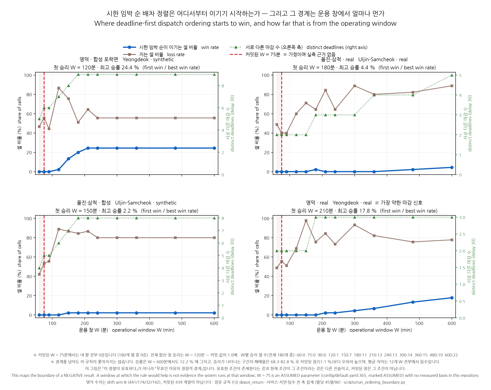

# 배차 정렬의 유효 경계 — 무효인 이유를 12개 점에서 정량화했습니다

PHASE 24. 산출물 [`ordering_boundary.json`](../data/processed/ordering_boundary.json),
스크립트 [`run_ordering_boundary.py`](../scripts/run_ordering_boundary.py) ·
[`make_ordering_boundary_figure.py`](../scripts/make_ordering_boundary_figure.py),
그림 [`ordering_boundary.png`](figures/ordering_boundary.png),
등록 6건 (`ordering_boundary_*`, [`NUMBERS.json`](NUMBERS.json)).

**[`dispatch_ordering.md`](dispatch_ordering.md)(PHASE 23)의 확장입니다. 그 문서를
먼저 읽으십시오.**

---

## 0. 한 문단 요약

> **PHASE 23 의 결론은 그대로입니다.** 「시한 임박 순 정렬」은 **커밋된 구성에서
> 무효**이며, 이번 실행은 그것을 셀 단위로 재현했습니다 — W = 75 에서 180개 셀
> 중 **0승**, 3,744개 값 전부 일치. **이번에 추가된 것은 「무효인 이유의 정량적
> 경계」뿐입니다.**

W 축을 2점(75 · 240)에서 12점(60 · 75 · 90 · 120 · 150 · 180 · 210 · 240 ·
300 · 360 · 480 · 600)으로 채워 **2,160개 셀**을 측정했습니다. 승률이 0 에서
벗어나는 최초의 W 는 **120분**으로, 커밋된 75분의 **1.6배**입니다.

⚠ **그러나 경계를 넘어도 이 규칙이 좋아지지는 않습니다.** 전체 승률은 W = 600
에서도 **12.2 %** 에 그치고, 승리가 나타나는 구간(W ≥ 120)의 패배율은
**68.3–82.8 %** 로 오히려 커밋된 창(51.1 %)보다 **높으며**, 평균 차이
(시한 임박 순 − 가까운 순)는 **12개 W 전부에서 음수**입니다 (−1.90 ~ −4.42).
즉 측정된 것은 「어디서부터 이 규칙이 옳아지는가」가 아니라 **「어디서부터 이
규칙이 가끔 이기기 시작하는가」**입니다.

⚠ **그리고 단일 임계값은 존재하지 않습니다.** W 단독으로도, 「서로 다른 마감
수」 단독으로도 승패가 갈리지 않습니다. §6–§7.

⚠ **커밋된 W = 75 는 가정이며 실측 근거가 저장소에 없습니다.**
`config/default.yaml:365` 가 그 줄을 `# ASSUMED` 로 표시하고 있습니다. §8.

---

## 1. ⚠ 이 문서를 잘못 읽는 법

이 문서에는 「시한 임박 순이 이기는 W 가 존재한다」는 측정이 들어 있습니다.
그것은 **다음을 뜻하지 않습니다.**

| 이 문서가 말하는 것 | 이 문서가 말하지 않는 것 |
|---|---|
| 유효한 조건이 **존재한다** | 현재 조건이 **그 조건이다** |
| 경계는 W ≈ 120분 부근에서 시작한다 | 이 시스템이 그 창으로 운용된다 |
| 경계 위에서는 승률이 0 을 벗어난다 | 경계 위에서는 이 규칙이 좋다 |
| 커밋된 75분은 경계 아래에 있다 | 75분이 실제 운용 값이다 (실측 근거 없음) |

**유효한 조건이 존재한다는 것과 현재 조건이 그것이라는 것은 다른 진술이고,
두 번째는 여전히 거짓입니다.** PHASE 23 §8 의 확정 서술
(「정보가 기여이고, 정렬은 조건부이며 커밋된 W = 75 는 그 조건이 아니다」)은
이번 실행으로 **바뀌지 않았고, 오히려 더 좁게 확인됐습니다** — 조건을 만족시켜도
이득은 작고 방향은 대체로 여전히 불리하기 때문입니다.

**출력 정렬은 바꾸지 않았습니다.** `printable.py::DISPATCH_HEADING` 과
`live/pipeline.py::WALK_DISPATCH_HEADING` 그대로이고, `outputs/dispatch*` 와
일치합니다.

---

## 2. 무엇을 재사용했고 무엇을 바꿨는가

**새 모형은 없습니다.** [`run_dispatch_ordering.py`](../scripts/run_dispatch_ordering.py)
를 모듈로 import 해 `build_arm` · `sweep` · `simulate` · `fixed_orders` ·
`summarise` · `binding_constraint` · `closure_profile` · `point_to_point` ·
`committed_model_order_invariance` · `scan_ranks` 를 **그대로 호출**합니다.

바꾼 모듈 속성은 **둘뿐**입니다:

| 속성 | 이전 | 이번 | 성격 |
|---|---|---|---|
| `WINDOWS` | `[75, 240]` | 12개 점 | 축 확장 |
| `binding_constraint` | — | **감싸기만** | 원본을 먼저 호출하고 `deadline_spread`(분산·엔트로피·최빈값 점유율) 키만 **추가**. 원본 값은 원본이 계산합니다 |

**그대로 둔 것**: 점유 규칙 (나) `depot_return` / (가) `inter_point`,
복귀 가정, 서비스 시간 정의, 성공 판정 `도착 ≤ min(ingress_survival, 지연 + W)`,
네 팔, 고정 순서 4종, 무작위 시드 0..199, drift arm B 단언, **라우팅 로직**.

### ⚠ 영덕 real 은 이번에도 유지했습니다

네 팔 전부 유지했습니다. 제외 지시는 PHASE 23 §3 이 기록한 대로 **다른
`vehicle_cutoff`(0.30, `hazard-resolution` 브랜치)에서 나온 전제**에 근거했고,
이 저장소의 0.70 에서는 성립하지 않습니다. PHASE 23 도 그 지시를 따르지 않았고
(산출물의 `⚠ arm_that_was_going_to_be_excluded` 블록), 이번에도 따르지
않았습니다.

### ⚠ 영덕 팔의 계보

**drift arm B** — 441 원점 / 174 구조 필요 / 32 도달 불가 / 142 배차. 스크립트가
단언하고 어긋나면 멈춥니다. 커밋된 계열 439 / 167 / 24 / 143 과 **평균·조정·
대체하지 마십시오** ([HANDOFF_ROUND3](HANDOFF_ROUND3.md) §5 규칙 5).

---

## 3. ⚠ §4-B 전제 확인 — 지시받은 인용을 먼저 조회했습니다

[HANDOFF_ROUND3](HANDOFF_ROUND3.md) §4-B 의 규칙에 따라, 착수 전에 인용된 값과
선행 작업을 전부 저장소에서 확인했습니다. 결과는 산출물의
`⚠ premise_checks_HANDOFF_4B` 에 기계 판독 가능한 형태로 들어 있습니다.

| 인용 | 조회 결과 |
|---|---|
| 「W = 75 에서 180개 셀 중 0승」 | **확인됨** — `summary.by_window.W75` = 0승 / 88무 / 92패 |
| 「W = 240 에서 13개 셀에서 이김」 | **확인됨** — `summary.by_window.W240` = 13 / 44 / 123 |
| 「PHASE 23 이 159초」 | **확인됨** — 산출물 `total_seconds` = 159.1. ⚠ `dispatch_ordering.md` §11 은 이를 「약 155초」로 적고 있습니다. **산출물이 근거이고 159.1 이 맞습니다.** |
| 「영덕 real 제외 지시가 잘못이었다」 | **확인, 단 정정 있음** — 지시가 잘못이었다는 것은 맞습니다(0.30 브랜치 전제). 그러나 **PHASE 23 은 그 지시를 이미 따르지 않았습니다** — 네 팔 전부 돌렸고 산출물에 거부 근거를 남겼습니다. 되돌릴 것이 없습니다 |
| 「그 팔이 가장 불리한 결과를 냈다」 | **부분 확인** — **커밋된 셀에서는 맞습니다**(8팀 13 대 가까운 순 24, 네 팔 중 최저). **전체 집계로는 아닙니다** — PHASE 23 기준 영덕 real 1승/31무/58패, 울진 real 0승/43무/47패로 승수는 울진 real 이 더 낮습니다. 두 문장을 구별해 쓰십시오 |
| 「순서 5종 — 시한 임박 · 가까운 · 목록 · 무작위 200시드 · 감도용 지점간」 | ⚠ **정정** — 아래 |

### ⚠ 「순서 5종」 열거의 정정 — 보수적으로 해결했습니다

지시의 열거는 **축 하나를 다른 축으로 잘못 부르고, 실재하는 순서 하나를
빠뜨립니다.**

- PHASE 23 의 순서는 **고정 4종 + 무작위**입니다: 시한 임박 순
  (`deadline_closing_window`) · 가까운 순 (`nearest_eta`) ·
  **폐쇄 이른 순 (`earliest_closure`)** · 목록 순 (`list_order`) ·
  무작위 200시드.
- **「감도용 지점간」은 순서가 아닙니다.** `inter_point` 는 **점유 규칙** (가)
  이며, 「목록을 어떤 순서로 걷는가」가 아니라 「구조를 마친 팀이 다음에 어디서
  출발하는가」를 바꿉니다. 정렬 축과 **직교**합니다.

**해결**: PHASE 23 의 격자를 **그대로** 재사용했습니다. 그러면 열거된 5개 항목이
전부 들어가고 **폐쇄 이른 순도 유지**됩니다. 축을 더하지도 빼지도 않았습니다 —
가장 보수적인 선택입니다.

---

## 4. ⚠ PHASE 23 재현 대조 — 최우선 보고 사항

**재현됐습니다.** W = 75 와 W = 240 의 모든 셀을 값 단위로 대조했습니다.

| 대조 항목 | 결과 |
|---|---|
| 셀 단위 값 대조 | **3,744개 값, 차이 0개** (4 팔 × 2 창 × 3 service × 3 지연 × 2 점유 × [4 순서 × 5 팀수 + 무작위 5 + binding_constraint]) |
| 헤드라인 집계 W = 75 | PHASE 23 `0 / 88 / 92` → 이번 `0 / 88 / 92` **일치** |
| 헤드라인 집계 W = 240 | PHASE 23 `13 / 44 / 123` → 이번 `13 / 44 / 123` **일치** |
| 파이프라인 카운트 (네 팔 전부) | **일치** |
| `config_hash` | **일치** (`f21177ab…cc80`) |
| drift arm B 단언 | 통과 (441 / 174 / 32 / 142) |

커밋된 셀(W = 75, service 25분, 지연 30분, 8팀)도 `dispatch_ordering.md` §4 의
표를 그대로 재현합니다:

| 팔 | 시한 임박 | 가까운 | 폐쇄 이른 | 목록 | 무작위 평균 |
|---|---:|---:|---:|---:|---:|
| 영덕 합성 | 19 | **24** | 19 | 16 | 16.49 |
| 울진·삼척 real | 19 | **24** | 19 | 18 | 17.99 |
| 울진·삼척 합성 | 16 | **24** | 16 | 17 | **18.48** |
| 영덕 real | **13** | **24** | 13 | 16 | 15.74 |

**소요 시간**: 176.2초 (실측). 예상은 약 30분이었으나, 계산 시간을 지배하는 것은
격자 스윕이 아니라 **팔마다 한 번뿐인 시나리오 구축·파이프라인 실행**이었습니다.
W 를 6배로 늘려도 총 시간은 159.1초 → 176.2초 로 **11 % 만** 늘었습니다.

---

## 5. STEP 2-A — W 별 승패 곡선

점유 (나) `depot_return`, W 당 180개 셀 (4 팔 × 3 service × 3 지연 × 5 팀수).
승/무/패는 **시한 임박 순 대 가까운 순**입니다.

### 전체 합산

| W (분) | 승 | 무 | 패 | 승률 | 패배율 | 평균 차이 |
|---:|---:|---:|---:|---:|---:|---:|
| 60 | **0** | 96 | 84 | 0.0 % | 46.7 % | −1.90 |
| **75 (커밋)** | **0** | 88 | 92 | **0.0 %** | 51.1 % | −2.42 |
| 90 | **0** | 94 | 86 | 0.0 % | 47.8 % | −2.48 |
| **120** | **1** | 42 | 137 | **0.6 %** | 76.1 % | −3.87 |
| 150 | 7 | 24 | 149 | 3.9 % | 82.8 % | −4.29 |
| 180 | 11 | 45 | 124 | 6.1 % | 68.9 % | −3.66 |
| 210 | 13 | 23 | 144 | 7.2 % | 80.0 % | −4.01 |
| 240 (탐색) | 13 | 44 | 123 | 7.2 % | 68.3 % | −3.91 |
| 300 | 14 | 23 | 143 | 7.8 % | 79.4 % | −4.42 |
| 360 | 15 | 31 | 134 | 8.3 % | 74.4 % | −4.01 |
| 480 | 19 | 29 | 132 | 10.6 % | 73.3 % | −4.14 |
| 600 | 22 | 22 | 136 | **12.2 %** | 75.6 % | −4.24 |

⚠ **승률이 0 에서 벗어나는 최초의 W 는 120분입니다.** 60 · 75 · 90 은 전부 0승.

⚠ **패배율과 평균 차이를 함께 보십시오.** 승률이 오르는 구간에서 **패배율은
줄지 않습니다** (오히려 W = 120–150 에서 76–83 % 로 최고). 평균 차이는 12개 W
**전부에서 음수**입니다. 승률만 떼어 인용하면 곡선의 방향이 반대로 읽힙니다.

### 팔별 (W 당 45개 셀)

| W | 영덕 합성 | 울진·삼척 real | 울진·삼척 합성 | 영덕 real |
|---:|---|---|---|---|
| 60 | 0/24/21 | 0/23/22 | 0/26/19 | 0/23/22 |
| **75** | **0**/20/25 | **0**/27/18 | **0**/21/24 | **0**/20/25 |
| 90 | 0/25/20 | 0/27/18 | 0/20/25 | 0/22/23 |
| 120 | **1**/5/39 | 0/18/27 | 0/5/40 | 0/14/31 |
| 150 | 6/5/34 | 0/13/32 | **1**/5/39 | 0/1/44 |
| 180 | 9/13/23 | **1**/15/29 | 1/6/38 | 0/11/34 |
| 210 | 11/5/29 | 0/7/38 | 1/5/39 | **1**/6/38 |
| 240 | 11/9/25 | 0/16/29 | 1/8/36 | 1/11/33 |
| 300 | 11/9/25 | 0/5/40 | 1/8/36 | 2/1/42 |
| 360 | 11/9/25 | 0/9/36 | 1/8/36 | 3/5/37 |
| 480 | 11/9/25 | 1/7/37 | 1/8/36 | 6/5/34 |
| 600 | 11/9/25 | 2/3/40 | 1/8/36 | 8/2/35 |

**승률이 0 을 벗어나는 최초의 W, 팔별**: 영덕 합성 **120** · 울진·삼척 합성
**150** · 울진·삼척 real **180** · 영덕 real **210**.

⚠ 축 전체에서 **최고 승률**: 영덕 합성 24.4 % · 영덕 real 17.8 % ·
울진·삼척 real 4.4 % · 울진·삼척 합성 **2.2 %**. 어느 팔도 과반에 이르지
않습니다.

⚠ **곡선의 모양이 팔마다 다릅니다.** 영덕 합성은 W = 210 에서 24.4 % 로 **포화**
하고 더 오르지 않습니다. 영덕 real 은 포화 없이 **계속 오릅니다**. 울진·삼척
합성은 W = 150 이후 **2.2 % 에 고정**됩니다. 하나의 곡선으로 요약할 수 없습니다.

---

## 6. STEP 2-B — 「서로 다른 마감」 수와의 관계

`deadline = min(ingress_survival, 지연 + W)` 는 모든 순서가 정렬하는 키입니다.
그 키가 실어 나를 수 있는 정보량을 (팔, W) 마다 산출했습니다 — 지연 30분 기준.
`n_distinct_deadlines` 는 PHASE 23 이 이미 세던 값이고, 분산·엔트로피·최빈값
점유율은 이번에 추가한 것입니다.

**정규 엔트로피** = 마감 값 분포의 Shannon 엔트로피 ÷ log₂(배차 지점 수).
0 이면 전원이 같은 마감, 1 이면 전원이 서로 다른 마감입니다.

| 팔 | W | 서로 다른 마감 | 정규 엔트로피 | 표준편차(분) | 최빈값 점유 | **회랑이 결정** | **창이 결정** | 승률 |
|---|---:|---:|---:|---:|---:|---:|---:|---:|
| 영덕 합성 (142곳) | 60 | 5 | 0.240 | 40.4 | 42.3 % | 57.7 % | 42.3 % | 0.0 % |
| | **75** | **6** | 0.268 | 46.3 | 38.0 % | 62.0 % | 38.0 % | **0.0 %** |
| | 120 | 7 | 0.294 | 64.5 | 37.3 % | 66.2 % | 33.8 % | 2.2 % |
| | 180 | 9 | 0.359 | 76.3 | 37.3 % | 95.1 % | 4.9 % | 20.0 % |
| | 240–600 | 9 | 0.359 | 79.1 | 37.3 % | **100 %** | 0 % | 24.4 % |
| 울진·삼척 real (116곳) | **75** | **2** | **0.018** | 13.7 | **98.3 %** | **1.7 %** | 98.3 % | **0.0 %** |
| | 240 | 3 | 0.029 | 36.0 | 97.4 % | 2.6 % | 97.4 % | 0.0 % |
| | 600 | 5 | 0.065 | 97.7 | 94.0 % | 6.0 % | 94.0 % | 4.4 % |
| 울진·삼척 합성 (127곳) | **75** | **5** | 0.185 | 16.2 | 73.2 % | 26.8 % | 73.2 % | **0.0 %** |
| | 180 | 8 | 0.345 | 58.2 | 44.9 % | 55.1 % | 44.9 % | 2.2 % |
| | 240–600 | 8 | 0.345 | 70.9 | 44.9 % | **100 %** | 0 % | 2.2 % |
| 영덕 real (124곳) | **75** | **2** | 0.133 | 49.7 | 66.1 % | 33.9 % | 66.1 % | **0.0 %** |
| | 240 | 3 | 0.154 | 127.0 | 63.7 % | 36.3 % | 63.7 % | 2.2 % |
| | 600 | 3 | 0.154 | **298.4** | 63.7 % | 36.3 % | 63.7 % | 17.8 % |

전체 표는 산출물 `deadline_statistics_by_arm_and_window` 에 12개 W × 3 지연으로
들어 있습니다.

### 상관 — ⚠ 인과가 아닙니다

셀 단위(2,160개) 상관입니다.

| 쌍 | Spearman | Pearson |
|---|---:|---:|
| 서로 다른 마감 수 ↔ 승리 여부 | **+0.244** | +0.234 |
| 정규 엔트로피 ↔ 승리 여부 | **+0.251** | +0.214 |
| 회랑 결정 비율 ↔ 승리 여부 | **+0.229** | +0.245 |
| 서로 다른 마감 수 ↔ **차이의 크기** | **−0.022** | +0.017 |

⚠ **기제는 이미 PHASE 23 §6 이 규명했습니다** — `min(survival, 지연+W)` 의 어느
항이 구속하는지를 세어서입니다. 위 계수는 **그 기제의 정량화이지 근거가
아닙니다.** W · 서로 다른 마감 수 · 회랑 결정 비율은 **구성상 함께 움직이므로**
(W 를 늘리는 것이 곧 회랑 항을 구속하게 만드는 것) 이 설계로는 분리할 수
없습니다.

⚠ **마지막 줄을 보십시오.** 마감 수는 「가끔 이기는가」와 약하게 관계있지만
**「얼마나 이기는가」와는 사실상 무관합니다**(−0.022). 마감 정보가 늘어도 차이의
크기는 커지지 않습니다.

### 관계가 단조롭지 않습니다

| 서로 다른 마감 수 | 셀 | 승 | 승률 | 패배율 | 평균 차이 |
|---:|---:|---:|---:|---:|---:|
| 2 | 465 | **0** | 0.0 % | 54.2 % | −2.65 |
| 3 | 540 | 22 | 4.1 % | 75.7 % | −4.50 |
| 4 | 120 | 1 | 0.8 % | 65.0 % | −3.64 |
| 5 | 135 | 2 | 1.5 % | 73.3 % | −3.71 |
| 6 | 120 | **0** | **0.0 %** | 70.8 % | −3.52 |
| 7 | 105 | **0** | **0.0 %** | 80.0 % | −4.17 |
| 8 | 360 | 9 | 2.5 % | 81.4 % | −5.56 |
| 9 | 315 | 81 | **25.7 %** | 58.4 % | −1.09 |

⚠ 마감이 **6개·7개**인 셀은 승률이 **0 %** 인데, **3개**인 셀은 4.1 % 입니다.
**단조 증가가 아닙니다.** +0.24 라는 약한 상관은 사실상 **마감 9개 구간
(영덕 합성 W ≥ 180) 하나가 만들어낸 것**입니다.

가장 선명한 반례 두 개:

- **영덕 real** — 마감이 **3개**뿐인데 W = 600 에서 승률 **17.8 %**.
  마감 값의 개수는 W = 180 이후 늘지 않지만 **표준편차는 99 → 298분으로**
  계속 벌어집니다(0 에 묶인 42곳은 그대로, 나머지가 창을 따라 올라감).
- **울진·삼척 합성** — 마감이 **8개**나 되고 회랑이 100 % 결정하는데 승률은
  **2.2 %** 에 고정.

**따라서 「서로 다른 마감 수」는 승패의 예측자가 아닙니다.** 개수가 아니라
**퍼짐**이, 그리고 그것조차 다른 축과 함께여야 움직입니다.

---

## 7. STEP 2-C — 임계 판정

### ⚠ 단일 임계값은 존재하지 않습니다

억지로 하나의 수를 만들지 않았습니다. 세 가지를 각각 검정했습니다.

**① W 단독으로 결정되는가 — 아니오.**

W 단독이 충분하려면 어떤 값 위의 모든 셀이 이기고 아래의 모든 셀이 져야
합니다. 실제로는 **최소 승리 W = 120, 최대 비승리 W = 600** 으로 두 구간이
**완전히 겹칩니다.** W = 600 에서도 180개 셀 중 158개는 이기지 못합니다.

**② 서로 다른 마감 수가 몇 개 이상이어야 하는가 — 그런 값이 없습니다.**

| 항목 | 값 |
|---|---:|
| 승리 셀의 최소 마감 수 | 3 |
| 비승리 셀의 최대 마감 수 | 9 |
| 마감 수 ≥ 3 인데 이기지 못한 셀 | **1,580개** |
| 깨끗한 분리 | **없음** |

마감 수 3 이상을 조건으로 걸면 비승리 셀 1,580개가 함께 딸려 옵니다. §6 의
비단조성이 그대로 여기서 나타납니다.

**③ 팀 수·서비스 시간·지연과의 상호작용 — 있습니다. 그것도 강하게.**

| 축 | 값 | 셀 | 승 | 승률 | 평균 차이 |
|---|---|---:|---:|---:|---:|
| **팀 수** | 1 | 432 | **0** | **0.0 %** | −2.13 |
| | 2 | 432 | 8 | 1.9 % | −3.35 |
| | 3 | 432 | 19 | 4.4 % | −4.08 |
| | 5 | 432 | 31 | 7.2 % | −4.69 |
| | 8 | 432 | 57 | **13.2 %** | −3.80 |
| **서비스 시간** | 12.5분 | 720 | 66 | **9.2 %** | −5.27 |
| | 25분 (기준) | 720 | 32 | 4.4 % | −3.95 |
| | 50분 | 720 | 17 | 2.4 % | −1.62 |
| **출동 지연** | 0분 | 720 | 6 | 0.8 % | −1.25 |
| | 30분 (커밋) | 720 | 9 | **1.2 %** | **−8.36** |
| | 60분 | 720 | 100 | **13.9 %** | −1.22 |

⚠ **팀이 1대뿐이면 어떤 W 에서도 이기지 못합니다** (432개 셀 전부).

⚠ **승리 115개 중 100개(87 %)가 지연 60분에서 나옵니다.** 커밋된 지연 30분
에서는 720개 중 **9개(1.2 %)**뿐이고, 그 구간의 평균 차이 **−8.36** 은 세 지연
중 가장 나쁩니다.

### 조건을 문장으로 쓰면

> 시한 임박 순이 이기기 시작하려면 **W ≳ 120분**이 필요하지만 **충분하지
> 않습니다.** 실제로 이기는 셀은 W 가 크고, **동시에** 팀이 여럿이고(≥ 2, 실질
> ≥ 3), 서비스 시간이 짧고, 출동 지연이 길어 팀당 왕복이 여러 번 일어나는
> 구석입니다. 이 조건들이 **동시에** 성립해야 하며, 성립해도 같은 조건의
> 대부분의 셀은 여전히 집니다.

축 전체에서 **최초로 이기는 단 하나의 셀**이 이를 압축해 보여 줍니다 —
**영덕 합성 · W = 120 · service 12.5분 · 지연 60분 · 8팀**: 69 대 58.
W 를 뺀 나머지 세 축이 **전부 가장 유리한 끝값**입니다(서비스는 PoC 기준의 절반,
지연은 커밋 값의 두 배, 팀 수는 스윕 상한).

### ⚠ 이기는 것과 좋아지는 것은 다릅니다

2,160개 셀 전체에서:

| 대조 | 승 | 무 | 패 |
|---|---:|---:|---:|
| vs 가까운 순 | **115 (5.3 %)** | 561 (26.0 %) | **1,484 (68.7 %)** |
| vs 목록 순 (정렬 없음) | 681 (31.5 %) | — | — |
| vs 무작위 평균 | 817 (37.8 %) | — | — |

⚠ **W 축을 6배로 늘려도 「목록 순」과 「무작위」를 이기는 비율은 과반에 미치지
못합니다** (31.5 % · 37.8 %). 정렬을 넓게 탐색해도 이 규칙은 **정렬하지 않는
것**보다 낫다고 나오지 않습니다.

**감도 팔 (가) `inter_point`** (⚠ 구간 위험 미검사): 2,160개 중 승 165 / 무 285 /
패 1,710. **방향이 같습니다.**

**최대 차이는 PHASE 23 에서 움직이지 않았습니다** — 최악 **−31**(울진·삼척 합성,
service 12.5, 지연 30, 5팀), 최선 **+25**(같은 팔, 지연 60, 8팀). W 를 채워 넣자
두 값 모두 **여러 W 에서 동률로 나타났을 뿐**(−31 은 W = 210–600 에서 12개 셀,
+25 는 W = 180–600 에서 7개 셀), 크기는 그대로입니다. 등록된
`dispatch_order_largest_gap_against_deadline`(−31)과
`dispatch_order_largest_gap_for_deadline`(+25)는 **그대로 유효합니다.**

---

## 8. STEP 2-D — 커밋된 값이 경계에서 얼마나 떨어져 있는가

| 항목 | 값 |
|---|---|
| 커밋된 W | **75분** (`responder.time_budget_min`) |
| 전체 합산 최초 승리 W | **120분** |
| 거리 | **1.6배**, 절대값으로 **45분** |
| 커밋 값 바로 아래·위 | W = 60 · 75 · 90 모두 **0승** |
| 팔별 최초 승리까지 | 영덕 합성 1.6배 · 울진 합성 2.0배 · 울진 real 2.4배 · 영덕 real **2.8배** |

즉 커밋된 창은 경계 **아래**에 있고, 가장 가까운 팔로 보아도 **1.6배**를 키워야
승률이 0 을 벗어납니다. 세 팔은 2배 이상 필요합니다.

### ⚠ 그러나 이 거리의 의미는 W 의 근거만큼만 있습니다

**저장소에 W = 75 의 실측 근거가 없습니다.**

- `config/default.yaml:365` — `time_budget_min: 75.0  # ASSUMED
  [src: rescue.py RescueConfig.responder_time_budget_min]`
- [`rescue_routing.md`](rescue_routing.md) §6 이 이를 **「Assumed numeric
  inputs」** 항목에 넣고 있습니다 — 노인 보행 0.7 m/s, 차량 40 km/h 와 같은
  줄에서.
- 소방 문서·출동 기록·인용·provenance 항목 **어디에도** 75 를 무언가에서
  유도한 흔적이 없습니다. 저장소 전체 검색 결과 유일한 「골든타임」 언급은
  패키지 소개문의 서술 문장이며 이 파라미터의 근거가 아닙니다.

**따라서: W = 75 는 가정이며 실측 근거가 없습니다.** 경계까지의 거리에 관한
모든 진술은 **가정된 창에 대한 진술**이고, 그 가정만큼만 유효합니다.

⚠ 그리고 이것이 **양방향으로** 작동한다는 점을 숨기지 마십시오. 실제 영덕 소방
운용이 75분인지 200분인지 400분인지는 **이 저장소의 어떤 것으로도 측정할 수
없습니다.** 그러므로 이 실험은 **실제 운용이 경계의 어느 쪽에 있는지 말할 수
없습니다.** 말할 수 있는 것은 경계가 어디인지와, **가정된 값이 그 아래에
있다**는 것뿐입니다.

---

## 9. 그림



`docs/figures/ordering_boundary.png` — 네 팔의 W 축 대 승률(파랑) · 패배율(갈색) ·
서로 다른 마감 수(초록, 오른쪽 축), 커밋된 W = 75 를 빨간 파선으로 표시.
`scripts/make_ordering_boundary_figure.py` 로 생성.

⚠ **새 파일명입니다.** [HANDOFF_ROUND3](HANDOFF_ROUND3.md) §5 규칙 3 이 금지하는
것은 **기존** `docs/figures/*.png` 의 재생성이며, 이 그림은 이전에 없던
파일이고 다른 어떤 파일도 건드리지 않습니다.

⚠ 그림은 패배율을 승률과 **같은 축에** 그립니다. 승률 곡선만 떼어 보면 상승
곡선으로 읽히지만, 패배율이 함께 있어야 「경계를 넘어도 좋아지지 않는다」가
보입니다. **잘라 쓰지 마십시오.**

---

## 10. ⚠ 이 문서의 수치를 쓸 때의 규칙

1. **PHASE 23 의 결론이 유지된다는 것을 먼저 쓰십시오.** 커밋된 구성에서
   0승 / 180 이고, 이번 실행이 그것을 재현했습니다. 경계 이야기는 그 다음입니다.
2. **승률을 패배율·평균 차이와 떼어 인용하지 마십시오.** 12개 W 전부에서 평균
   차이가 음수입니다.
3. **「최초 승리 W = 120분」을 임계값처럼 쓰지 마십시오.** W 단독으로 결정되지
   않으며(§7 ①), 그 셀은 나머지 세 축이 전부 유리한 끝값인 단 하나의 구석
   입니다.
4. **「서로 다른 마감 수 N 이상이면 이긴다」고 쓰지 마십시오.** 그런 N 은 존재
   하지 않습니다 — 관계가 단조롭지 않고, 마감 6·7개 구간의 승률은 0 % 입니다.
5. **상관을 인과로 쓰지 마십시오.** 기제는 PHASE 23 §6 이 규명했고 이 문서는
   그것을 정량화합니다. W·마감 수·회랑 결정 비율은 구성상 분리 불가입니다.
6. **W = 75 를 인용할 때 「가정, 실측 근거 없음」을 붙이십시오** (§8).
7. **W ≥ 240 은 탐색용 축입니다.** 시스템이 그 창으로 운용된다는 근거로 쓰지
   마십시오.
8. **영덕 수치는 drift arm B 입니다.** 커밋된 439 계열이 아닙니다.
9. **(가) `inter_point` 수치에는 「구간 위험 미검사」를 반드시 붙이십시오.**
10. **절대 구조 인원을 성과로 인용하지 마십시오.** 팀 수·서비스 시간은 PoC
    파라미터이며 측정된 영덕 소방 역량이 아닙니다. 인용할 것은 **대조**입니다.
11. **「영덕 real 이 가장 불리하다」는 커밋된 셀에 한정된 문장입니다.** 전체
    집계 승수로는 울진·삼척 real 이 더 낮습니다 (§3).
12. **출력 정렬은 바뀌지 않았습니다.** 이 문서는 정렬을 바꿀 근거가 아니라
    **조건과 그 경계를 명시할** 근거입니다.

---

## 11. 재현

```bash
python scripts/run_ordering_boundary.py
python scripts/make_ordering_boundary_figure.py
```

약 176초. 스냅숏 저장소와 커밋된 hazard npz 만 읽고, 네트워크 I/O 가 없으며,
무작위 팔은 시드 0..199 로 고정돼 있습니다. 영덕 팔이 drift arm B 를 재현하지
못하면 단언이 실행을 멈춥니다. PHASE 23 산출물이 트리에 있으면 W = 75·240 의
모든 셀을 값 단위로 대조해 `⚠ reproduction_of_phase23` 에 기록합니다.

참조 환경은 conda `wfg311` ([ENVIRONMENT.md](ENVIRONMENT.md)).
