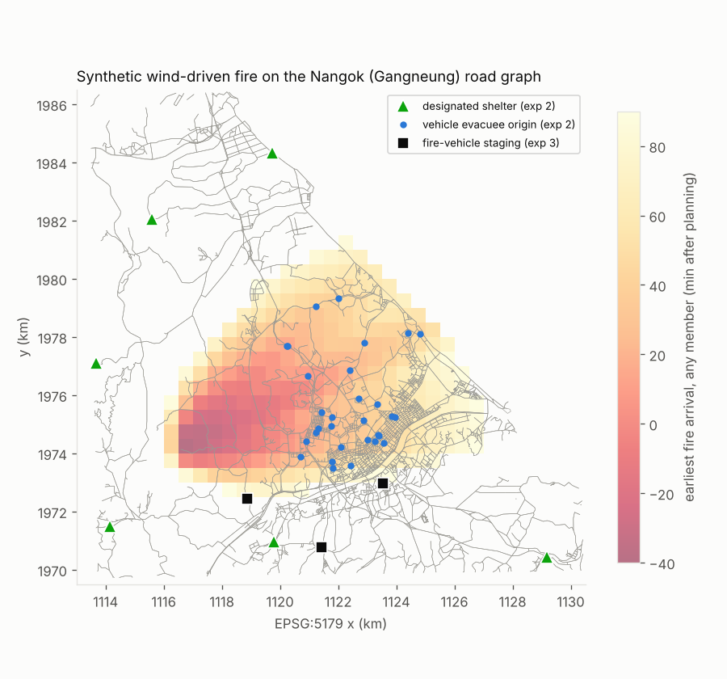
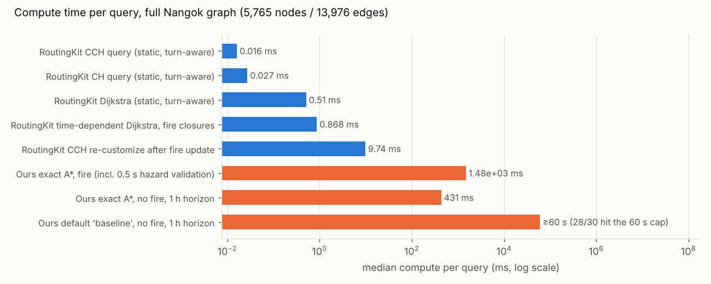
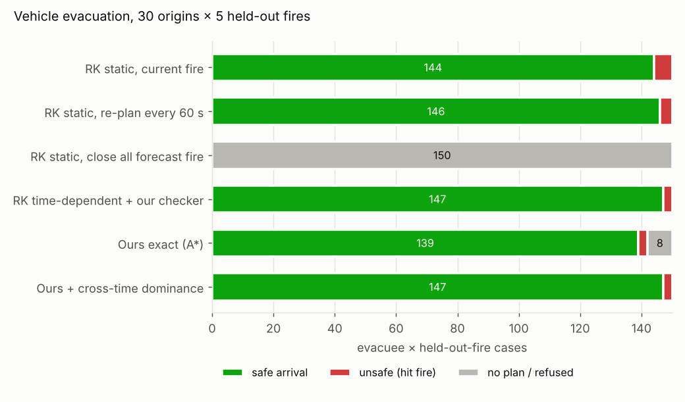
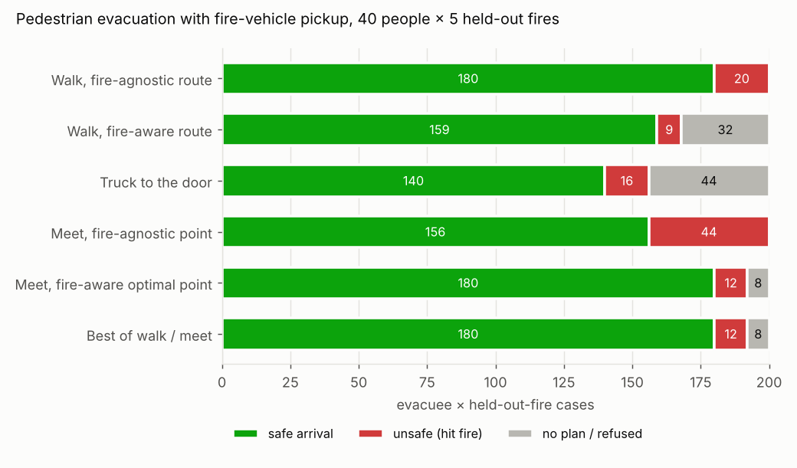

# RoutingKit vs. WildfireGuardian routing — a wildfire-evacuation comparison

**Question.** Is [RoutingKit](https://github.com/RoutingKit/RoutingKit) better than our
`routing-package/` for *wildfire evacuation routing*? Where we are worse, how do we fix it?
The study also tests a new capability: **pedestrians meeting a fire vehicle** at an
optimal, fire-aware rendezvous point.

**Short answer.** They solve different problems, and each is better at a different thing.

* **For wildfire safety, RoutingKit's core product is the wrong model.** Its CH/CCH
  indexes answer *static* shortest-path queries (no time). On a spreading fire,
  "route around what's burning now" sent **2.4 %** of evacuees into the fire.
  Re-planning every 60 s still sent **2.1 %**. Closing everything the forecast ever
  touches found **no route for 98.5 %** of evacuees (they are standing in the fire's path).
* **For speed, scale, data import and range of uses, our package is far behind.**
  On the same Nangok graph, RoutingKit's CCH answers a turn-aware query in **16 µs**. Our
  default `baseline` solver hit its 60 s cap on **28 of 30 queries with no fire at all**.
  Our A* mode answered in about 0.4 s but needed up to 60 s with a fire. We also do not
  support pedestrians, multimodal trips, rendezvous, many-to-many queries or OSM import.
* **The best system combines both: our time-dependent safety model, run with
  RoutingKit-style engineering.** With wildfire closures that never reopen,
  earliest-arrival routing is a FIFO time-dependent shortest path. Plain Dijkstra is then
  *exact*. RoutingKit's `Dijkstra` takes a time-dependent weight functor, so this runs in
  **0.9 ms**. It returned **the same arrival as our exact solver in every case where both
  finished**, and our independent checker accepted 100 % of its routes. It never timed
  out, while our exact solver did in 8 of 150 cases.

Everything below is **synthetic**: a real road graph, a generated fire. It shows how the
algorithms behave. It is not evidence of physical safety (see [Limitations](#limitations)).

---

## 1. What each system is

| | RoutingKit (KIT, C++) | WildfireGuardian `routing-package/` (Python) |
|---|---|---|
| Core problem | Static shortest path, scalar weights | Earliest arrival under time-dependent hazard, per-scenario flame / peak-flux / cumulative-dose limits, destination dwell and opening windows |
| Main technique | Contraction Hierarchies (CH); Customizable CH (CCH) with fast re-weighting; Dijkstra that accepts a time-dependent weight functor | Exact vector-label search over (node, incoming edge, time, admission), rational arithmetic, A* with static lower bounds |
| Time-dependence | Only via the Dijkstra functor (no TD index) | Native: hazard tables per time interval, ensemble members |
| Uncertainty | None | Ensemble members; all must be satisfied |
| Assurance | None beyond correctness of the algorithm | Strict input validation, independent route checker, `CONDITIONAL_OPTIMUM` / `PROVEN_INFEASIBLE` certificates, session continuity, stale-result rejection, recorded-return fallback |
| Data | OSM PBF import with car / bike / pedestrian profiles, nearest-node snapping | Hand-adapted JSON graph; no OSM pipeline |
| Modes | Any (you build the graph) | Vehicle only; "pedestrian routes, fleet scheduling and pickup are outside this contract" (`docs/ROUTING_SPEC.md`) |
| Scale | Continental (millions of nodes) | One city; times out on hard 30-member road cases (archived evidence) |
| Maintenance | Active (last commit Apr 2026) | Ours |

## 2. Set-up

* **Graph:** the real Nangok (Gangneung) r1 road graph from
  `routing-package/fixtures/nangok_full_graph_fixture.json`: 5,765 nodes, 13,976
  directed edges, 12,573 forbidden turns (mostly U-turns). RoutingKit runs on a
  *turn-expanded* graph, so its routes obey the same turn bans.
* **Fire:** an elliptical minimum-travel-time spread on a 100 m raster. It is aggregated
  to the package's 500 m hazard grid using the earliest arrival in each cell. Ignition is
  west-south-west of downtown and wind blows toward ENE, the pattern of the April 2023
  Gangneung fire. The fire was lit 40 min before planning time. There are 5 ensemble
  members, each perturbing wind ±12°, spread rate ±25 % and the length-to-breadth ratio.
  "Strong" uses a head spread rate of ≈5.8 km/h; "moderate" uses ≈4 km/h.
  Heat flux rises to 60 kW/m² as the front arrives, flames for 10 min, then decays.
  
* **Assumed limits** (declared, not validated):
  * vehicle: peak 10 kW/m², dose 500 kJ/m² (the fixture's values);
  * pedestrian: peak 2.5 kW/m²;
  * speeds: evacuation traffic 15 km/h (congested), fire vehicle 30 km/h, walking 1.2 m/s (0.8 m/s sensitivity case).
* **Honest evaluation:** leave-one-out. Forecast-based methods plan with 4 members and
  are scored against the held-out 5th ("truth"). Nowcast methods see the truth fire's
  *current* state perfectly, which is generous to them. Every vehicle route is re-timed
  on the same 1 s lattice and scored by **our independent checker**
  (`routing.independent.check_route`) against the truth fire.

## 3. Results

### E1 — raw speed, no fire (`exp1_static_speed.py`)

Values are medians on the full graph; RoutingKit uses 2,000 random queries and ours uses 30.

| Engine | Median query |
|---|---:|
| RoutingKit CCH, turn-aware (preprocessing 320 ms order + 15 ms build + 10 ms customize) | **0.016 ms** |
| RoutingKit CH, turn-aware (2.6 s build) | 0.027 ms |
| RoutingKit Dijkstra, turn-aware | 0.51 ms |
| RoutingKit time-dependent Dijkstra (random closing times) | 0.49 ms |
| RoutingKit CCH full re-customization (a whole new weight set) | 9.7 ms |
| RoutingKit CCH partial re-customization, 10 / 100 / 1000 closed edges | 1.2 / 7.5 / 29 ms |
| **Ours, A***, 1 h horizon (includes hazard validation) | 431 ms |
| **Ours, default `baseline`** | **≥ 60 s: 28 / 30 hit the cap** |

The default `solver` in our adapter is `baseline`. It is arrival-ordered and keys labels
by time. Without a heuristic it enumerates (edge, time) states and cannot finish
city-scale trips. A* finishes them easily.



### E2 — vehicle evacuation in a spreading fire (`exp2_fire_evacuation.py`)

**Full comparison, 30 origins × 5 held-out fires (strong fire):**

| Strategy | Safe | Hit fire | No route | Mean arrival (safe) | Compute median / p95 |
|---|---:|---:|---:|---:|---:|
| RK static, block what burns now | 144 | 6 | 0 | 24.1 min | 0.8 / 1.3 ms |
| RK static, re-plan every 60 s from current edge | 146 | 4 | 0 | 24.3 min | 26 / 66 ms (whole trip) |
| RK static, block all forecast fire | 0 | 0 | **150** | — | 47 ms |
| **RK time-dependent Dijkstra + our checker** | **147** | **3** | 0 | 24.9 min | **0.9 / 1.2 ms** (+≈0.3 s checker) |
| Ours exact A* (raw hazard) | 139 | 3 | 8 timeouts | 23.9 min | 1.5 s / **42 s** |
| Ours + cross-time dominance (hull) | 147 | 3 | 0 | 24.9 min | 1.6 / 2.3 s |

* The 3 "hit fire" cases for the forecast methods are **forecast misses**: the held-out
  truth fire fell outside the 4-member envelope. Every forecast method shares them.
* The **time-dependent Dijkstra returned exactly the same arrival** as our exact solver in
  all 142 cases where both finished. It also matched our cross-time-dominance solver in
  all 150 cases.
* Our exact solver's 8 timeouts are two origins, each timing out under 4 of the 5
  held-out fires. The cross-time-dominance variant solved every case within 3.6 s.

**Larger sample, RoutingKit arms only (200 origins × 5 fires = 1,000 cases):**

| Strategy | Strong fire: safe / hit / none | Moderate fire: safe / hit / none |
|---|---:|---:|
| RK static, block what burns now | 970 / **24** / 6 | 981 / **15** / 4 |
| RK static, re-plan every 60 s | 973 / **21** / 6 | 981 / **15** / 4 |
| RK static, block all forecast fire | 15 / 0 / 985 | 3 / 0 / 997 |
| RK time-dependent Dijkstra (+ checker) | 965 / **14** / 21 | 979 / **6** / 15 |

Paired, strong fire: time-dependent planning fixed 10 of the static plan's 24 fire hits
and introduced 1 new one. 12 cases were overrun under both. Time-dependent routes arrived
on average **6 s later**: 5 % of routes took a longer detour, the worst by 286 s.
The 21 "no route" cases are the forecast saying *no safe drive exists*. A static engine
cannot produce that signal, and those people should be escalated to rescue (see E3).
In-ensemble, where the truth is one of the members, the time-dependent plan is safe by
construction. The remaining risk is forecast coverage, not routing.



### E3 — pedestrians meeting a fire vehicle (`exp3_rendezvous.py`)

40 people on foot × 5 held-out fires. Three fire vehicles start at staging points
2.5–5 km from the fire, outside its 2-hour reach. Dispatch delay is 120 s and boarding
takes 60 s. Safety means reaching any node the forecast says the fire won't reach for
2 h past the horizon.

**Exact rendezvous algorithm.** It uses three time-dependent Dijkstra runs:
1. Walk tree from the person.
2. Multi-source drive tree from all stations, which also picks the nearest vehicle.
3. One multi-source drive search seeded with *every* node r at its own pickup time,
   max(walk(r), drive(r)) + boarding, keeping only r that stay tenable while waiting.

With closures that never reopen, this is exact over all meeting points and shelters. It
takes **≈9 ms** in total.

| Strategy (walk 1.2 m/s) | Safe | Hit fire | No plan | Mean time to safety |
|---|---:|---:|---:|---:|
| Walk, fire-agnostic route | 180 | 20 | 0 | 36.2 min |
| Walk, fire-aware route | 159 | 9 | 32 | 35.2 min |
| Truck to the door, person waits at home | 140 | 16 | 44 | 17.3 min |
| Meet, fire-agnostic point (static engine) | 156 | **44** | 0 | 14.1 min |
| **Meet, fire-aware optimal point** | **180** | **12** | 8 | **16.4 min** |
| Meet, fire-aware + 3-min safety margin | 180 | **3** | 17 | 16.8 min |
| Best of walk / meet (chosen by plan) | 180 | 12 | 8 | 15.7 min |

* Meeting cuts time-to-safety **≈19 min** versus walking (faster in 94 % of paired
  cases). It saves **9** people for whom both walking and door pickup fail.
  For slow walkers (0.8 m/s) it saves **17**.
* The meeting point is never the person's home. Median walk is ≈450 m and the median
  wait is ≈30 s for the person, 0 s for the truck. The truck is the bottleneck, so the
  person walks toward it.
* **Fire-awareness matters more for rendezvous than for driving.** A static
  meeting-point engine sent 44 / 200 people into the fire, against 12 for the fire-aware
  optimum. Adding a 3-minute safety margin cut that to 3, without losing a single safe
  outcome.
* Designated-shelter variant (`results/exp3_rendezvous.json`), where people must reach
  1 of 6 fixed shelters: walking takes 82 min. Meeting cuts this to 23 min and saves 11
  people.



### E4 — scaling with ensemble size (`exp4_ensemble_scaling.py`)

12 origins, all members used for planning (no held-out truth), strong fire. Each
cell shows median / max compute and outcome counts.

| Members | RK time-dep. Dijkstra: search | + our checker gate | Ours exact A* | Ours + cross-time dominance |
|---:|---:|---:|---:|---:|
| 5 | 0.96 ms | 0.26 s / 0.35 s, 12 checked | 1.5 s / 2.2 s, 12 optimal | 1.6 s / 2.4 s, 12 optimal |
| 15 | 0.47 ms | 0.67 s / 0.89 s, 8 checked + 4 no route | 3.9 s / **60 s**, 7 optimal + **1 timeout** + 4 at-issue | 4.1 s / 9.3 s, 8 optimal + 4 at-issue |
| 30 | 0.45 ms | 1.35 s / 1.78 s, 8 checked + 4 no route | 7.4 s / **60 s**, 7 optimal + **1 timeout** + 4 at-issue | 7.7 s / 17.7 s, 8 optimal + 4 at-issue |

* All three methods agree on every origin. The 4 "at-issue / no route" origins are
  already inside some new member's fire at t = 0.
* The time-dependent search cost does **not** grow with members, because per-edge
  closing times are pre-reduced across members.
* What grows is **our** Python cost: hazard validation and the rational-arithmetic
  checker scale linearly with members (0.26 → 1.35 s). The exact solver times out again
  at 15–30 members, as in the archived 30-member road study.
* Cross-time dominance removes the timeouts, but the per-label Python cost still
  dominates. This is why recommendation 5 (move the inner loop out of Python
  `Fraction`s) matters.

## 4. Verdict

| Criterion (wildfire evacuation) | Winner | Evidence |
|---|---|---|
| Correct safety model (time, uncertainty, exposure) | **Ours** | Static RK plans hit fire 1.5–2.4 % of the time; time-agnostic closure strands 98–99 % |
| Assurance (validation, independent checking, certificates, session safety) | **Ours** | No RK equivalent |
| Query speed / scaling | **RoutingKit** by 10³–10⁶× | E1, E2, E4 |
| Live updates (closures) | **RoutingKit** | CCH partial re-customization in 1–29 ms |
| Data ingestion (OSM, profiles, snapping) | **RoutingKit** | We have none |
| Pedestrian / multimodal / rendezvous | **RoutingKit** (as a toolkit) | We scope these out; E3 is a ~230-line script on RK |
| Reliability under budget | **RK-style TD Dijkstra** | Our exact solver timed out in 8 / 150 cases (E2); our default solver in 28 / 30 (E1) |

**We are inferior as an engine, not as a model.** The improvements below keep our model
and assurance layer and replace the slow parts.

## 5. How to make our routing better (prioritised)

1. **Make A* the default, never `baseline`.** It is a one-line change in
   `routing/core.py` (`request.get("solver", "baseline")`) and the adapter docs.
   `baseline` timed out on 28/30 hazard-free city trips (E1).
2. **Add a monotone fast path: time-dependent Dijkstra plus our checker as the gate.**
   * Take the running maximum of each cell's hazard over time, the "monotone hull". This
     is conservative: no routing through burned-over ground.
   * Turn the hull into per-edge closing times and run a FIFO time-dependent Dijkstra.
     That is exact for flame and peak limits. Gate the route with the existing independent
     checker, which also verifies dose.
   * Fall back to the exact label search only if the gate rejects the route or a
     non-monotone hazard is supplied.
   * In E2 this path matched the exact optimum in every comparable case. Its cost is
     about 1 ms of search plus about 0.3 s of checker, and it never timed out. Dose never
     made the gate reject a route here.
   * Even the hull's conservatism cost nothing: exact on the raw hazard and Dijkstra on
     the hull gave identical arrivals.
3. **Use cross-time dominance in the exact solver when the hazard is monotone.**
   `monotone_core.py` changes three lines and is exact under the verified monotone
   condition. On the package's 17 frozen regression cases it returns identical status,
   arrival and legs to `routing.core.solve`. It took the monotone path in 15 and
   correctly fell back in 2. Fire-case p95 dropped from 42 s to 2.3 s and timeouts from 8 to 0 (E2).
   At 15–30 members it also removes the exact solver's timeouts (E4).
4. **Stop re-validating the whole hazard on every plan.** `validate_hazard` costs about
   0.5 s per call for 4 members × 90 intervals, which is about 35 % of a fire-case solve.
   Validate once per accepted hazard version in `RoutingSession`. The session already owns
   version admission; pass a frozen, validated snapshot to `solve`, as `PreparedGraph`
   already does for graphs.
5. **Move the inner loop out of Python `Fraction`s.** Use integer milliseconds and
   integer flux units (exactly representable), or put the search core in C++/Rust.
   RoutingKit's `Dijkstra` with a weight functor is a drop-in for the fast path. Keep the
   rational-arithmetic checker as the independent gate. That keeps the assurance story
   while the search gets about 1000× faster.
6. **Adopt RoutingKit as infrastructure, not as the planner:**
   * OSM import with proper car and pedestrian profiles, instead of a hand-made fixture;
   * `GeoPositionToNode` to snap GPS positions;
   * CCH with partial customization for road closures and static A* lower bounds;
   * one-to-many / many-to-many queries for fleet assignment, such as which truck goes
     to which person.
7. **Add a pedestrian + rendezvous mode.** E3 shows the algorithm is exact, takes about
   9 ms, cuts time-to-safety by about 19 min and rescues 9–17 extra people per 200 cases.
   Fire-awareness reduced unsafe meetings from 44 to 12 (3 with a margin).
   * Connect it to the vehicle planner's "no route" outcome: when no safe drive exists,
     escalate to dispatch a rescue.
   * Next steps: several people per truck with capacity limits (vehicle routing),
     traffic, and buildings as shelter-in-place nodes.
8. **Budget for forecast misses, not routing.** All remaining unsafe cases for the
   time-aware methods came from the truth falling outside the ensemble. Use more members
   and a safety margin. In E3 a 3-minute margin cut unsafe meetings 4× with no loss of
   safe outcomes. Report "no safe route" as an actionable outcome.
9. **At larger scale (province-wide), consider time-dependent customizable indexes.**
   Examples are TD-CCH / CATCHUp from the same KIT group. At Nangok scale (5.7k nodes) a
   plain C++ Dijkstra already answers in under 1 ms, so an index is unnecessary.

## Limitations

* The fire, flux model, tenability limits, speeds, staging points and shelters are
  **generated assumptions**. This is not a forecast, and no physical-safety claim
  follows. Ember spotting, smoke visibility, traffic dynamics and road blockage by
  debris are absent.
* E3 scores plans with edge-level closing times, the same semantics used for planning,
  not with our rational checker. The checker is vehicle-lattice only.
* The 500 m hazard grid is coarse relative to roads (median edge 82 m).
* Our solver used 1 s ticks and a 90-minute horizon. The archived hard cases used
  30 members and waits; waits are disabled here as in the fixture.
* `monotone_core.py` is an experimental copy. It is not a change to the sealed
  `routing-package/`, whose release checks were not modified.

## Reproduce

```sh
cd experiments/routingkit_comparison
pip install numpy matplotlib
sh rk/build.sh                        # clones RoutingKit into rk/RoutingKit and builds rk/rk_tool
python3 -B exp1_static_speed.py        # ~50 min (our baseline solver hits 60 s caps)
HEAD_ROS=1.6 N_EVAC=30 python3 -B exp2_fire_evacuation.py
HEAD_ROS=1.6 SKIP_OURS=1 N_EVAC=200 TAG=_rk200_strong   python3 -B exp2_fire_evacuation.py
HEAD_ROS=1.1 SKIP_OURS=1 N_EVAC=200 TAG=_rk200_moderate python3 -B exp2_fire_evacuation.py
HEAD_ROS=1.6 python3 -B exp3_rendezvous.py
HEAD_ROS=1.6 TARGET=safezone TAG=_safezone python3 -B exp3_rendezvous.py
HEAD_ROS=1.6 TARGET=safezone WALK_MS=0.8 TAG=_safezone_slow python3 -B exp3_rendezvous.py
HEAD_ROS=1.6 TARGET=safezone MARGIN_S=180 TAG=_safezone_margin180 python3 -B exp3_rendezvous.py
HEAD_ROS=1.6 python3 -B exp4_ensemble_scaling.py
HEAD_ROS=1.6 python3 -B make_figures.py
```

Files: `common.py` (graph, fire, hazard adapters, RoutingKit process),
`rk/rk_tool.cpp` (RoutingKit driver: CH / CCH / time-dependent Dijkstra over a
turn-expanded graph), `monotone_core.py` (experimental cross-time dominance),
`results/` (all raw JSON and figures).
