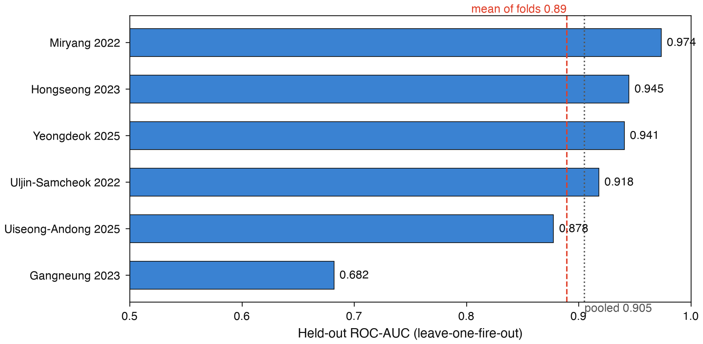

# Forecast-conditioned, time-expanded routing for household-level wildfire evacuation and rescue in rural Korea

## Abstract

Satellite detection and district-level fire-danger forecasts were both operating during the
March 2025 Gyeongbuk wildfires, the largest on Korea's record by burned area. Neither
answered which way a rural household should walk now, or whether a rescue crew can
still reach the house. WildfireGuardian couples an
event-held-out ignition-probability model to a time-expanded pedestrian router and a
rescue-ingress calculation, and re-derives every published number from a committed
artifact. The spread model is deliberately ordinary — a
gradient-boosted classifier over sixteen public features, evaluated leave-one-fire-out on
six real Korean fires, mean-of-folds held-out ROC-AUC 0.890 (fold range 0.682–0.974;
pooled out-of-fold 0.905, a different quantity). Its operating point is weak and reported
as such: pooled cell recall at the shipped threshold is 0.138 and three of the six
held-out fires produce no true positive at all. The coupling is nonetheless where the
decision changes: on the canonical Yeongdeok field, 42 of 458 scanned walk-network origins
reach a refuge only under the forecast-aware policy, and 2 have no safe walking route, on a
network covering 32.6 % of the predicted fire core whose bias runs in an unmeasured
direction. That contrast is measured against a fire-blind baseline, so it does not separate
knowing where the fire will be from knowing where it is. On a second region that separation
has now been measured: a present-perimeter opponent, which refuses what is burning now plus
a fixed buffer and needs no model at all, recovers most of what that region's fire-blind
contrast credits to the forecast. Two further results are negative
and reported in full: the
deadline-first dispatch ordering the system ships never out-rescues nearest-first at the
operating window, in 0 of 180 configuration cells, and a geostationary detector sees these
fires only at a sub-pixel size floor of roughly 0.1 to 1 hectare, tens of minutes after
their recorded occurrence time. On a six-event dataset the transferable contribution is the
evaluation design — paired contrasts, matched null controls, and registries that keep
withdrawn claims in the tree — rather than the model.

## 1. Introduction

In March 2025 a wildfire that began in Uiseong-gun spread east across Gyeongsangbuk-do
through Andong, Cheongsong and Yeongyang to Yeongdeok. Its surveyed forest damage came to
99,289 hectares — the largest in the Korean series since it began in 1986 — with 3,819
homes damaged and 3,587 people displaced (Gyeongsangbuk-do final tally, reported 6 May
2025; the province's recovery plan of 7 May carries the same area [@gyeongbuk2025recovery]).

Those figures must carry their basis and date, because the published ones share neither
and do not agree. The 26 deaths on the chain are the provincial disaster headquarters'
count as of 08:30 on 30 March 2025 [@dgmbc2025toll]; Yeongdeok-gun's notice of 29 April
puts 10 of them in Yeongdeok
where that count had 9, and this paper keeps both rather than asserting one
[@greenpeace2026survey]. A rapid attribution study of 30 April 2025 splits them differently
between districts and counts alongside them a separate fire's dead, on a "southeastern
Korea" extent of "more than 48,000 hectares" that is not the chain's [@wwa2025korea].
Nationwide totals are compiled on another basis over another period — the Korea Forest
Service's spring fire-watch season, not March — so this paper states the chain's share of
any nationwide total nowhere, and the service itself warns that a fire-affected area read
off the fire line and a surveyed damage area cannot simply be compared [@khan2025area].

The dead were old, and so are the survivors. Yeongdeok-gun's notice gives a mean age of
84 among its ten dead and a maximum of 101. In a survey of 300 residents of Andong,
Yeongdeok and Uiseong interviewed in October 2025, 189 of 296 respondents (63.9 %) were
aged 60 to 79 and 53 (17.9 %) were 80 or older; in Yeongdeok alone 34.0 % were 80 or older
and 36.0 % lived alone before the fire [@greenpeace2026survey]. That survey is a
non-probability sample of survivors — the dead are absent by construction — so it
describes who answered, not the population, and its casualty figures are re-cited rather
than measured.

Detection was not the failure, though the paper cannot claim it was an advantage either:
Section 4.8 measures the fastest satellite product over Korea and finds its first
anomaly tens of minutes after the
recorded occurrence time, at a size floor too coarse for an
ignition, on a clock whose relation to the emergency call this repository cannot
establish. The gap was between knowing and acting. A
district-level probability does not tell one
household on one lane which direction is still walkable at 09:40, nor a fire crew which
of the houses that cannot self-evacuate they can still drive to, or for how much longer.
It is sharpest where the deaths occurred: dispersed rural settlement, slow
walkers, road networks with few alternatives. The same survey
shows how the warning travelled: village broadcast and a neighbour together account for
237 mentions against 112 for the national emergency text
message, and in Yeongdeok — where only 48.0 % received the text — 89 against 22.

WildfireGuardian closes that gap on public data. It fits a per-cell ignition-probability
model, propagates it into a time-sliced hazard field, and consumes that field twice: in a
time-expanded pedestrian router that refuses nodes whose forecast risk will have crossed a
cutoff by the walker's arrival, and in a rescue-ingress calculation asking when
each approach corridor closes to a vehicle. Its outputs are operator documents (Fig. 1).

We make three claims. The coupling changes decisions, measurably, as a paired contrast:
both arms of Section 4.3 run over the same origins, network and field, so neither the
routing layer's known approximations nor the coverage limit contaminates it. The
operating point is weak, and owning that is part of the result. And the evaluation design
is the transferable part: the discipline of matched controls of Section 3.5 is what six
fires permit and a large dataset makes easy to skip. How much of the change the forecast
itself is responsible for is a separate question, and Section 4.5 answers it on one region
by replacing the baseline with a policy that needs no model: much less than the fire-blind
contrast implies. The non-claim is the dispatch ordering,
which wins 0 of 180 configuration cells against nearest-first at the operating window.

## 2. Related work

**Wildfire spread as a learning problem.** Public benchmarks now train next-day spread
models over hundreds of fires with multi-modal inputs — Next Day Wildfire Spread over
roughly a decade of US observations [@ndws2022], WildfireSpreadTS as a multi-temporal
successor [@wildfirespreadts2024], and the WSTS+ extension, which doubles the unique
years of history and reports that time-series inputs beat single-day inputs
[@wstsplus2026]. Six Korean fires cannot compete on that axis, and the metrics are not
comparable across these settings anyway: label definition, geometry and above all
prevalence differ, and prevalence moves average precision by construction. Physical
modelling supplies the alternative framing:
minimum-travel-time fire growth [@finney2002], and an earlier Rothermel-based surface
model in this project captured a small fraction of the burned area, which motivated the
move to a data-driven field.

**Evacuation routing.** Lane-based evacuation routing was posed as a network flow
problem two decades ago [@cova2003]. Recent work brings wildfire information into that
formulation directly: Borgwardt et al. pose wildfire evacuation as maximum flow on a
time-expanded network with integrated hazard data [@borgwardt2024], and RESCUE routes
under stochastic congestion and uncertain spread [@rescue2026]. Both are vehicle-centric
and network-scale. This paper's layer is neither: it routes individual slow pedestrians
to refuges on a real walk graph and adds a responder-side ingress term a maximum-flow
objective has no notion of, having no crew driving toward the fire.

**Evacuation triggers and simulation.** The closest conceptual ancestor is the wildfire
evacuation trigger point: a spatial line whose crossing by the fire front should start an
evacuation, set by coupling spread modelling to GIS [@cova2005], refined by reverse
geocoding to name the road segments that matter [@li2017], and later coupled to traffic
simulation so it accounts for the time evacuation takes [@li2019]. Trigger geometry
answers *when to leave*; our router answers *which way*, on the same idea that a route's
safety depends on arrival time rather than the fire's present extent. At community scale,
WUI-NITY couples fire, pedestrian and traffic models into one platform [@wahlqvist2021];
the wildland-urban-interface framing follows the standard definition [@radeloff2005], whose
transfer to rural Korean settlement is untested here.

**Detection.** Geostationary imagers trade resolution for cadence: GK2A's Advanced
Meteorological Imager returns the Korean local area every two minutes at 2 km in the
infrared [@kim2021gk2a]. Section 4.8 measures what that buys, using the mid-infrared
contrast and the sub-pixel area inversion standard since Dozier [@dozier1981].

**Calibration and guarantees.** Conformal risk control offers distribution-free
guarantees on a monotone risk by calibrating a threshold [@angelopoulos2024crc]. Section
4.2 reports what happens when it is applied honestly at six fires.

**Walking speed.** The elderly gait speeds this system assumes sit in the range for
which gait speed is an established predictor of survival in older adults
[@studenski2011]; we use a fixed conservative speed rather than an individualised one,
and sweep it.

## 3. Data and methods

### 3.1 Study fires and public inputs

Six real Korean wildfires form the dataset: Gangneung 2023, Hongseong 2023, Miryang
2022, Uiseong-Andong 2025, Uljin-Samcheok 2022 and Yeongdeok 2025 — five independent
events plus one co-located pair, since the last two belong to the same March 2025 chain,
a dependence Section 6 returns to.

Inputs are public: active-fire detections from NASA FIRMS (VIIRS and MODIS) [@firms],
whose detection times define the prediction target; weather from ERA5 reanalysis on
single levels [@era5]; terrain from SRTM [@farr2007]; fuel from ESA WorldCover at 10 m
[@worldcover]; and road networks, building footprints and candidate refuge and depot
points of interest from OpenStreetMap, graph-built with OSMnx [@boeing2017; @osm]. No
proprietary or paid source is used.

One further public input feeds only the detection-timing measurement of Section 4.8:
GK2A level-1B radiances, read without credentials from the NOAA open-data mirror. The
detector is a mid-infrared-minus-window contrast (3.8 µm against 11.2 µm) under a
contextual test whose rule is a conjunction of three conditions, all referred to a
30–80 km background annulus: the pixel's 3.8 µm brightness temperature exceeds its own
background median by four robust standard deviations, *and* the contrast exceeds its
background median by four, *and* the contrast clears an absolute floor of 3 K. The
multiplier was fixed at four before any fire was examined and never adjusted. The archive begins in February 2023, so the two
2022 fires fall outside it and were excluded rather than worked around.

### 3.2 Spread model and evaluation protocol

The model predicts, for each 500 m grid cell and each satellite overpass, the probability
that the cell is detected as burning at the next overpass. It is a gradient-boosted tree
classifier (`HistGradientBoostingClassifier`) over sixteen features spanning fire
geometry (distance to the nearest prior detection, elevation above the source), terrain
(slope, aspect), fuel (burnable fraction from land cover) and weather (temperature,
humidity, vapour-pressure deficit, wind speed, wind alignment, antecedent precipitation
and dryness). The training table holds 151,904 rows with 2,989 positives, a prevalence of
0.0197; the seed is fixed and the projection is EPSG:5179.

Evaluation is leave-one-fire-out (leave-one-group-out with the fire as the group): the
model is trained on five fires and scored on the sixth, so no cell of the held-out fire
is in training. Two summaries of the same run are reported, and they are different
quantities that must never be substituted for each other. The **mean of folds** gives
each fire one vote and is the generalisation figure. The **pooled out-of-fold** AUC
scores one ROC over all 151,904 out-of-fold rows, weighting each row once, and is
dominated by the two largest folds, at 54.5 % and 27.4 % of the rows. Fold sizes differ by
a factor of 208.9 and the smallest carries 0.26 % of the rows, so neither summary is
neutral.

Three baselines run through the same folds, features and seed — random forest, logistic
regression and the shipped model — against the objection that it only beats a bad physics
model.

### 3.3 Hazard field and time-expanded routing

The classifier's calibrated probabilities are propagated forward into a hazard field: a
stack of time slices, each a grid of P(ignite) values, covering 0 to 720 minutes from
the trigger in 180-minute steps on the canonical Yeongdeok field. Both downstream layers
consume a field of that form, though not the same instance: the pedestrian results below
are computed on this canonical field and the committed responder series on the synthetic
one of Section 3.4.

The pedestrian router is a Dijkstra search over a time-expanded state `(node, time bin)`
on the OpenStreetMap walking graph, at a fixed elderly gait speed of 0.7 m/s adjusted for
slope, with a 10-minute time bin and a 600-minute travel budget. An edge is admissible
only if the hazard at its head node, read at the arrival time rounded up to the next bin,
is below a pedestrian cutoff of 0.5; among admissible paths the search minimises
cumulative exposure, the integral of P(ignite) over travel time. Two policies are compared
over identical origins: a **fire-blind** policy taking the shortest-distance route to the
nearest refuge without consulting the hazard, and a **forecast-aware** policy applying the
cutoff and the exposure objective. Origins are sampled by walking the graph's node list at
a fixed stride of 18; they are walk-network locations and are never called households.

Section 6 records this router's approximations, deliberately not fixed. All divide out of
a paired contrast: both arms run through the same scoring function on the same field.

### 3.4 Rescue ingress and dispatch

A crew driving toward a fire faces the mirror-image problem. For each home the responder
route is computed on the OpenStreetMap driving graph from the nearest mapped depot and
sampled into points; the **ingress survival time** is the earliest forecast slice at which
any sampled point reaches a separate, higher vehicle cutoff of 0.7. A home is dispatchable
if that time exceeds the responder's estimated arrival — dispatch delay plus travel time —
by a safety margin. The four-way outcome partitions the origin set exactly and the
unreachable class is reported, never imputed: of 439 committed origins, 272 are
self-sufficient and 167 need a rescuer, of whom 143 are dispatchable and 24 have no
surviving vehicle ingress. An assumed immobile fraction of 0.3 drives the split and is
swept. **That series is only a partial flip to real data, and every 439-origin number in
this paper inherits it.** Its roads, refuges and depots are real OpenStreetMap geometry;
its hazard field and terrain are labelled synthetic in the artifact's own provenance, the
forward simulation needing a raw fire bundle this repository does not distribute. Its
policy contrasts are the robust part; its absolute magnitudes are illustrative.
The shipped ordering ranks dispatchable homes by urgency — ingress survival minus
responder arrival, smallest closing window first — and Section 4.7 measures it against
nearest-first, earliest-closure, unsorted scan order and 200 random permutations across a
grid of operational window, service time, dispatch delay and team count.

### 3.5 Controls, sweeps and the evidence registry

Every result below carries at least one of five controls, each of which exists because an
earlier version of this project made a claim one of them later removed.

- **A flat-terrain control** beside every slope result. Under flat timing edge time is proportional to length, so a distance-ranked router must produce identical routes; a non-zero flat control means the pipeline moved, not the terrain.
- **A column-addition null** beside every experiment that changes the feature count. Adding two columns of pure noise to the sixteen raises pooled AUC by +0.0041 on average over 60 draws, 95th percentile +0.0093; on far-band AUC the same null runs from -0.0363 at its 5th percentile to +0.0425 at its 95th. Such an arm must clear that envelope, not zero.
- **A platform-drift floor** beneath every cross-run comparison. Re-running the committed protocol on a second machine moves pooled AUC by 0.0064 and far-band AUC by 0.0307; smaller differences are not measurements.
- **A null-hazard control**, an identically-zero hazard field, beneath every claim that the fire changed an outcome.
- **Sweeps rather than defaults** for the parameters carrying the most weight: evacuation-time budget, slope sampling interval, immobile fraction, vehicle cutoff, dispatch delay and forecast-perturbation magnitude.

The registry makes the rest checkable. Each publishable value has an entry in
`docs/NUMBERS.json` naming its source artifact, its JSON path, the expression that
re-derives it, its caveat, and the phrasings that misstate it; a gate re-derives every
entry on every change, scans the prose for retired figures and quantity-name collisions,
and refuses a document that states a registered quantity with a different value.
Superseded values are annotated in place, never deleted. A second registry holds the claims
this project has **withdrawn** — what each asserted, what retired it, what should be said
instead, and the spellings that restate it — and every tracked document is read against it,
so a withdrawn claim cannot survive in a file nobody thought to list. It matches spellings,
not meaning: in an independent probe, sentences reusing a registered spelling were caught
and sentences reworded around one were not, and that limit is recorded rather than designed
away. A further limit is not about matching at all, and it appeared in September 2026:
some of this project's artifacts are *generated* from templates, and a sentence that had
just been retired was corrected in one generated file while the template it is built from
kept it. Nothing was wrong in the artifact a reader saw and every gate passed, so the
retired wording would have returned at the next rebuild. Had that sentence been a
registered spelling the scan would have found it in the template, which the scan does
read; it was not, so nothing did. The general point survives either way and needs no
registry: a correction applied to a generated file is one rebuild from being undone. The
repair was accordingly a test asserting that the generated file is its template line for
line apart from the injected data, not a longer list of spellings. The injected line
itself stays outside that test, and a wrong value inside it still passes every gate
named here; that hole is open and recorded rather than repaired. This
manuscript is scanned by both gates like any other document here. Figures from
outside the repository — the tallies of Section 1 — are not registry values and carry their
agency, date and scope instead.

## 4. Results

### 4.1 Held-out spread skill

Under leave-one-fire-out cross-validation the mean of the six held-out ROC-AUC values is
0.890, with a sample standard deviation across folds of 0.107 and a range of 0.682 to
0.974 (Fig. 2). The pooled out-of-fold AUC over all 151,904 rows is 0.905. The difference
is structural, not cosmetic: pooled is row-weighted, effectively an average over the two
largest fires, while mean-of-folds gives Gangneung 2023 — 396 rows, 8 igniting cells,
0.26 % of the evidence — the same vote as Uiseong-Andong 2025 with 82,736 rows. The
weakest fold is the smallest one, and any single-number headline hides it.

Standard baselines over the same folds, features and seed do not establish the shipped
model as the most accurate (Table 1).

Table 1. Baselines over the same six leave-one-fire-out folds, the same sixteen features and the same seed. Hyperparameters are untuned. ⚠ Lineage: these rows were produced on the corrected-DEM bundle, which is why the shipped model reads 0.8943 here against the committed headline's 0.890 in the text — the same model on a different, deliberately not-adopted lineage, not a second estimate of the same quantity. Read the ordering, not the gap: the shipped model leads on pooled AUC (0.9036 against 0.8963) and trails on mean-of-folds, and calibration does not separate it from the random forest either. That pooled gap is 0.0073, barely clear of this project's own 0.0064 platform-drift floor, so it is an ordering that reproduces across both lineages rather than a measured margin.
| model | mean-of-folds AUC | fold sd | pooled Brier | pooled ECE |
|---|---:|---:|---:|---:|
| Random forest | 0.9142 | 0.0437 | 0.0174 | 0.0068 |
| Logistic regression | 0.9028 | 0.0605 | — | — |
| Gradient-boosted trees (shipped) | 0.8943 | 0.0924 | 0.0183 | 0.0086 |

The measured reasons for shipping the gradient-boosted model are therefore pooled-AUC
advantage, inference speed, native handling of missing values and permutation
importances — not calibration and not mean-of-folds accuracy. An earlier version of this
project justified the choice by a finding that fire-weather severity dominates wind
direction by a large ratio in permutation importance. That claim is **withdrawn** and
described here only as withdrawn: it compared the sum of six features against a single
variable, and ERA5's 0.25° grid does not resolve the winds concerned.

Two further results bear on how much of this skill is real. Correcting a defective
digital elevation model that had filled the East Sea with a ramp to -497 m across half of
one fire's raster — training data for every fold, since training pools all six fires —
moves mean-of-folds by +0.0048 and pooled by -0.0017. Two summaries of one re-run
disagreeing in sign is why that lineage was not adopted; the far-band figure moves by
-0.0358, the largest correction in the number set and the reason far-band values must
carry their lineage. Separately, an arm adding two directional
terrain features sits at the 66.7th percentile
of its matched column-addition null on the pooled metric — inside
the noise of adding any two columns. It exceeds all 60 noise draws on
mean-of-folds, but excluding the 8-positive fold that supplies the gain leaves -0.0002:
the exceedance was a fold, not a finding.

### 4.2 The operating point, and why no threshold guarantee is available

A ranking metric is not an operating point. What the system does at the threshold it
ships is weak, and Fig. 3 states it plainly.

At the 0.3 advance threshold the pooled out-of-fold recall is 0.138 — 412 true positives
among 2,989 igniting cells — with precision 0.308 and F1 0.19. The unweighted mean of the
six per-fold recalls is 0.0867, and the gap is structural: three of the six folds have
exactly zero true positives at 0.3. On two the threshold is not merely unmet but
unreachable, the largest out-of-fold probability anywhere in the fold being 0.0241 at
Gangneung 2023 and 0.296 at Hongseong 2023; on the third, Miryang 2022, two cells exceed
0.3 and neither ignites. Average precision over the full ranking is 0.169 against a
no-skill baseline of 0.0197 — 8.6 times chance, and for the reasons given in Section 2
not comparable with published average precision elsewhere.

Two clarifications travel with these numbers. First, 0.3 is a configuration default never
tuned on these probabilities; the F1-maximising threshold here is 0.14, recorded in the
artifact and deliberately not adopted, because a threshold chosen on the probabilities it
is scored on is optimistically biased. Second, this recall is **not** the router's miss
rate: it cuts the classifier's per-step output, where the router thresholds the
cumulative, survival-accumulated field at 0.5.

Calibrating the threshold with a distribution-free guarantee [@angelopoulos2024crc], done
honestly at six fires, produces a negative result. With five calibration fires the
finite-sample correction is 1/(n+1) = 0.167, consuming 0.833 of a 0.20
false-negative-rate budget. Under the naive convention the bound holds on 3 of 6 held-out
fires, worst held-out rate 0.75, and a satisfying threshold flags 9.9 % to 18.5 % of all
cells. Under the conformal convention it holds on 6 of 6, worst rate 0.108, but flags
26.0 % to 45.6 % of the map — against a 1.97 % prevalence. Exchangeability breaks twice
besides: the held-out fire's probabilities come from a model trained on the calibration
fires, and a fire-level finite-sample term is applied to a cell-level quantile. No
threshold computed here is adopted; the operating point stays at 0.3, and the reason is
now stated rather than defaulted.

### 4.3 What hazard awareness changes about who can walk out

On the canonical Yeongdeok hazard field, 458 origins are scanned; the fire-blind route
reaches a refuge without entering the predicted hazard for 414 of them and enters the
hazard for 44. Of those 44, the forecast-aware router brings 42 to a refuge without
entering the hazard and finds no route at all for 2 (Fig. 4; the routes and the origins
themselves are mapped in Fig. 5). No origin falls into the
budget-exceeded class at 600 minutes, and none enters the hazard under the
forecast-aware policy, which is structural: the policy refuses any node at or above the
cutoff.

![Decision shift on the canonical Yeongdeok field. Left: the same 458 scanned origins under the fire-blind and the forecast-aware policies. Right: the predicted hazard core over the forecast horizon. The fire-blind arm consults no hazard at all, present or forecast, so the shift between the two bars is what hazard awareness of any kind buys and not what the forecast alone buys (Section 4.3, third caveat). The absolute rates on the left are computed on a walk network covering 32.6 % of the predicted fire core; the remaining two thirds are unmeasured and the direction of the bias is unknown. Not re-acquiring the region is deliberate: the walk box does not fit the simulation grid, so redrawing it would force re-extending the canvas and re-simulating the field, replacing a stated limit with an unstated one.](figures/F5_decision_shift.png)

![The canonical Yeongdeok 2025 case on the SRTM hillshade. (a) Forecast P(ignite) at 720 min, the cells at P ≥ 0.5 at 0 min (teal), the 720-min 0.5 isoline (dashed), the reported ignition (star); the rectangle is the walk-network extent. (b) The walk network, the refuge nodes snapped from 50 OSM points of interest (triangles), all 458 scanned origins classed as in the committed artifact (414 safe on both routes, 42 safe only on the forecast-aware route, 2 with no safe walking route), and three example origins with the fire-blind shortest route (grey, dashed) against the forecast-aware route (red). Routes are recomputed at figure time with the repository's own router from the committed snapshots, and the recomputed partition equals the committed one; the isoline is drawn on a one-cell smoothing of the slice for display only.](figures/F8_routing_map.png)

Three caveats are inseparable from those counts. **First and most important, they are
rates on a covered third.** Yeongdeok's walk-network bounding box contains only 32.6 %
of the grid cells at P(ignite) ≥ 0.5 in the field's final slice; the western part of the
predicted core has no road network in the box at all. The origins are a spatially biased
sample, the bias is real and its direction is unmeasured. Every absolute Yeongdeok rate
in this paper carries that caveat; paired contrasts are unaffected, both arms using the
same origins. **Second, the field itself was
reconstructed.** An earlier lineage of these counts came from a run reverted the next day,
and the "quasi-static fire core" limitation recorded against those numbers was a property
of that reverted field, not of the fire: on the canonical field the core grows by 316.06 %
from the first slice to the last. The two lineages differ on more than one axis, so the
movement between them is not a single-variable contrast and no per-origin ledger exists.

**Third, the counterfactual is a fire-blind walk.** The baseline consults no hazard at
all, present or forecast, so the 42 measure what hazard awareness of any kind buys, not
what the forecast alone buys: a router refusing only the cells alight at departure would
recover an unmeasured share of them. This is a coupling effect, not a forecasting
effect. That arm has since been run, on a different region and against that region's own
fire-blind contrast, and Section 4.5 reports it; it has not been run over these 458 origins.
[GAP: the present-perimeter baseline over the canonical Yeongdeok origins, which is what
would separate the two effects on this field rather than on another one]

### 4.4 Three regions under one rule

The same rule, parameters and stride ran over two further regions acquired identically
(Fig. 6, Table 2).

Table 2. Three regions under one identical rule. The right-hand columns are the covariates that must travel with any cross-region statement: OpenStreetMap mapping density and the share of each region's own predicted fire core that its walk-network box actually contains. Densities are over the geodesic bounding-box area. Depot density is a statement about what OpenStreetMap maps, not about where fire stations are; see the text below on Uiseong-Andong, whose responder side is recorded as not applicable rather than as zero dispatches.
| region | origins | safe on both | safe only forecast-aware | no safe route | over budget | core coverage | core area (ha) | road km/km² | nodes/km² | refuge POIs/100 km² | depot POIs/100 km² |
|---|---:|---:|---:|---:|---:|---:|---:|---:|---:|---:|---:|
| Yeongdeok 2025 | 458 | 414 | 42 | 2 | 0 | 32.6 % | 25,900 | 1.803 | 9.43 | 5.58 | 0.45 |
| Uiseong-Andong 2025 | 368 | 263 | 91 | 12 | 2 | 99.2 % | 3,275 | 2.39 | 7.45 | 3.79 | 0.00 |
| Uljin-Samcheok 2022 | 393 | 377 | 3 | 10 | 3 | 81.5 % | 7,300 | 1.663 | 8.21 | 2.92 | 0.45 |

The forecast-aware-only share is 9.17 %, 24.73 % and 0.76 %. All three are measured against
the same fire-blind baseline, so §4.3's third caveat binds them too. **These three rows must
not be ranked against each other on that column.** With n = 3, coverage, core area and
mapping density all move together; the predicted-core areas span a factor of 7.91 under
one definition, and one region's rate is computed on a third of its own core. The one
ordering that carries information runs against the naive reading: the Spearman rank
statistic relating a region's core growth to its share of origins safe on the
forecast-aware route alone is -0.5 over three regions — an ordering, not an association,
with no p-value claimed. A second quantity shows the mechanism: of the origins whose
fire-blind route is unsafe, the share the forecast-aware router still gets to a refuge is
0.955, 0.883 and 0.231. Where the core advances fastest, unsafe origins fall into "no
safe route" rather than the forecast-aware bucket.

Uiseong-Andong has no `amenity=fire_station` mapped inside its
896.5 km² walk box, though the wider acquisition box contains six, so its responder side
is recorded as not applicable rather than as zero dispatches.

One column of that table needs a qualification the next section's run supplied. The
committed classification scores the fire-blind route under no time budget while the
forecast-aware router enforces one internally, so the two arms are read under different
rules. The over-budget column is the only bucket in the series that runs against the
system — its registered meaning is that the fire-blind route is safe and the forecast-aware
route is not — and at Uiseong-Andong its 2 origins have fire-blind arrival times of 624.8
and 628.2 minutes. Under one budget applied to both arms they are origins no arm saves,
rather than origins on which the forecast lost. The committed value is not moved and this
paper reports the qualification rather than a correction. Of the other two regions,
Uljin-Samcheok has not been re-read under the uniform rule and Yeongdeok cannot be, its
walk graph of that vintage no longer being recoverable.

### 4.5 The fair opponent: refusing where the fire is now

Section 4.3's third caveat names the weakness of a fire-blind baseline, and on one region it
has now been measured rather than conceded. A present-perimeter policy is what a county
office can run with no model at all: refuse every node within a fixed buffer of the cells
burning at the departure slice, drop any refuge that falls inside the buffer, and take the
shortest remaining path. Run over the same Uiseong-Andong origins, refuges and hazard field
as the two arms of Section 4.4, scored by the same function and with one 600-minute budget
applied to all three arms, it recovers most of the origins that region's fire-blind contrast
credits to the forecast-aware policy. The run reproduces the committed classification —
every bucket count, and the origin identities of every bucket the committed artifact
stores — before it measures anything, which is the warrant for reading its column beside the
other two.

This paper states no count from that arm, and the reason is itself a result. The row was
built twice, independently and concurrently, on the same origins and the same field, by two
different constructions of the opponent. One prunes the refused nodes out of the graph and
runs the same distance-minimising search as the fire-blind control, under no time budget.
The other runs the time-expanded, time-minimising router against a frozen binary hazard,
holds it to the 600-minute budget, and lets it refuse to let a walker already inside the
buffer set out at all. Both reproduce the committed classification first, both are
internally consistent, and they disagree substantially on what the forecast is then still
worth. Which of them is the fair opponent is a modelling choice the project has not made,
and it is not one an analysis settles by preferring its own. The registry governing these
values also requires the disputed quantity to travel with any count taken from the arm, so
this section quotes none of them and names the dispute instead. [GAP: which build of the
present-perimeter opponent defines the comparison, and therefore what the forecast's
residual advantage over it is]

The buffer width is a second free parameter and nothing in the data chooses it. The
committed arm was run at five widths, and across them the opponent's failures change in kind
rather than simply shrinking: at the two narrowest the buffer sits inside the fire's own
growth and most failures are routes that cross ground which is alight by the time the walker
reaches it, while at the two widest most failures are refuges reached only after the
evacuation budget has expired, with a few origins walled off from every refuge. Both
constructions of the opponent show that change of kind, which is why it is stated here and
the counts are not. What the run does not support is any statement about whether a workable
width could be chosen in advance: the five widths differ by factors of two, so the grid holds
a single point in the region such a claim would be about. Two documents in the repository
this paper cites currently draw the stronger conclusion from those same five points, and
correcting them is an open item there.

Two caveats bind the whole comparison. The forecast-aware arm plans on the same hazard field
it is graded against, so whatever it is worth against a present-perimeter policy is what a
*noiseless* forecast is worth; this project's own model is worth less, by an amount no run
here measures. And this is one fire, one ignition and one departure time: which buffer comes
off best is a property of this fire's growth against this road network, and no run tests it
on a second one.

### 4.6 Sensitivity and controls

![Sensitivity on the canonical Yeongdeok field. Left: the share of origins whose fire-blind route fails, against the evacuation-time budget, with a flat-timing control. Centre: origins safe only on the forecast-aware route, against the slope-sampling interval, with a flat control. Right: peak P(ignite) along one committed route pair as the forecast field is dilated, with the pedestrian cutoff and the radius at which the forecast-aware route first crosses it. ⚠ Scope: that pair is a real pipeline output but its origin differs from the committed `routing_demo.json` headline case, so both artifacts state their result as robustness of the routing *method* and not a restatement of the headline. The dilation and translation axes and the Monte-Carlo figure quoted in the text come from the committed artifacts `forecast_robustness.json` and `dilation_perturbation.json`, which do not yet carry registry keys of their own; they are flagged here as artifact values rather than registered ones.](figures/F6_sensitivity.png)

**The evacuation-time budget is the binding assumption, not the terrain.** Sweeping the
budget on the canonical field (Fig. 7, left), the share of origins whose fire-blind route
fails rises from 0.0961 at 600 minutes to 0.5655 at 30 minutes, a ratio of 5.89. A
short-budget failure share is meaningless without its budget attached. The forecast-aware
class stays empty here because a budget failure is a walk-time failure, and walk time
belongs to the graph.

The count of fire-blind routes entering the predicted hazard rises from 20 to 44 between
the reverted and the canonical fields. That belongs to the **fire-blind baseline**, not to
the proposed system: the forecast-aware router cannot enter the hazard at all, and a
fire-blind walk is likelier to walk into a fire four times larger.

**Terrain changes how people walk, not whether they arrive.** Applying real slope to
edge times raises whole-network traversal time by 26.6 % at Yeongdeok at 60 m sampling
(15.14 % and 23.67 % in the two other regions), with a mean directional asymmetry of
0.1996 of flat time — which is why the walking graph is directed. Yet the classification
barely moves (Fig. 7, centre): 42 origins are safe only on the forecast-aware route at
30 m and 60 m sampling and 41 at 90 m, against 41 in the flat control, and the number
whose bucket differs from the flat control at all three intervals is **zero**, while 179
forecast-aware routes, 39.1 %, differ from the flat control at 60 m. Switching the
objective from distance to time under slope timing changes 150 of 458 routes and cuts the
longest walk from 444.0 to 352.8 minutes; the flat control changes 0 routes, as it must.

**Forecast error has a characterised failure mode, not robustness.** Under perturbation
the forecast-aware route's exposure is below the fire-blind route's in 86 % of 2,000
Monte-Carlo draws, but the safety margin is fragile: under morphological dilation the
forecast-aware route's peak risk first reaches the 0.5 cutoff at a radius of 125 m, and an
independent spatial-translation axis first breaks at that same 125 m — the minimum over
eight directions, with the band running to 530 m, so the fragility is strongly
direction-dependent. A quarter of one grid cell of error in the worst direction
invalidates the margin.

**The road network itself is a source of uncertainty.** Re-acquiring the OpenStreetMap
network eleven months later changed the walk-graph node count by 0.0474 % and moved the
count of origins with no surviving vehicle ingress by 33.3 % (24 to 32), while the paired
exposure-reduction contrast moved by 0.5614 percentage points. Neither network is the
right one; the reported quantity is sensitivity, and it says binary verdicts are
network-fragile where paired contrasts are not.

### 4.7 Rescue ingress, and a dispatch ordering that does not work

On the committed 439-origin responder run, survival-aware routing reduces mean responder
exposure from 6.12 to 1.71 probability-minutes over the 143 dispatchable origins, a 72.0 %
reduction: a relative contrast between two policies on one synthetic hazard field
(Section 3.4) on the responder side only, not an absolute safety guarantee. 57 of the 143 shortest-path routes cross the
hazard, which is what the survival-aware policy avoids.

The dispatch ordering is negative, and reported as such. It carries a different lineage,
stated in the caption of Fig. 8 and binding on every number below. "Homes" is shorthand
for the sampled walk-graph origins of Section 3.3.

![Dispatch ordering. Left: homes reached within the operational window against the number of rescue teams, at the committed operating cell, for the shipped deadline-first ordering and four alternatives including 200 random permutations. Right: win, tie and loss tally of deadline-first against nearest-first across 180 configuration cells per window. The second window is exploratory and more than three times the committed one. ⚠ Lineage: this grid was measured on a re-acquired network vintage rather than the committed 439-origin series, two of its four arms use a synthetic hazard and terrain, and it runs a travel-aware occupancy rule in which a team stays occupied for its return leg — a rule the shipped triage code does not use, and without which the number rescued is teams times slots and no ordering can differ from any other. What is shown is therefore a contrast between orderings under that rule, on those arms; it is not a rescue-capacity forecast for any region and carries no lives-saved reading.](figures/F7_dispatch_ordering.png)

Table 3 tallies deadline-first against nearest-first on two grids: the headline grid of
Fig. 8, and an exploratory grid that widens the window axis to twelve points to look for
an operating region where the shipped ordering would pay.

Table 3. Deadline-first against nearest-first, on the headline grid and on a widened window axis. The headline grid is four arms by two windows by three service times by three dispatch delays by five team counts; the widened grid replaces the two windows with twelve points from 60 to 600 minutes. Both carry the lineage stated in the caption of Fig. 8. Each entry is a number of configuration cells and its share of that row's grid; these are cells, not people. Every one of the headline grid's 13 wins falls at the exploratory 240-minute window, so the committed-window row is the operationally relevant one. The per-window cell count on the widened axis is its 2,160 cells over twelve window points.
| grid | cells | wins | ties | losses |
|---|---:|---:|---:|---:|
| Headline, both windows | 360 | 13 (3.6 %) | 132 (36.7 %) | 215 (59.7 %) |
| Headline, committed 75-min window | 180 | **0** (0.0 %) | 88 (48.9 %) | 92 (51.1 %) |
| Widened window axis, 60–600 min | 2,160 | 115 (5.3 %) | 561 (26.0 %) | 1,484 (68.7 %) |
| Widened axis, at the 600-min window | 180 | 22 (12.2 %) | 22 (12.2 %) | 136 (75.6 %) |

At the most operationally relevant cell — committed window, 25-minute service, 30-minute
delay, eight teams — deadline-first reaches 19 homes against nearest-first's 24, a gap of
-5; unsorted scan order reaches 16 and 200 random permutations average 16.49 ± 1.69, so
the sort beats no sort and loses to nearest-first. The worst cell is -31, where it falls
below an arbitrary order as well. Over the widened axis it beats unsorted order in only
31.5 % of cells and the random mean in 37.8 %.

The mechanism is measured rather than guessed. The urgency key is corridor closure minus
responder arrival, and at the committed window the window closes before most corridors do,
so the distinct deadline values are few: 2 over 116 homes in one arm, 6 over 142 in
another. With two distinct deadlines the key is nearly constant and sorting it sorts noise
— a property of the window relative to the closure times, not of the sort. Widening the
window does not repair that: the first win comes at 120 minutes, and neither a window
threshold nor the number of distinct deadlines separates a winning region, 1,580 cells
failing to win despite having at least as many deadlines as the lowest-scoring winning
cell. No operating region recommends the shipped ordering, and the paper does not construct
one. What the analysis does establish positively is reproducibility: re-deriving
3,744 values from the earlier run cell by cell produced **0** differences.

### 4.8 How early could a satellite have seen these fires?

Four of the six fires fall inside the GK2A archive and three produced a detection under
the rule of Section 3.1 (Table 4). In each, the first satellite-detectable anomaly follows
the fire's recorded occurrence time by 22 to 64 minutes. **That reference clock is the
weakest part of the measurement and we do not lean on it**, for the reasons given in the
caption and in Section 5.

Table 4. First GK2A infrared anomaly at each archived fire, relative to that fire's recorded occurrence time. That reference is the `start` field of the project's fire manifest, which the manifest marks as provenance only, sources to no emergency-call record, and nowhere says what the field is; its relation both to the true ignition and to the emergency call is unestablished, so these are delays behind a recorded time and not detection-behind-report figures. FIRMS delays are for the same events against each event's own recorded report time, which differs from the GK2A reference by one minute at Uiseong-Andong and at Yeongdeok. Yeongdeok is a confounded case, not a miss: see the text.
| fire | GK2A | FIRMS | contrast at detection | pixels | contextual threshold |
|---|---:|---:|---:|---:|---:|
| Uiseong-Andong 2025 | +22 min | +117 min | 22.9 K | 1 | 12.2 K |
| Gangneung 2023 | +34 min | +151 min | 66.4 K | 1 | 62.1 K |
| Hongseong 2023 | +64 min | +17 min | 93.8 K | 2 | 32.6 K |
| Yeongdeok 2025 | confounded | +81 h | 11.6 K (best) | — | 22.0 K |

The rule is not simply permissive. Across 709 control steps at the same four sites, at
the same clock times fourteen days earlier, no pixel was ever flagged. Zero of 709 is an
upper bound, not an absence: it puts the per-step false-alarm rate at roughly 0.4 % with
95 % confidence, still a few alarms a day at a two-minute cadence. The size floor is
firmer than the clock. A two-component sub-pixel split of the weakest detection
[@dozier1981] implies a fire area of 0.19 ha at an assumed 750 K flame temperature; that
assumption alone moves the value more than eightfold across a 600–900 K range, so the
floor is an order of magnitude, 0.1 to 1 ha.

The fourth archived fire, Yeongdeok 2025, is neither a detection nor a miss and is
excluded rather than counted either way. Uiseong-Andong was burning 66 km away that day,
inside Yeongdeok's own background annulus, and lifted the contextual threshold there to
21.96 K — above the strongest target anomaly of 11.61 K, seen 28 minutes after the
reference time. That contamination is measured but was not separated from the other
candidates: the manifest flags this fire's bounding box as reconstructed, the two
committed manifests place its ignition point about 30 km apart against a 15 km target
radius, and FIRMS saw nothing there for 81 hours. A coordinate error alone could produce
the same null, so Yeongdeok is set aside rather than explained.

Against FIRMS the trade runs both ways: GK2A was earlier at two of the three fires and
47 minutes later at Hongseong, where a VIIRS overpass happened to fall well — at n = 3, a
description of three events, not an operating characteristic. What survives is narrow: a
2 km pixel does not see a fire until it is of the order of a hectare, and on these fires
that took tens of minutes from the recorded occurrence time.
Whether that is ahead of or behind the emergency call, this measurement cannot say.

## 5. Discussion

**What the coupling adds over a spread map.** A hazard map answers "where will the fire
be"; a household needs "is my route still passable when I get there", and the two differ
because a slow walker's arrival time is a variable in the answer. Section 4.3 is the
measurable form of that difference, and Section 4.5 bounds how much of it belongs to the
forecast rather than to hazard awareness of any kind: on the one region where the stronger
opponent has been built, most of the same origins are recovered by refusing where the fire
is now, with no model at all. It is not a
claim that the system knows where the fire will be: the router needs ranking quality, not
per-cell precision, because it cuts a cumulative, survival-accumulated surface at its own
threshold. That the surface itself goes unchecked is the first limitation in Section 6.

**Why n = 6 forbids a threshold guarantee.** Section 4.2 quantifies why the intuition that
a distribution-free method rescues a small-sample setting is wrong: small-N event datasets
do not get guarantees by changing the calibration method, but by having more events.

**Where the trigger comes from, and where the warning goes.** Section 4.8 establishes a
floor: a 2 km geostationary pixel
cannot see a fire below roughly a hectare, so a satellite trigger cannot be an
ignition-scale alarm whatever its cadence, and the system treats it as corroboration. A
floor of that kind rules a source out of the primary slot; it puts nothing into it. The
project's design notes had drawn two further readings from it and both are **withdrawn**,
with no number moving: that the satellite arrives after the emergency call, whose time no
artifact here records, and that human report is therefore the primary channel — a channel
this repository has never measured. The system is built to the narrow statement rather than
its converse.
The survey evidence at the other end is firmer, and is the measured reason the outputs are
a sheet a village head can read aloud and a household-ordered dispatch list rather than a
broadcast — a claim about delivery channels only, since the survey does not evaluate the
routing.

**The instrument is the contribution.** Several results here exist only because a control
existed: the terrain null because of the flat control, the feature-arm null because of the
column-addition envelope, and the claim that distance drives vulnerability was
**withdrawn** because a null-hazard control showed the failing set was set-identical with
no fire at all. The same discipline stopped an input before it reached this paper: a
designated-site subset labelled with a county name was refused when its points proved to
lie outside that county's own study box — a label checked against the geometry it claims
rather than against a code table. It was re-cut on the right administrative code, and only
then used as the inventory Section 6 reports.

**What outside readers asked first.** Three domain researchers replied in writing to the
author in September 2026; their comments are design feedback rather than data. One of them
put two questions that nothing measured here answers: whether prioritising rescue need by
age alone stays appropriate in an ageing population, and whether these results are usable
without modelling how forest-fire suppression and residential emergency response divide
roles during a fire. Another's off-network walking point is a limitation in Section 6.

[GAP: the practitioner consultations — a fire-service duty officer, a village head and a
social worker — have not happened; they are design feedback rather than collected data,
and any quotation from them needs the author's consent handling first]

## 6. Limitations

**The routing result is graded against the predicted field, not against observed
burn.** This is the objection we would raise first against this paper. An origin counted
in the 42 is one whose fire-blind route crosses a cell the *model* flagged and whose
forecast-aware route does not: a statement about two policies read on one surface, not
that the fire went where the surface said. At Section 4.2's operating point the same
evidence is consistent with detours around cells that never burned, and with burned cells
the model never flagged left unavoided under both policies. Every control here perturbs
the predicted field, so none admits external truth. [GAP: settling this needs a third
routing pass over the same 458 origins on a hindsight field rasterised from the observed
FIRMS detections, reporting how many of the 42 fire-blind routes intersect observed burn
inside the walker's arrival window. Those detections are not distributed with the
repository, and the two committed manifests for this fire place its ignition point about
30 km apart]

**The counterfactual was weak, and the stronger one is run on only one region.** Every
contrast in Sections 4.3 and 4.4 is against a fire-blind baseline. Section 4.5 replaces it
on Uiseong-Andong with a present-perimeter opponent and most of that region's contrast does
not survive the substitution. The same substitution has not been made on the canonical
Yeongdeok field, so the 42 of Section 4.3 remains a fire-blind contrast and must be read as
one; and even where the substitution has been made, the residual difference is not reported,
because two defensible builds of that opponent disagree about it.

**Six fires, and not six independent ones.** Because Uiseong-Andong 2025 and Yeongdeok
2025 belong to one chain (Section 3.1), the Yeongdeok fold's training data may contain
cells of the same fire complex as the fire it is scored on, and a leak-free refit has not
been run. [GAP: refitting that fold with the co-located fire excluded, re-simulating its
field and routing the same 458 origins needs the raw acquisition bundle the repository
does not distribute; this is the experiment most likely to move the 42-origin result]

**Coverage**: every absolute Yeongdeok rate rests on a walk network holding 32.6 % of
that fire's predicted core (Section 4.3).

**Origins are not households, and no interval attaches to a share of them.** They are
walk-graph nodes at a fixed stride, so their distribution reflects road-network structure.
They are also not a probability sample: the 458 are a deterministic systematic subsample —
every 18th of the walk graph's 8,443 nodes, then filtered by the hazard at time zero and by
a band around the predicted core — so no design-based standard error is defined for the
shares in Sections 4.3 and 4.4, and neighbouring origins are not independent. Building
footprints are no better:
OpenStreetMap maps 124, 339 and 1,220 footprints across the three regions, and 91.5 % of
1 km cells containing built-up land at Yeongdeok hold no mapped building. Origins needing
rescue are 2.13 times more dispersed than origins in general and 69.2 % of clusters at a
500 m radius hold a single point — figures about the sample, not the region.

**Weather resolution.** ERA5's 0.25° (~28 km) grid leaves the severity features nearly
uniform within a fire at a time step: they discriminate between fires and days, not
between cells within an overpass. It bounds what any wind-direction feature here can
show. Permuting the six swappable instantaneous weather features costs
0.0344 of far-band AUC — a ceiling on the cost of a real forecast source, not a
measurement, since no forecast data was acquired.

**The top feature is partly an acquisition artifact.** Days-since-rain ranks first by
permutation importance, yet removing it *raises* mean-of-folds by 0.0270 and far-band by
0.0533, because for three of six fires the ERA5 window contains no wet sample and the
feature pins to the window's start. This describes the feature as computed, not dryness.

**The 500 m grid attenuates terrain.** Native ~30 m effective slope is 3.01 times the
500 m-baseline slope pooled over the six fires, native mean 17.3°, so the grid hides
roughly two thirds of the terrain. Direction analyses inherit this: the observed spread
bearing sits 83.5° from the ERA5 wind bearing, where 90° is what unrelated bearings give,
and upslope agreement is 51.8° on steep steps against 88.4° on gentle ones.

**Router approximations, recorded and not fixed.** The objective samples risk at the edge
head at a rounded arrival time while the reported exposure samples at the tail at the
exact departure time; on a constructed example the optimiser can prefer a path whose
*reported* exposure is 2.22 times the alternative's. Remaining-time displays are quantised
to the slice grid and are upper bounds. The search is deterministic but not provably
optimal over exact-clock paths, though no counterexample exists at the bin sizes in use.
The class named "forecast-aware route exceeds budget" names a cause its code condition
does not establish; it is empty at Yeongdeok, and elsewhere the search did not complete
within the scan's constraints. None was fixed; all divide out of the paired contrasts.

**A pedestrian is not confined to the graph, but this router is.** A walker can cross a
field or a yard where a vehicle cannot, so a shortest-path formulation borrowed from
road-bound traffic may not transfer cleanly on foot — a point put to the author in written
comments by an external researcher in September 2026. Every route here stays on mapped
ways, and whether that makes the reported failures pessimistic or optimistic is unmeasured.

**Assumptions the results ride on.** A fixed 0.7 m/s gait speed with no individual
variation and no pre-movement delay; an immobile fraction of 0.3; a pedestrian cutoff of
0.5 and a vehicle cutoff of 0.7; dispatch operational windows, service times and team
counts that are proof-of-concept parameters, not measured capacity — the committed
75-minute window is an assumed constant and nothing here grounds it; and refuge semantics from
OpenStreetMap tags, which in rural Korea return parks and pavilions unless corrected for
local village-hall tagging.

**Every refuge in this paper is an OpenStreetMap point, and a designated list now exists
that no result here uses.** An agency-designated inventory for Yeongdeok-gun entered the
repository from the 주소정보누리집 address portal of Korea's Ministry of the Interior and
Safety: on the 2025-03-01 cut, 64 earthquake outdoor evacuation sites, 92 tsunami
emergency evacuation sites and 17 cooling centres; on the 2024-01-24 cut, 55
public-service agency points, four of them fire-service and six police — candidate depots
where Table 2 puts OpenStreetMap depot density at 0.45 per 100 km². None is a *wildfire*
refuge: the designated categories here are earthquake, tsunami and heat, and this subset is
seven of the portal's point layers rather than its whole taxonomy, so it narrows the
question rather than answering it. The two sets are also not on one extent and
must not be differenced as they stand: the designated counts are for the whole county,
between 77 % and 84 % of each layer falling inside the canonical walk box, while the
router's refuges are counted inside that box alone. [GAP: the router's 50 OpenStreetMap refuge points have not
been compared against that designated list, so how far the routing results depend on refuge
provenance is unmeasured. Both inputs are committed and the comparison is runnable now:
clip the designated sites to the walk box, re-snap the refuges, and re-run the same 458
origins on the same canonical field]

**The detection measurement rests on three fires and an unsourced clock.** No night-time
detection appears in the sample, so night performance is unmeasured. Only the size floor
stands on its own. [GAP: the reference times come from a manifest field marked provenance
only. No entry names a report time and none says what the field is, so the delays can be
read against neither the true ignition nor the emergency call and the sign of the error is
unknown in both directions. One record of the 신고접수시각 for one of these fires would
settle it]

**Operational status.** No trigger has ever fired on a live detection and the messaging
layer is a dry run: the SMS path is simulated, private cell-broadcast origination is not
authorized in Korea, and the approval-gated email channel has never completed a verification
send. Nothing here reached a real resident or a real crew.

## 7. Conclusion

A wildfire spread model trained on six fires is not a contribution to spread modelling,
and this paper does not present it as one. What six real fires, real road networks and a
strict evidence discipline support is a different claim: that coupling an event-held-out
probability field into a time-expanded pedestrian router and a rescue-ingress calculation
changes household-level decisions measurably, as a paired contrast — 42 of 458 scanned
origins on the canonical Yeongdeok field reach a refuge only under the forecast-aware
policy, on a network covering 32.6 % of that fire's predicted core. That contrast is
against a fire-blind baseline, and Section 4.5 shows on a second region that a policy which
refuses only where the fire is now recovers most of it — so the claim is about coupling a
hazard field into the routing at all, and the part attributable to the forecast is smaller
and, on the evidence here, not yet a single number.

The rest of the contribution is the instrument, and the instrument is visible in what
this paper declines to say: the operating point is reported rather than hidden, the
conformal calibration is called vacuous at this sample size rather than dressed as a
guarantee, the shipped dispatch ordering is reported as losing, the detection floor is
reported without the stronger claim its own design notes had drawn from it because the
clock that claim needs is unsourced, and withdrawn claims stay in the tree as withdrawn.
On a dataset this small, that discipline is the difference between a result and a
coincidence, and it is the part of this work that transfers.

## Data and code availability

The code, committed artifacts, evidence registry and this manuscript are at
https://github.com/Sparkxt-0318/wildfireguardian. Raw geospatial inputs are public and
are re-acquired by the scripts in `scripts/`; the repository distributes no raw data.
Every measured number in this paper is registered in `docs/NUMBERS.json` with its source
artifact, derivation and caveat, and re-derived from that artifact by `make verify`;
externally sourced figures are attributed in place with agency, date and scope.
Figures are regenerated from committed artifacts by `paper/make_figures.py` and none was
edited by hand. Authorship and the disclosure of agent-assisted drafting are recorded in
`paper/AUTHORSHIP.md`.
